# TechZone 環境払い出し手順

① 「[https://techzone.ibm.com](https://techzone.ibm.com)」を開きます。画面右上の「プロファイル」アイコン横にある「アプリケーション」アイコンをクリックします。

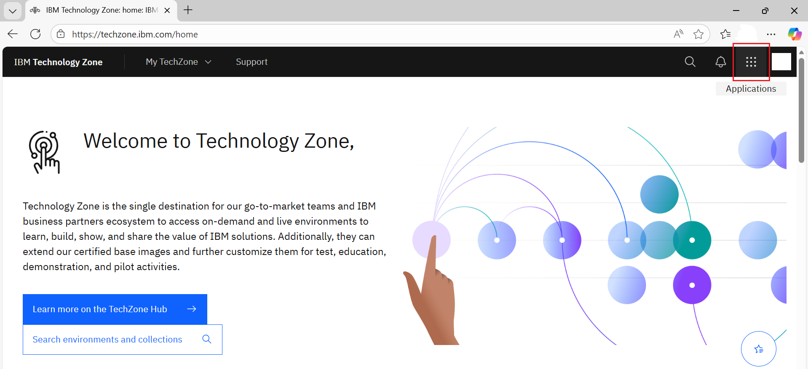

② メニューから「Environments」をクリックします。

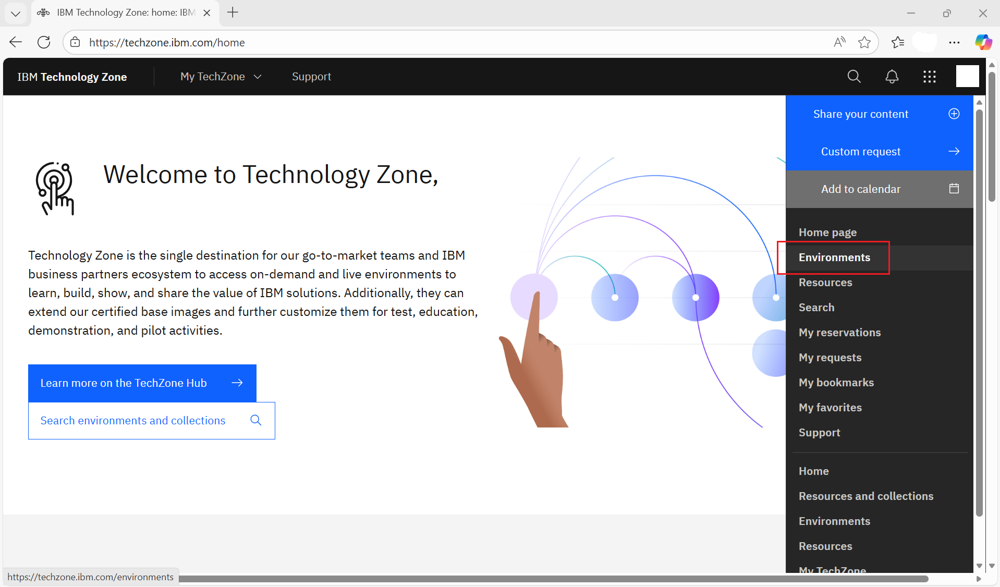

③ 「Hardened Windows Server 2022 Standard (OCP-V) – IBM Cloud」を検索します。結果が複数ある場合は、必ず認証済みのものの「Reserve」ボタンをクリックします。

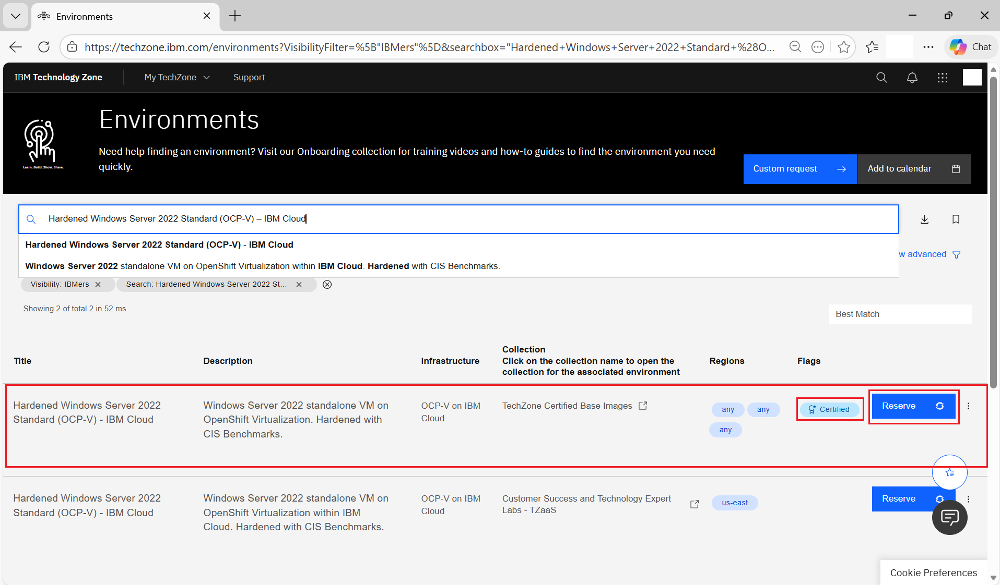

④ 「Request an Environment」をクリックします。

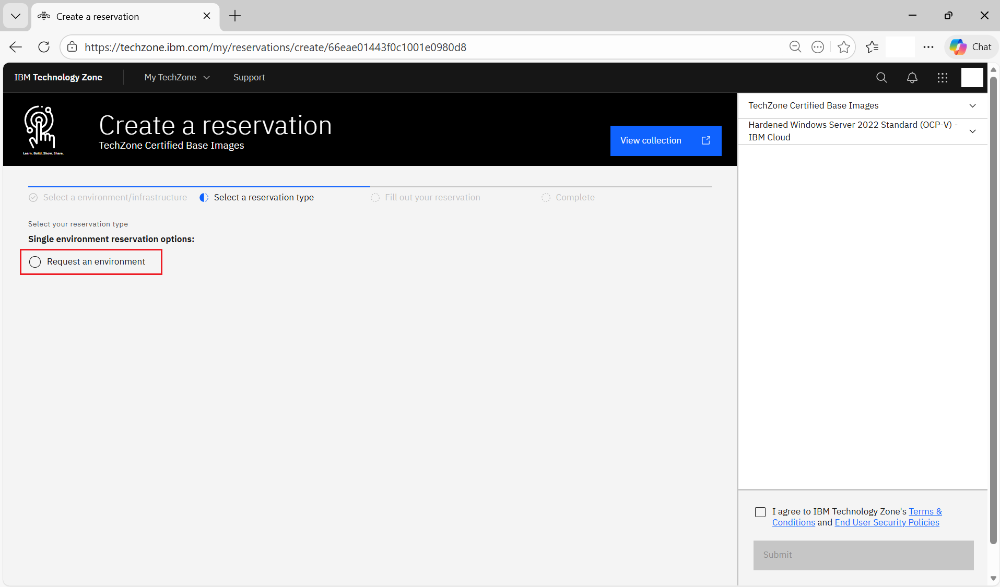

⑤ 「Purpose」と「Purpose Description」を指定します。適切な Purpose を選択します。
Sales Opportunity Number がある場合は入力します。Sales Opportunity Number がある場合、より長期間利用することができます。

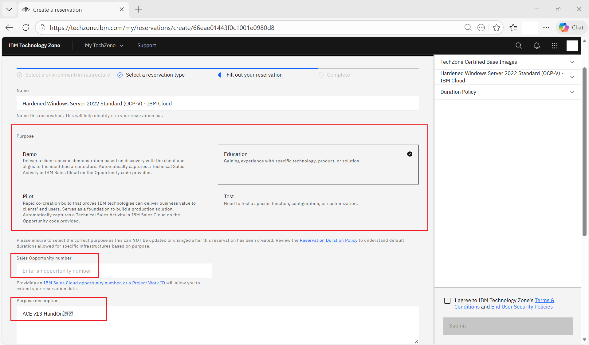

⑥ Preferred Region Template を選択します。
開始日時・終了日時、CPU コア数、メモリ、ディスクサイズを入力します。
「IBM Technology Zone の利用規約に同意します」のチェックボックスをオンにし、［Submit］をクリックします。

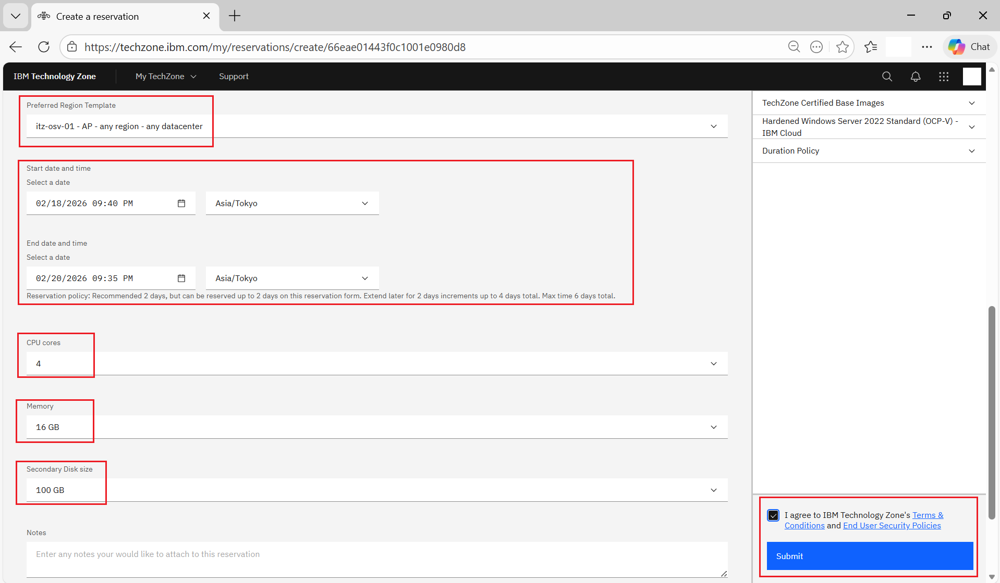

⑦ Reservationが作成されたことを確認します。

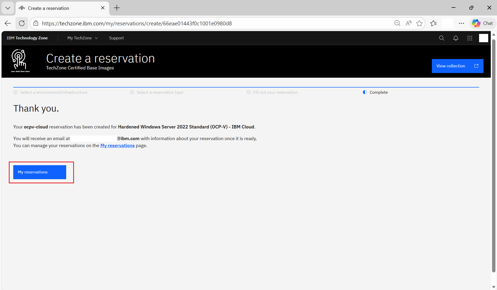

⑧ 予約を確認するには、「My Reservations」をクリックします。ステータスは「Provisioning」と表示されており、「Ready」ステータスに更新されるまで「数10分～1時間程度」ぐらいかかります。

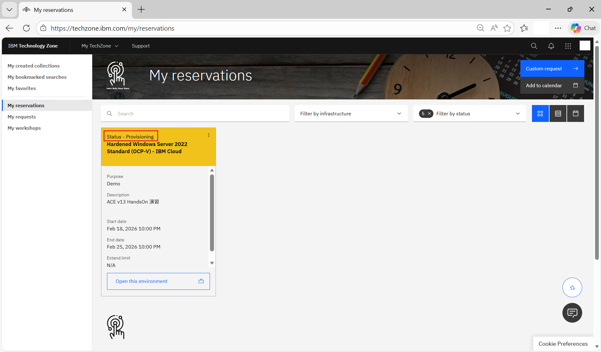

⑨ 申請が完了すると、下記のような通知メールが届きます。

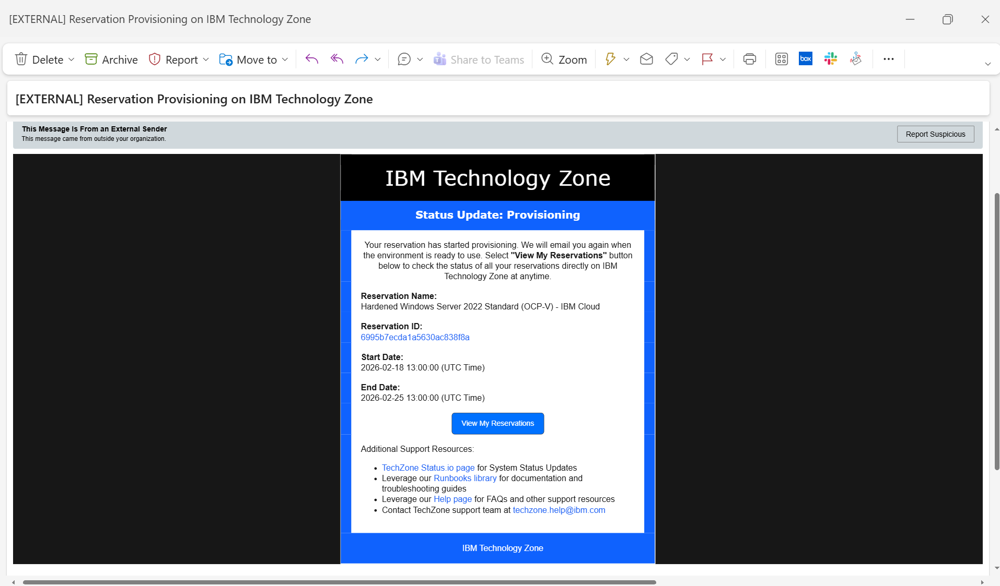

⑩ ステータスが「Ready」になると、別途通知メールが届きます。

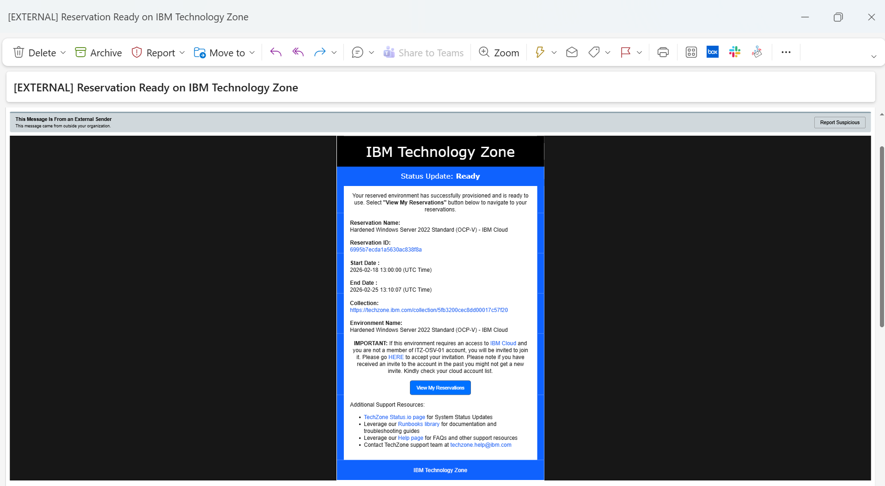

⑪ 「My Reservations」ページに移動し、ステータスが「Ready」になっていることを確認します。

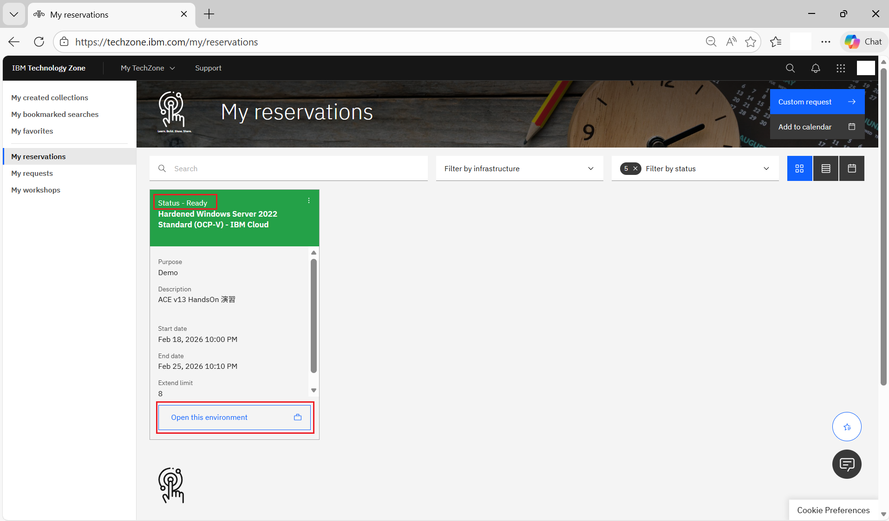

⑫ 「Open this environment」をクリックすると、予約の詳細および VM へ接続するための情報が表示されます。

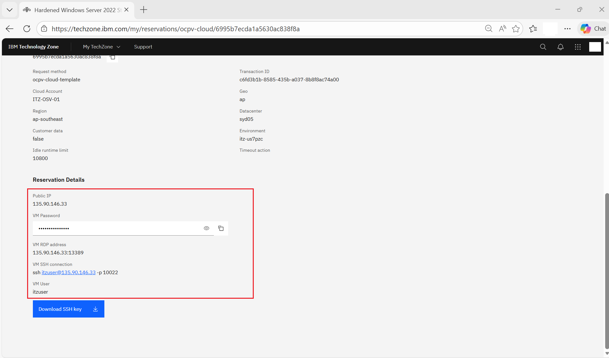

⑬ Remote Desktop Client を開きます。Windows を使用している場合は、rdpを起動します。

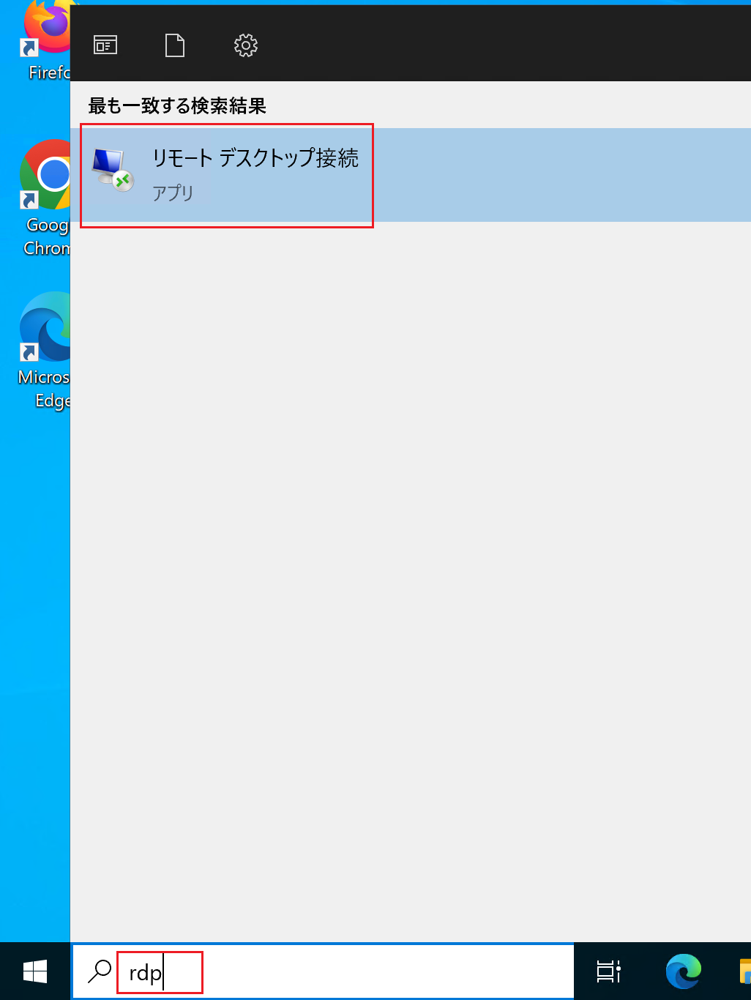

⑭ 予約の詳細ページに記載されている VM の RDP アドレスをRemote Desktop Client に入力し、「オプションの表示」をクリックます。

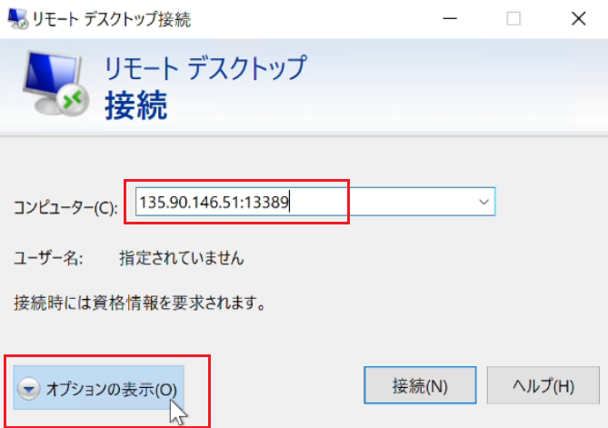

⑮ 予約の詳細ページに記載されている VM のユーザー名を入力します。このユーザーはローカルアカウントのため、ユーザー名を入力する際は「\\\ユーザー名」の形式で指定します。

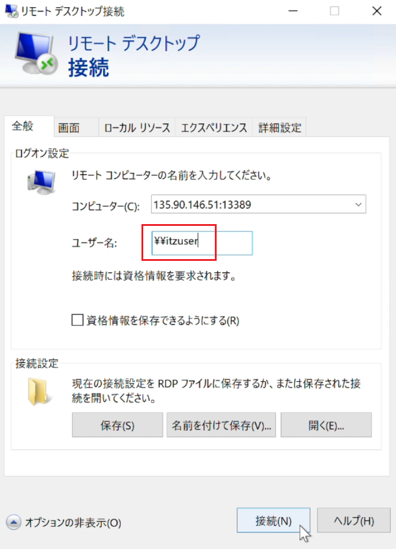

⑯ 予約の詳細ページに記載されているパスワードを入力し、「OK」をクリックします。

> デフォルトの設定では間違ったパスワードを10回入力するとアカウントがロックされてしまいます。

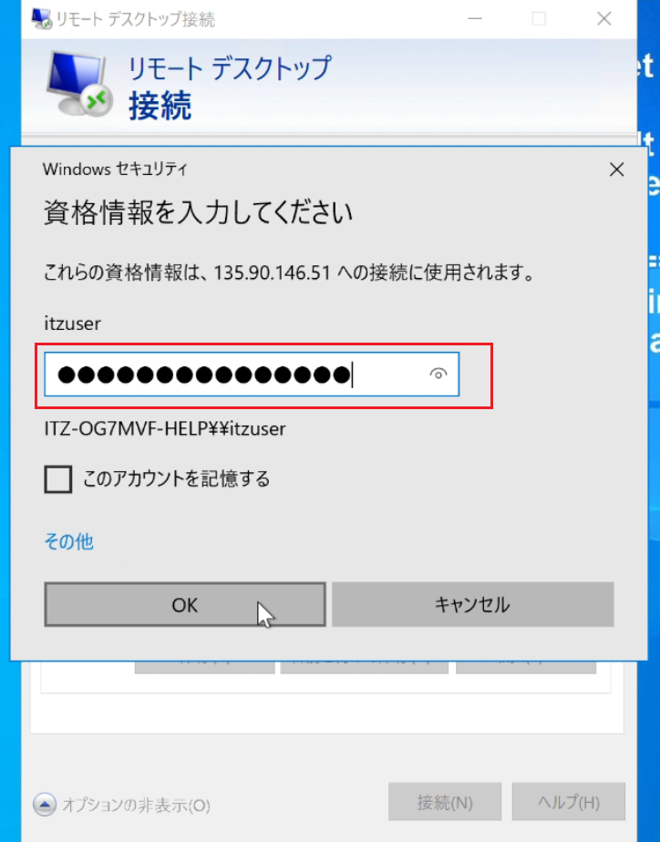

⑰ 証明書の内容を確認し、「このコンピューターへの接続について今後確認しない」にチェックを入れ「はい」をクリックします。

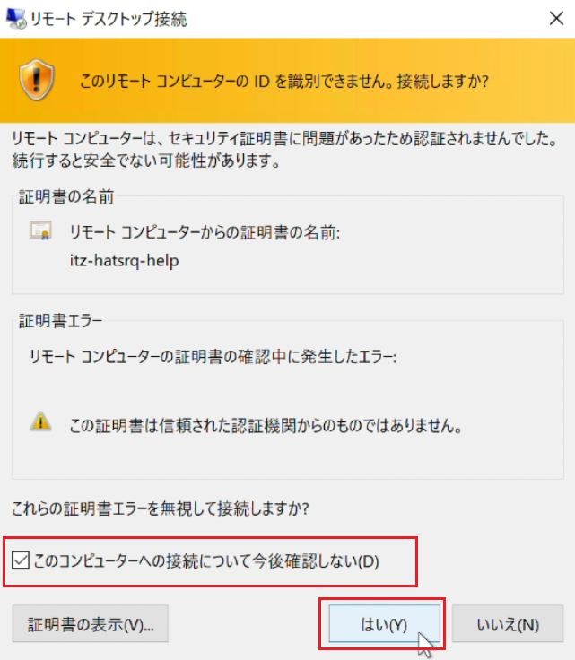

⑱ VMへ正常に接続できることを確認します。

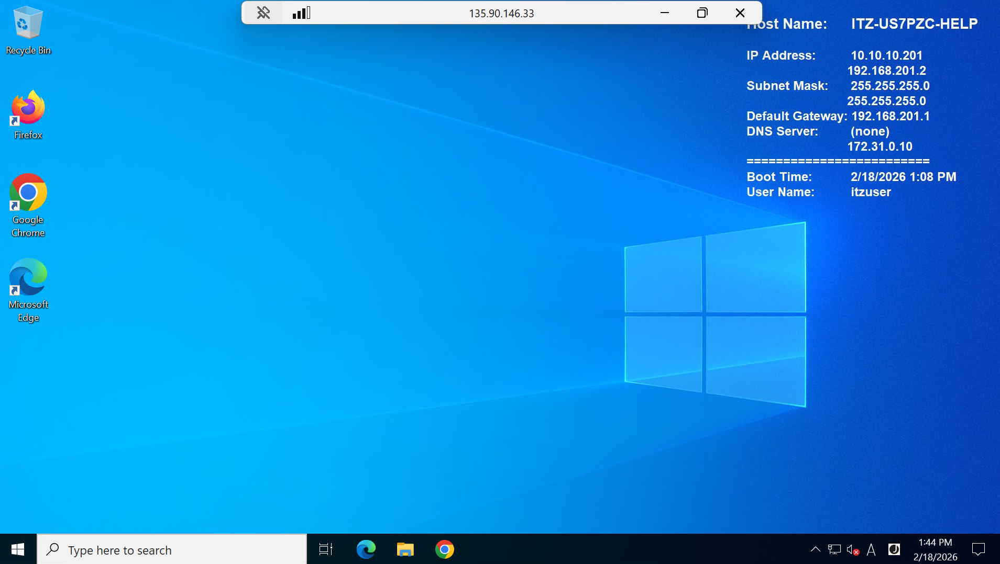

以上となります。
