# Windowsの日本語化設定手順

① 「Settings」を開きます。

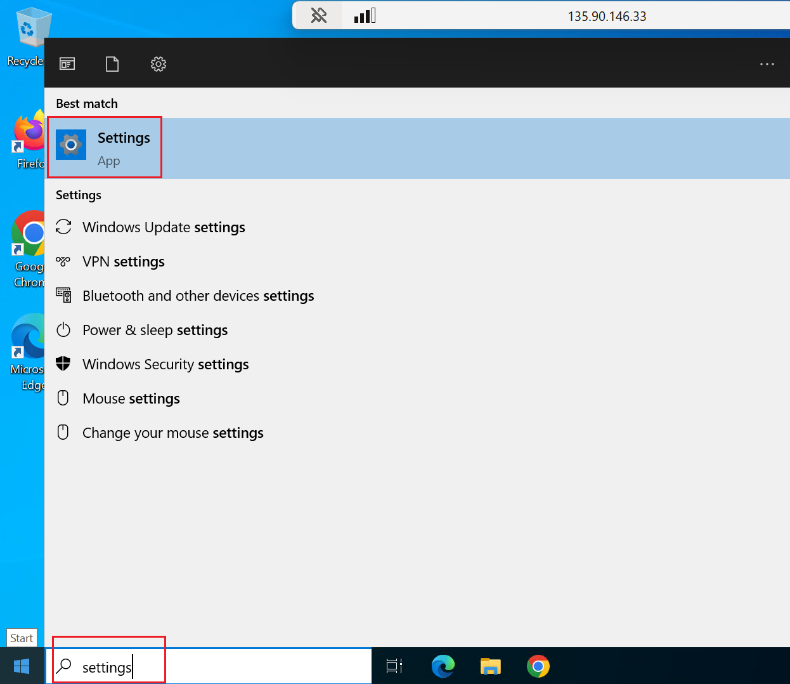

②「Time & Language」を選択します。

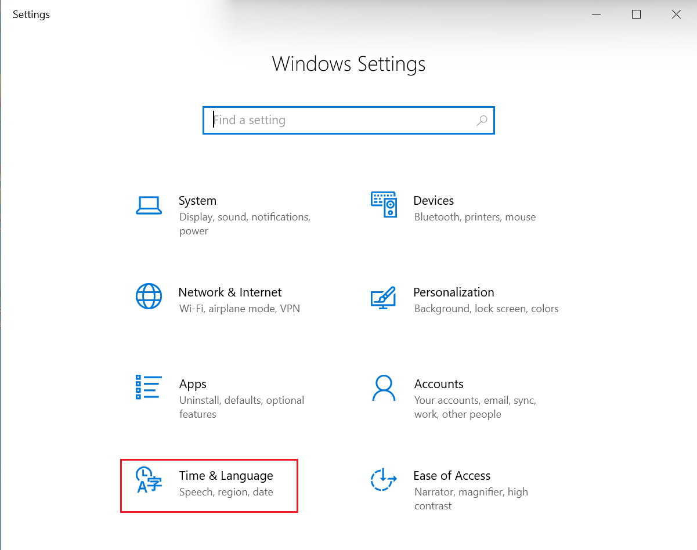

③ 左側のメニューから「Language」を選択し「Preferred languages」から「Add a language」をクリックします。

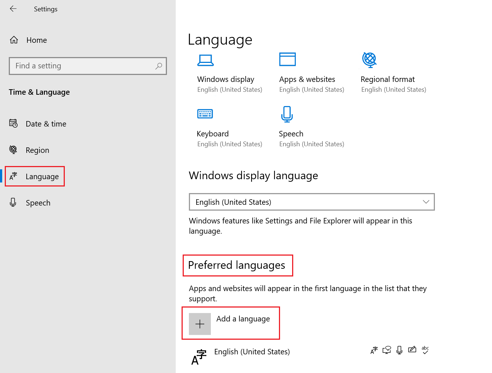

④ 一覧から「日本語」を選択し「Next」をクリックします。

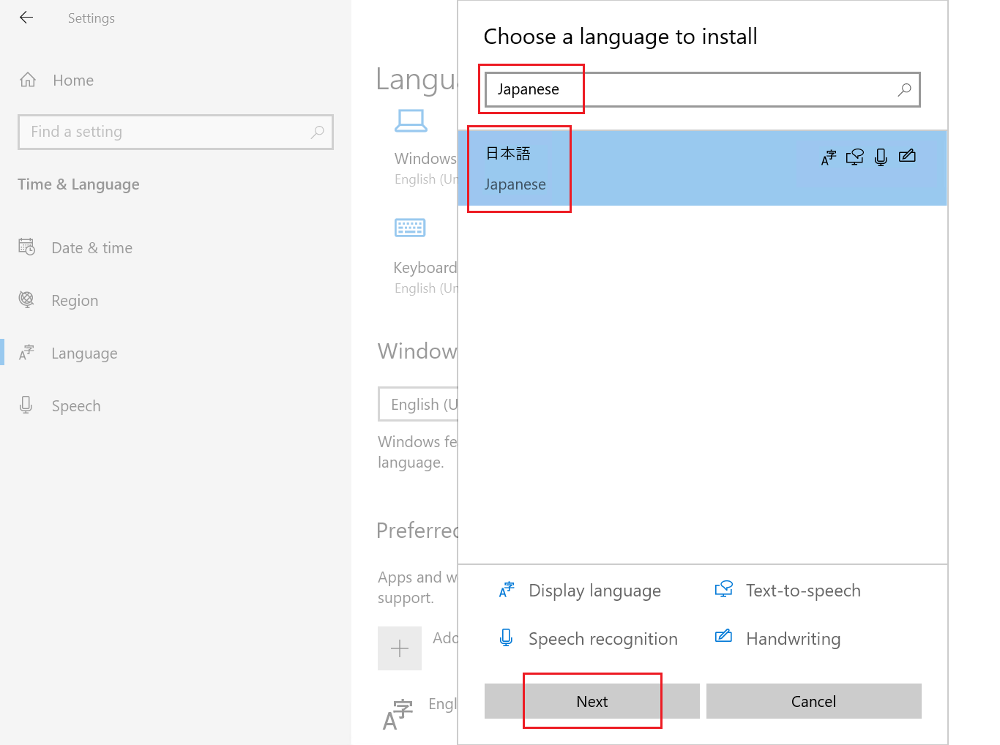

⑤ 下記の項目にチェックを入れ、インストールを進めます。

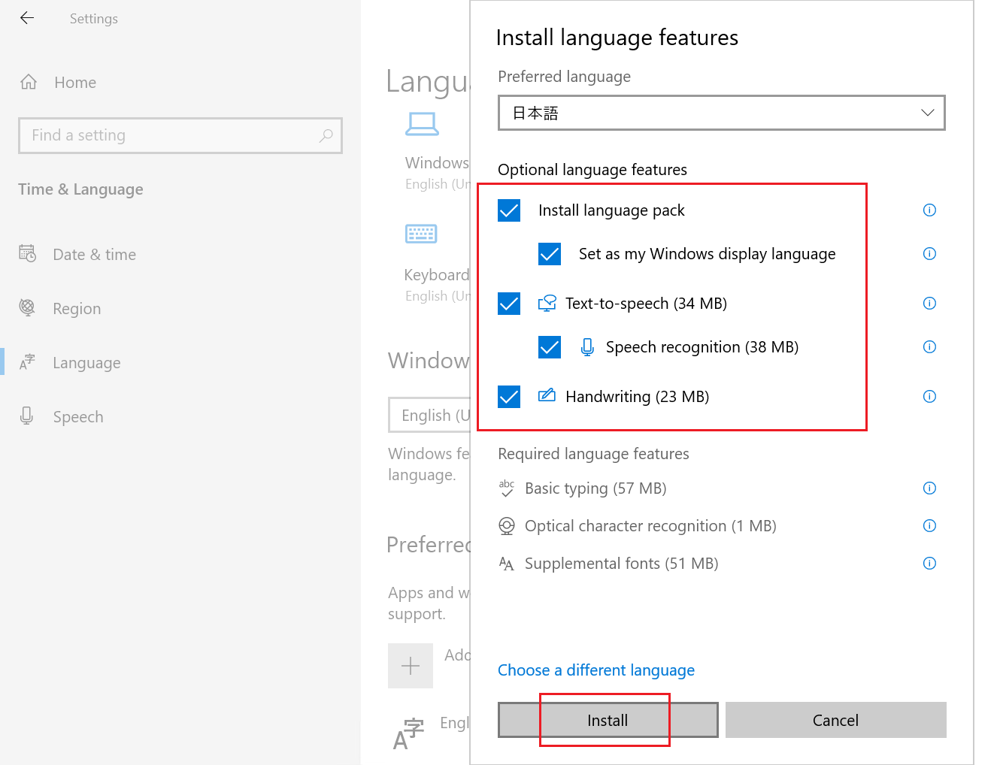

⑥ インストールが完了したら、一度サインアウトします。

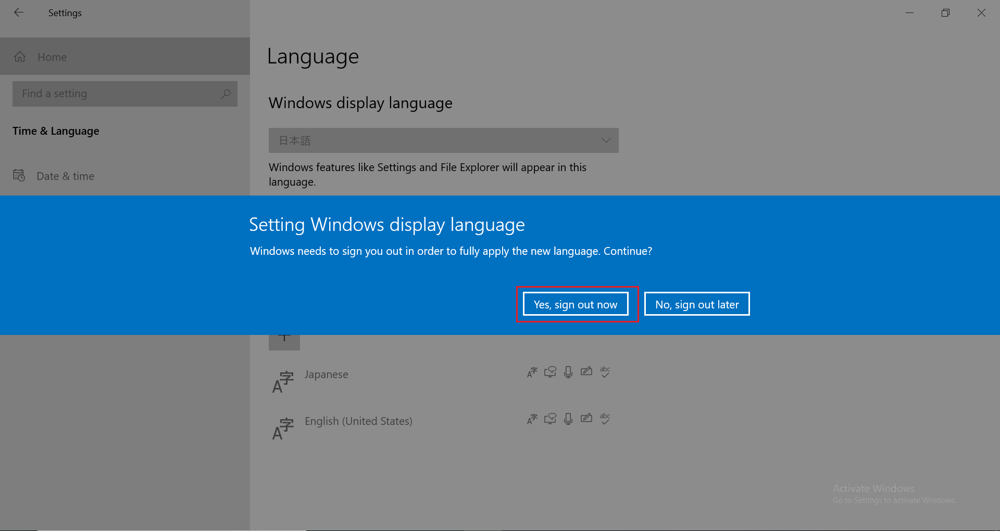

⑦ 再度サインインし、日本語表示に切り替わっていることを確認します。   
「Settings」を開き、「時刻と言語」を選択します。

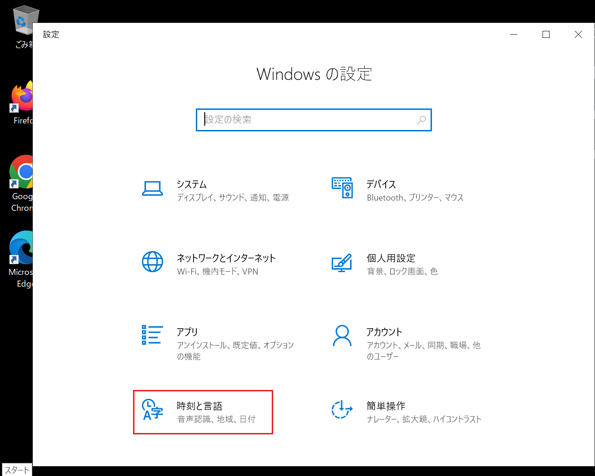

⑧ 「日付と時刻」を選択し、タイムゾーンを「日本標準時（UTC+09:00）」に設定します。

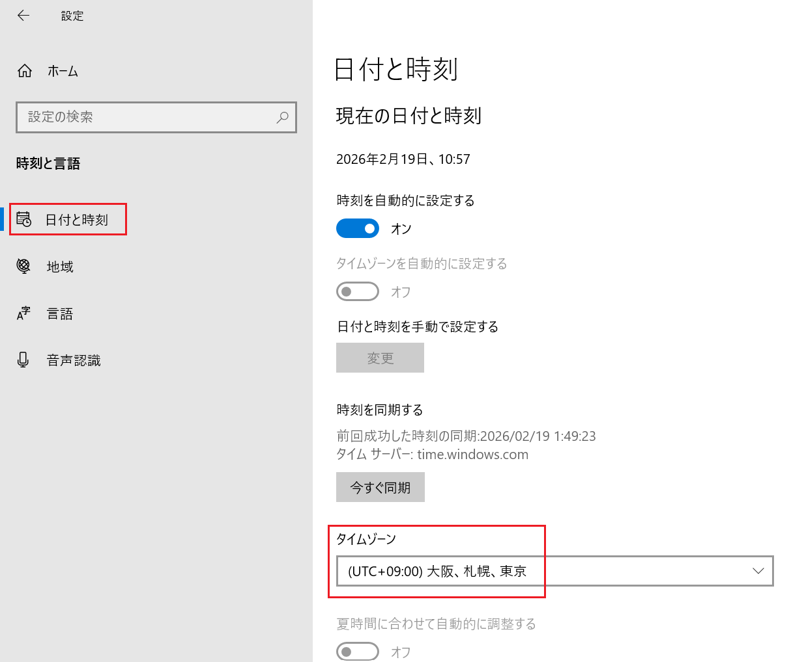

⑨ 左側のメニューから「地域」をクリックし、「国または地域」を「日本」に設定します。

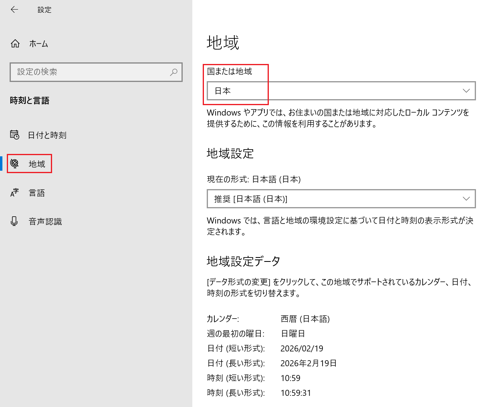

⑩ キーボードレイアウトを日本語に変更します。   
左側のメニューから「言語」を選択し、「優先する言語」の一覧から「日本語」を選択して「オプション」をクリックします。

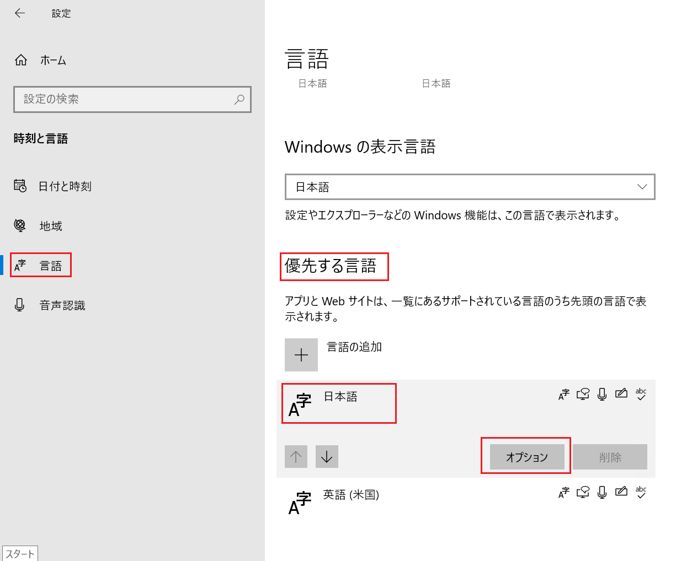

⑪ 「レイアウトを変更する」をクリックします。

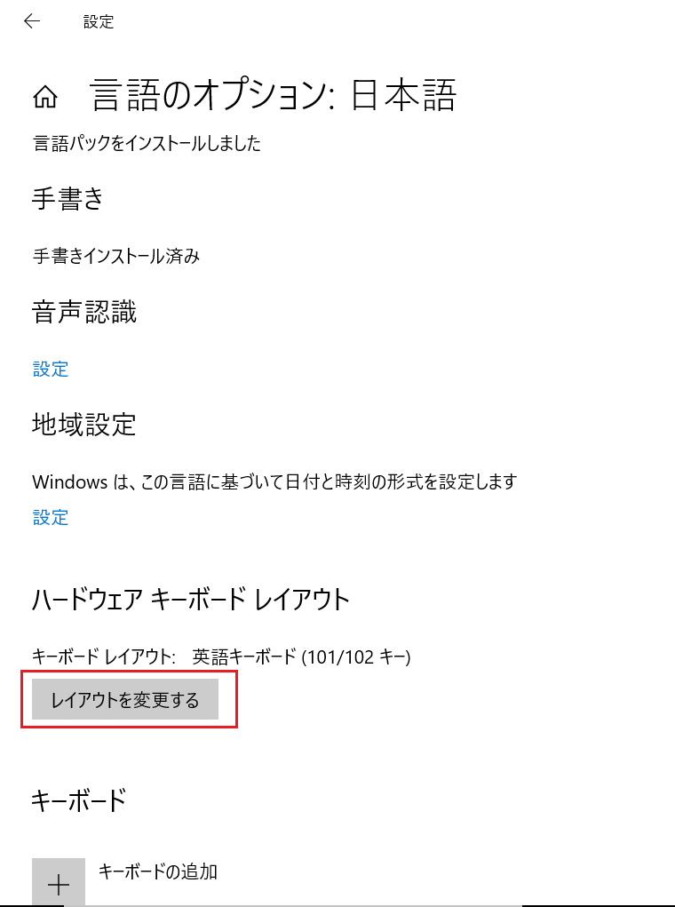

⑫ 「日本語キーボード」を選択します。再起動して設定を反映させます。

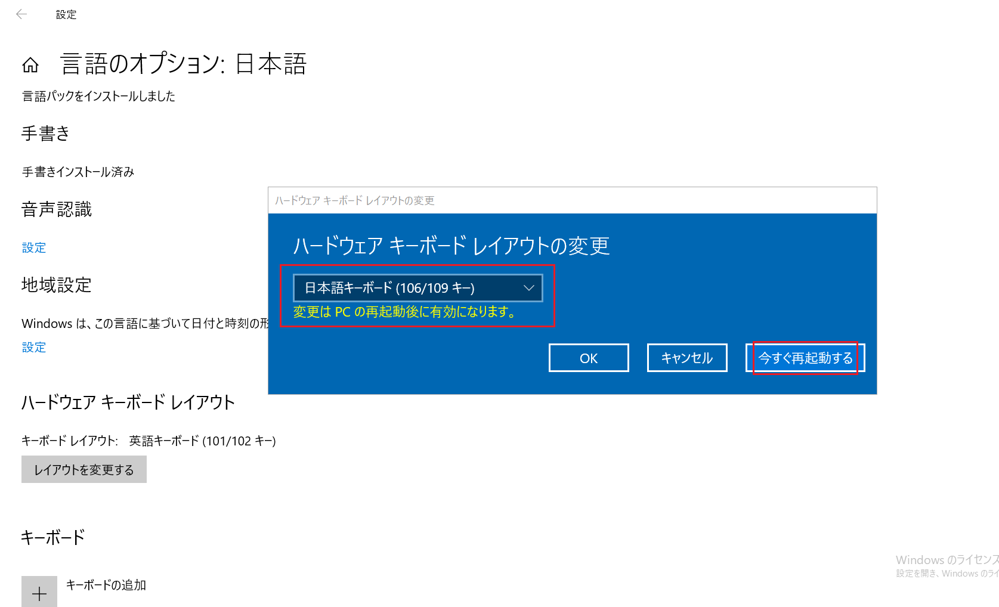

以上となります。

