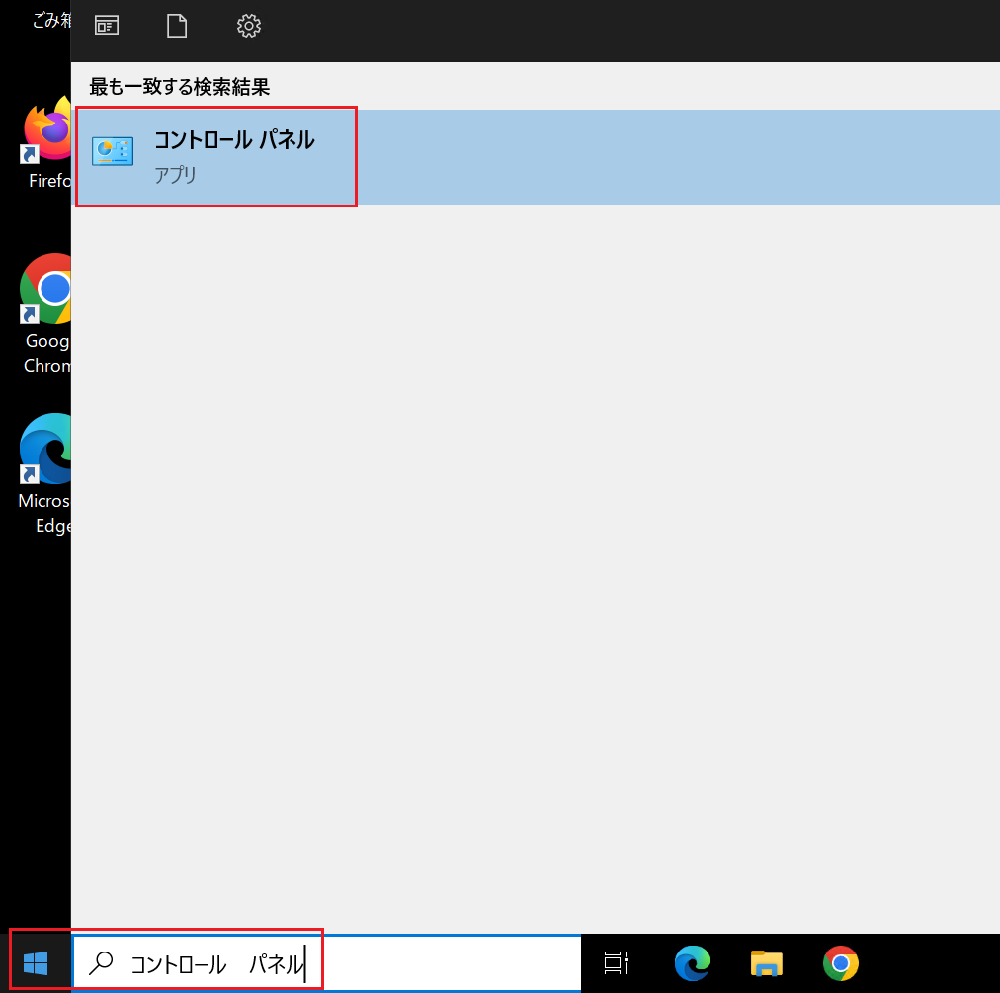
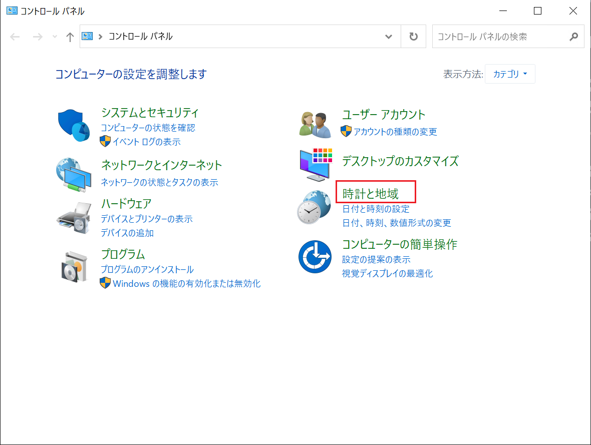
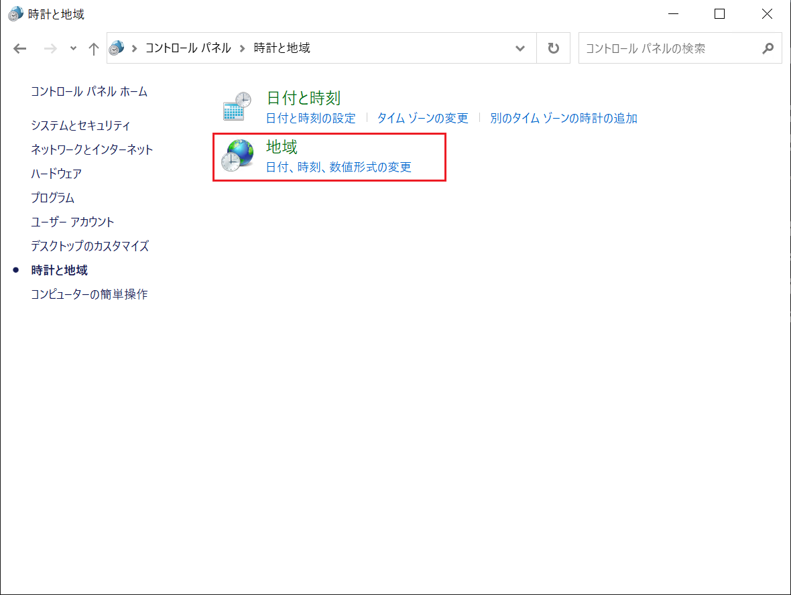
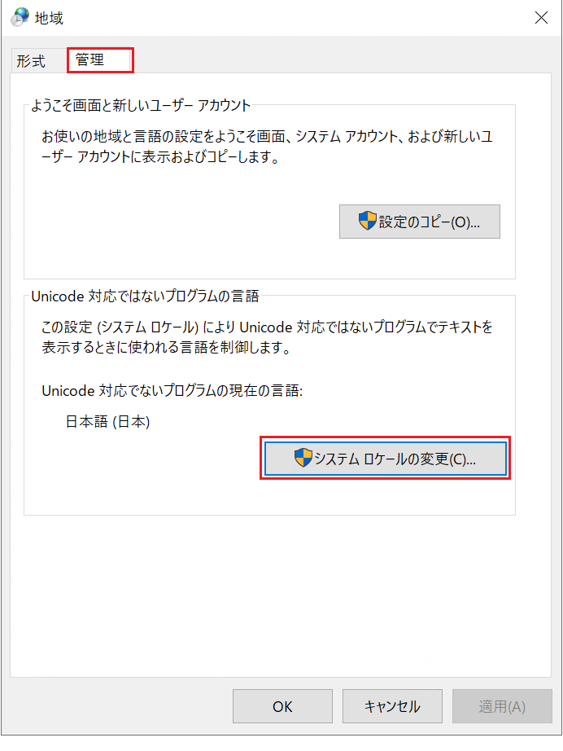
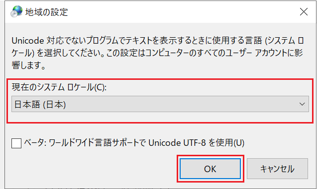
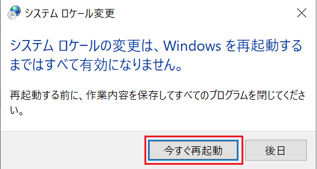

# Windowsのロケール変更手順

Windows のシステムロケールを日本語に変更することで、非 Unicode アプリケーションや旧式の日本語ソフトが正しく表示・動作するようになります。文字化けの防止にも有効です。

① ［スタート］メニューから［コントロール パネル］を開きます。

② 「時計と地域」をクリックし、地域設定を開きます。

③ 「地域」をクリックし、地域設定を開きます。

④ ［管理］タブを開き、［システム ロケールの変更］をクリックします。

⑤ 「現在のシステム ロケール」を［日本語 (日本)］に設定します。

⑥ 再起動後、設定が有効になります。

⑦ Notepadや他のツールを使用して、Shift_JIS の文字が正しく表示されるか確認します。

以上となります。

