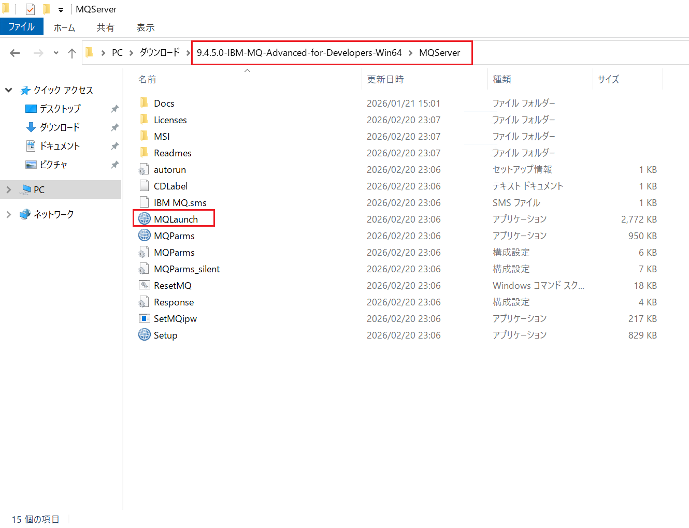
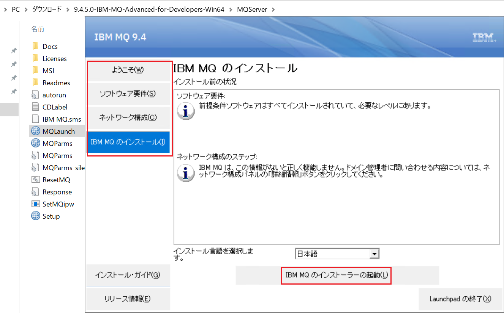
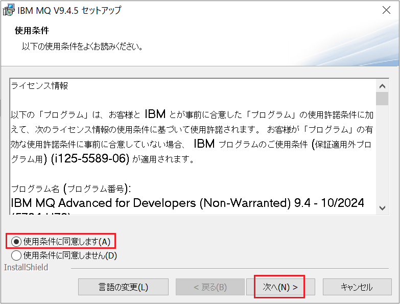
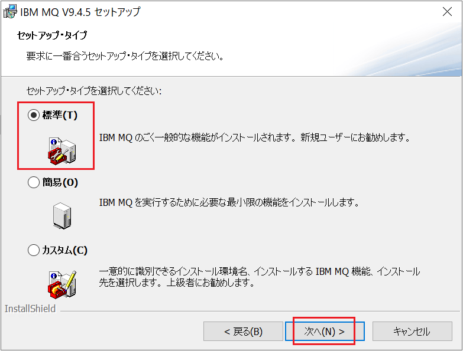
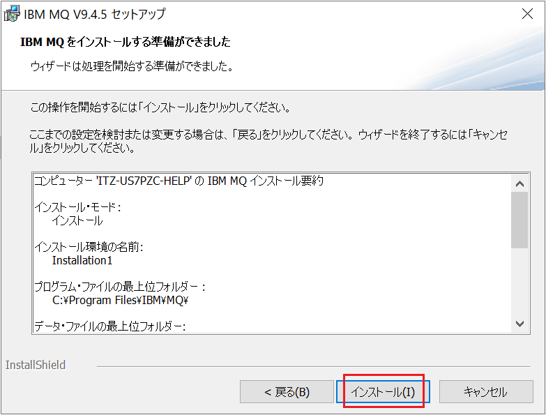
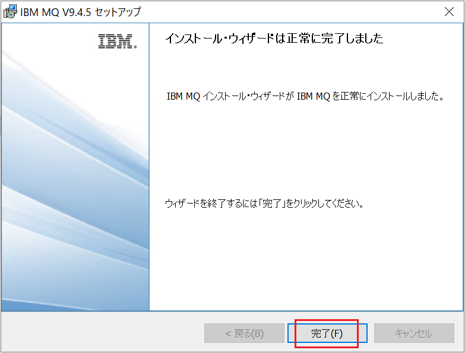
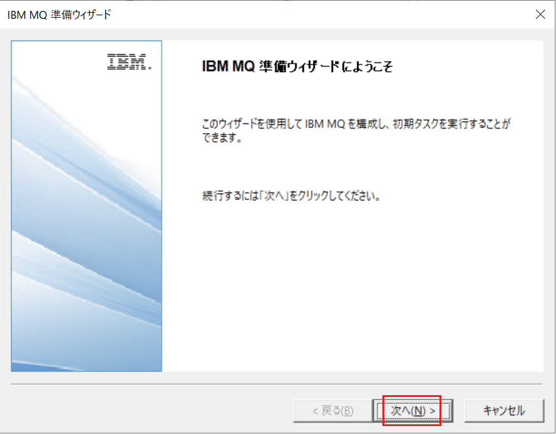
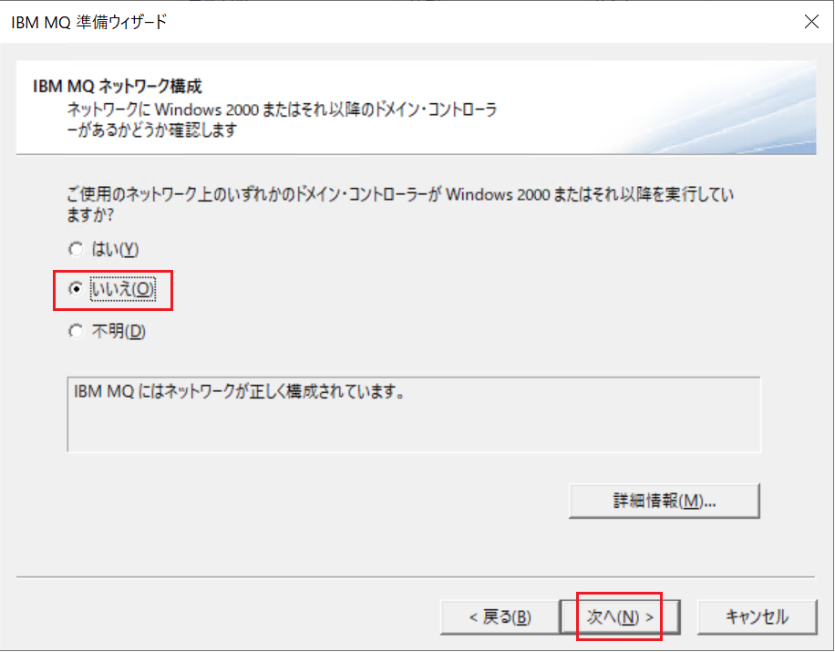
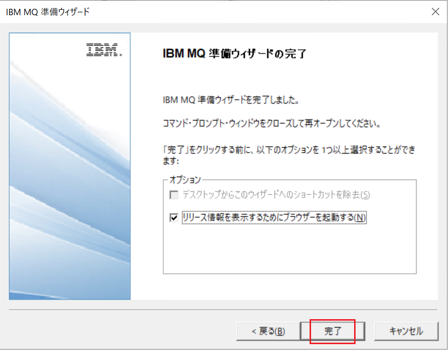
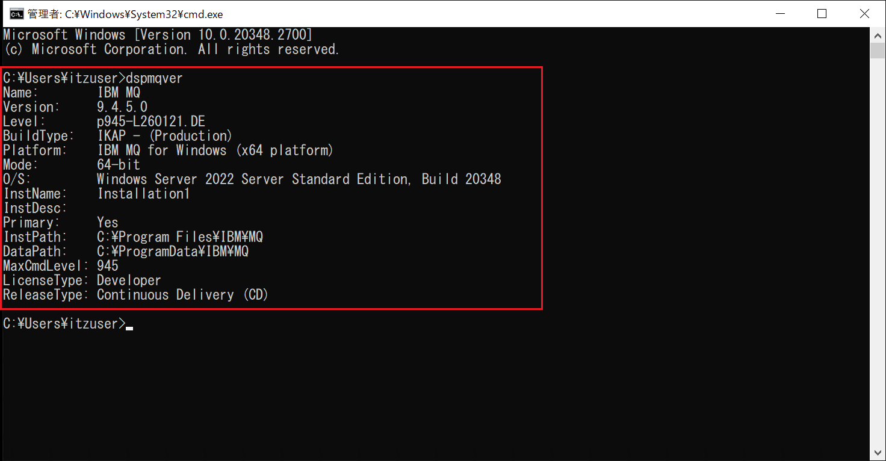

# MQのインストール手順

本ハンズオン演習では、IBM MQ Advanced for Developers 9.4.5.0 を使用しています。導入作業は管理ユーザーで実施します。

① IBM MQ Advanced for Developers のインストール用ファイルを準備します。

Windows向けのインストールファイルは、以下のリンクからダウンロードします。
[IBM MQ Advanced for Developers 9.4.5.0](https://www14.software.ibm.com/cgi-bin/weblap/lap.pl?popup=Y&li_formnum=L-HYGL-6STWD6&accepted_url=https://public.dhe.ibm.com/ibmdl/export/pub/software/websphere/messaging/mqadv/9.4.5.0-IBM-MQ-Advanced-for-Developers-Win64.zip)

② インストールファイルを展開し、「MQServer」フォルダー内に移動します。   
「MQLaunch」を実行します。

③ Launchpadで各項目を確認し、「IBM MQ のインストーラの起動」をクリックして実行します。

④ 使用条件に同意して「次へ」を左クリックします。

⑤ セットアップタイプを「標準」に設定し、「次へ」をクリックします。

⑥ 「インストール」をクリックします。

⑦ インストール・ウィザードの処理が完了するまで、約2～3分程度かかります。完了画面が表示されたら、「完了」ボタンをクリックします。

⑧ IBM MQ 準備ウィザードが自動的に起動します。このウィザードでIBM MQサービスを構成するため、キュー・マネージャーを起動する前に必ず実行する必要があります。「次へ」をクリックします。

⑨ Windowsドメイン環境の場合、IBM MQ が Active Directory のセキュリティグループ情報を参照するために、この設定は重要です。今回のハンズオン環境ではローカルシステムアカウントを使用する構成のため、「いいえ」を選択します。

⑩ IBM MQ 準備ウィザードの完了画面が表示されたら、「完了」をクリックしてウィザードを終了します。

⑪ コマンドラインで「dspmqver」コマンドを実行し、「IBM MQ」が導入されたことを確認します。

以上となります。

