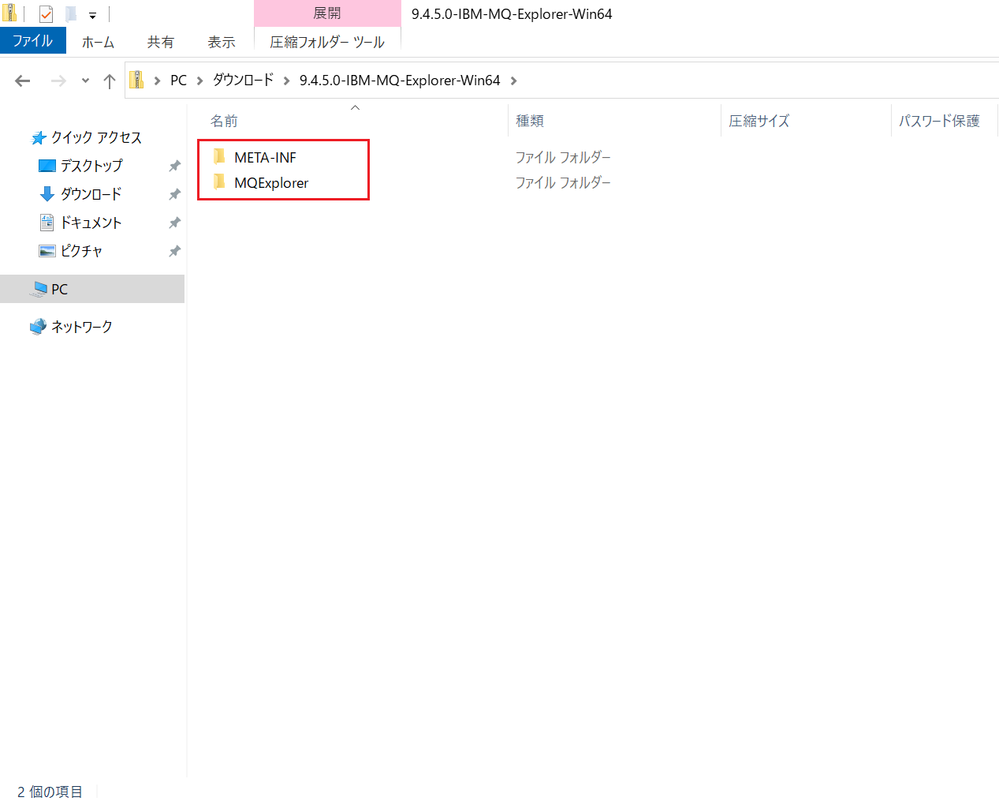
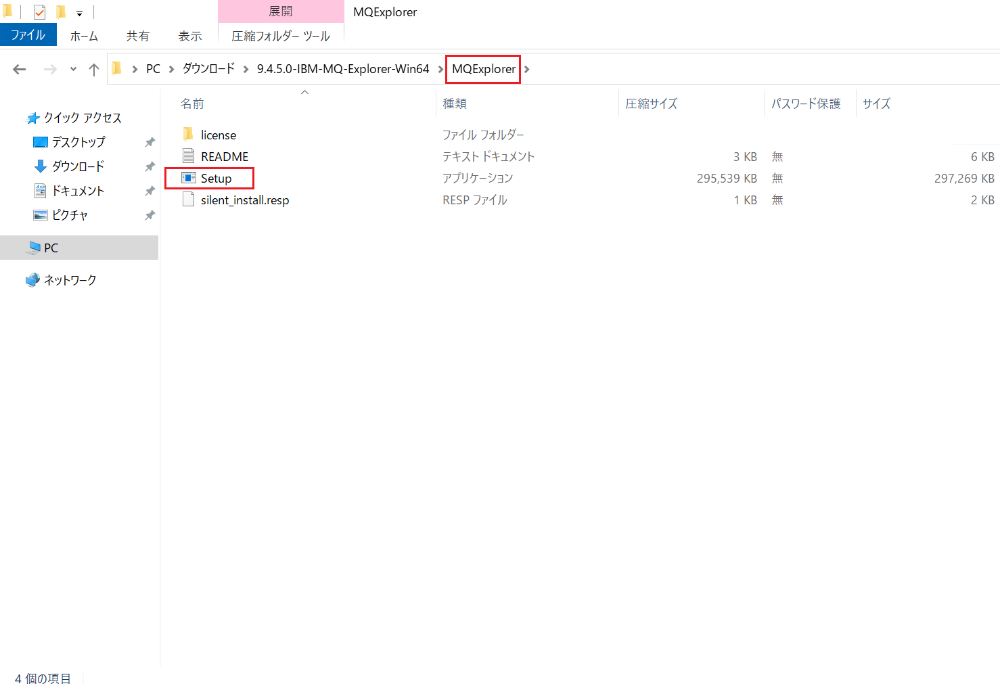
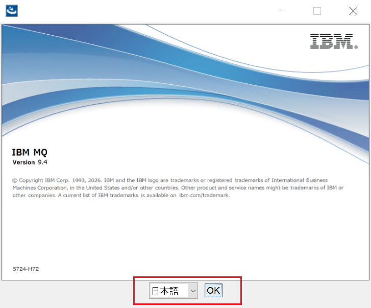
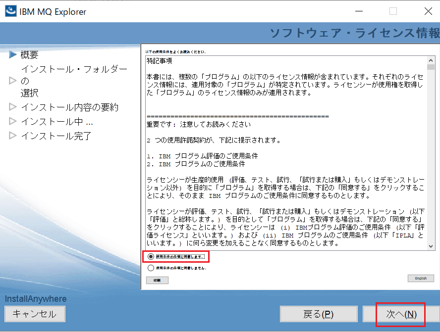
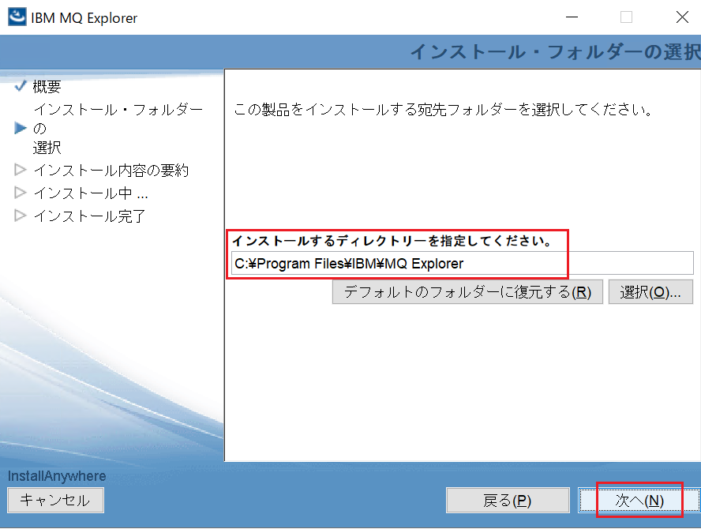
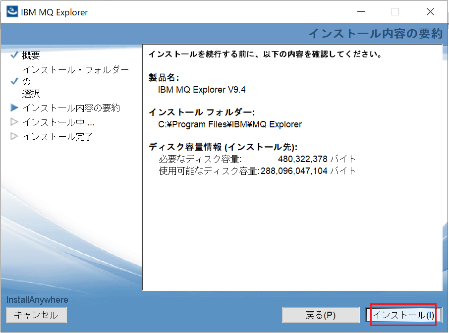
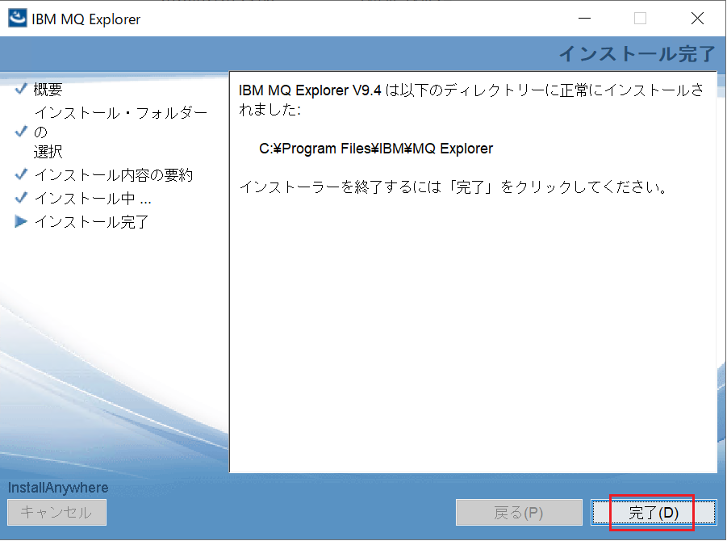
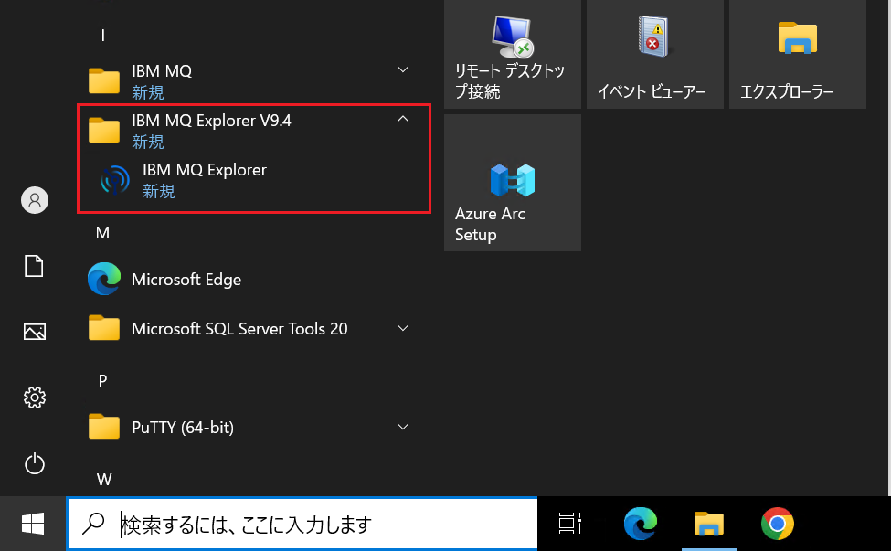
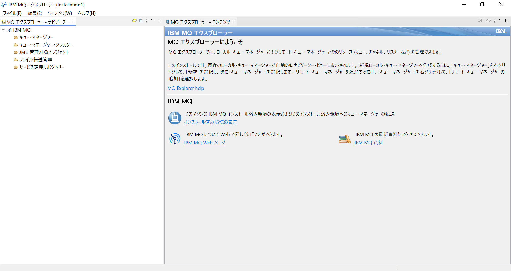

# MQ-Explorerのインストール

本ハンズオン演習では、IBM MQ Explorer 9.4.5.0 を使用しています。導入作業は管理ユーザーで実施します。

① IBM MQ Explorer のインストール用ファイルを準備します。

Windows向けのインストールファイルは、以下のリンクからダウンロードします。
[IBM MQ Explorer](https://www.ibm.com/support/fixcentral/swg/selectFixes?parent=ibm~WebSphere&product=ibm/WebSphere/WebSphere+MQ&release=9.4.0.0&platform=All&function=fixid&fixids=*IBM-MQ-Explorer*)

② インストール用「9.4.5.0-IBM-MQ-Explorer-Win64.zip」ファイルを展開します。サブディレクトリが2つ作成されます。

その中の「MQExplorer」サブディレクトリへ移動します。

③ 「Setup.exe」を起動します。画面に表示される案内に従い、「OK」をクリックして進めていきます。

④ ライセンス条項に同意します。

⑤ デフォルトのインストール先をそのまま使用します。

⑥ 「インストール」をクリックします。

⑦ インストール処理が完了したら、「完了」をクリックします。

> [!NOTE]
>
> オペレーティングシステムが Windows の場合、インストール、アンインストール、Fix Pack の適用、Fix Pack の削除など、主要な作業を行った後は、必ず Windows PC または VM を再起動してください！

⑧ MQ Exploreが導入されたことを確認します。  
    　フォルダー：IBM MQ Explorer V9.4    
    　アイテム：IBM MQ Explorer  

⑨ スタートメニューにある「MQ Explorer」のアイコンをクリックしてMQ Explorerを起動します。

MQ Explorer が表示されることを確認します。

以上となります。
   

> 関連情報：
>
> - [IBM MQ Explorer のインストール](https://www.ibm.com/support/pages/installing-standalone-ibm-mq-explorer-94-windows-and-linux?view=full)