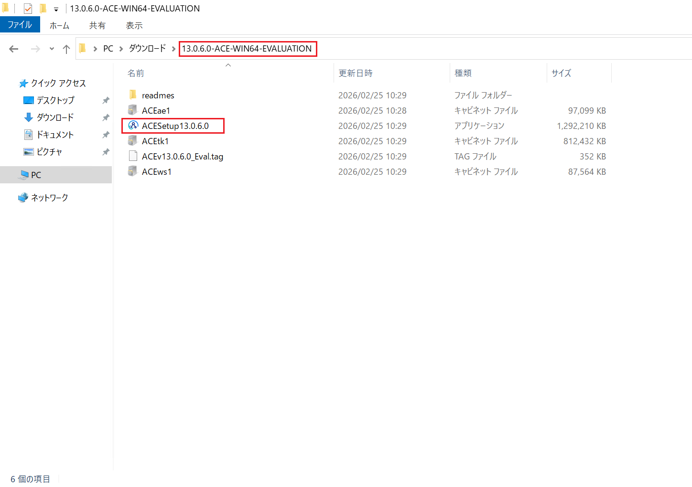
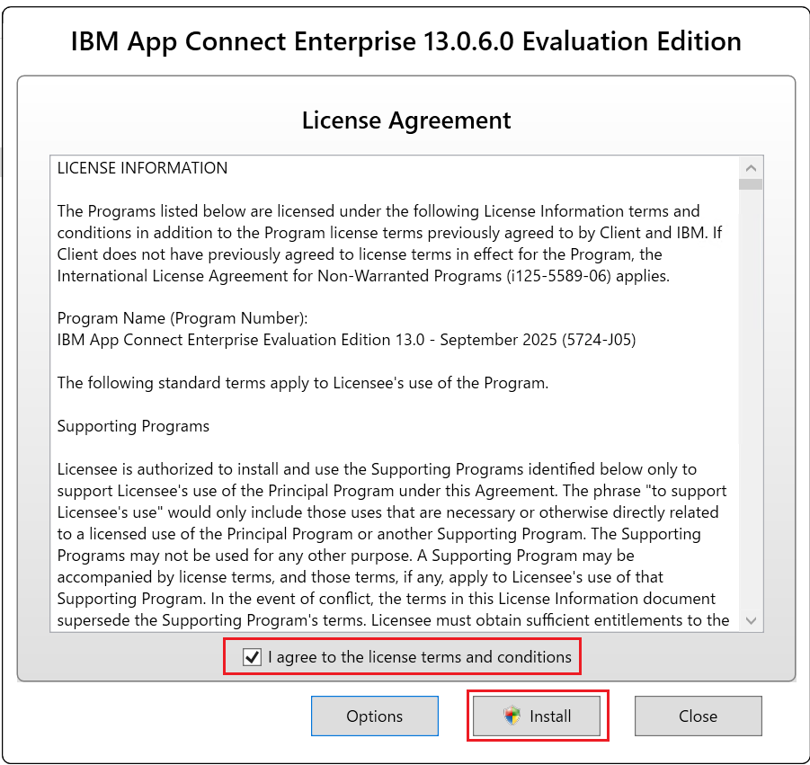
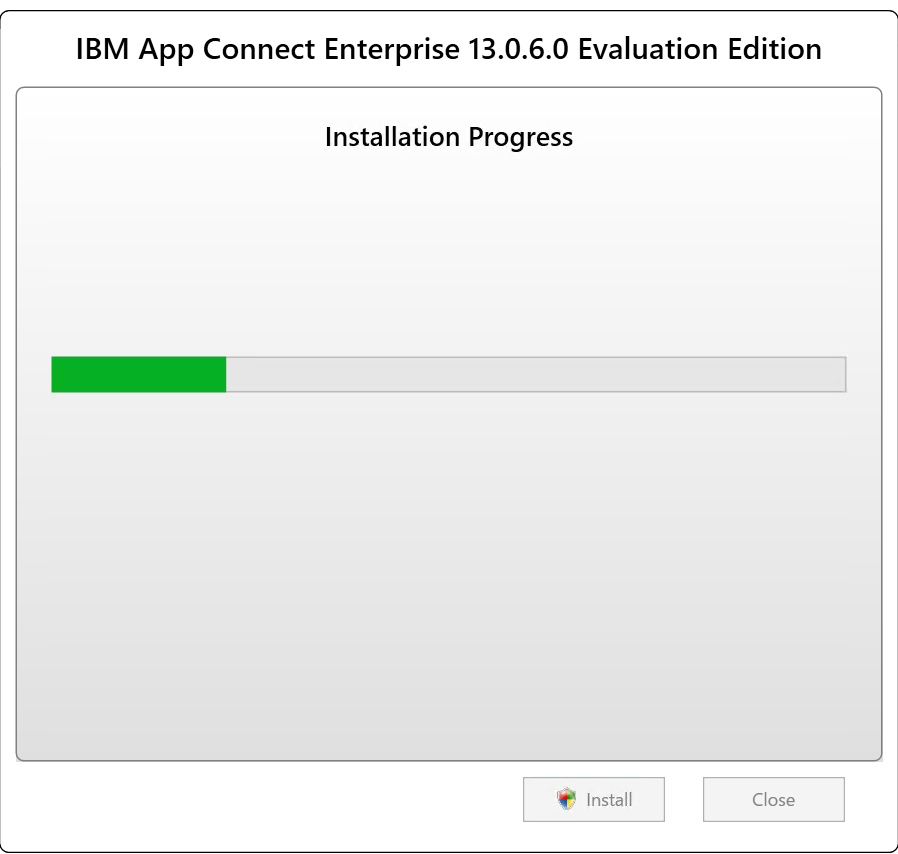
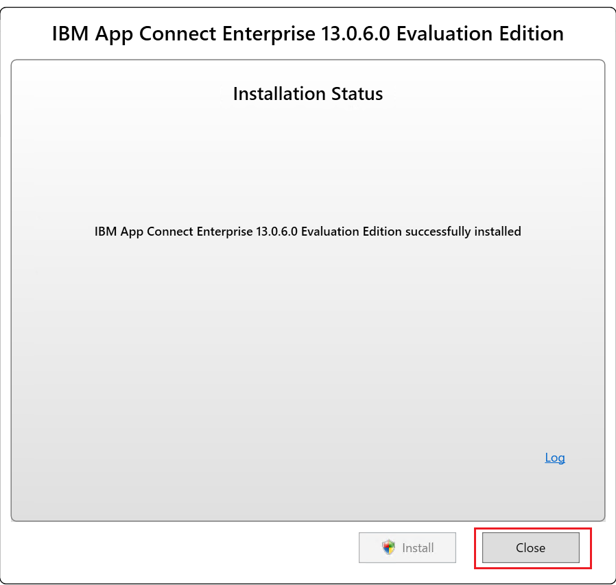
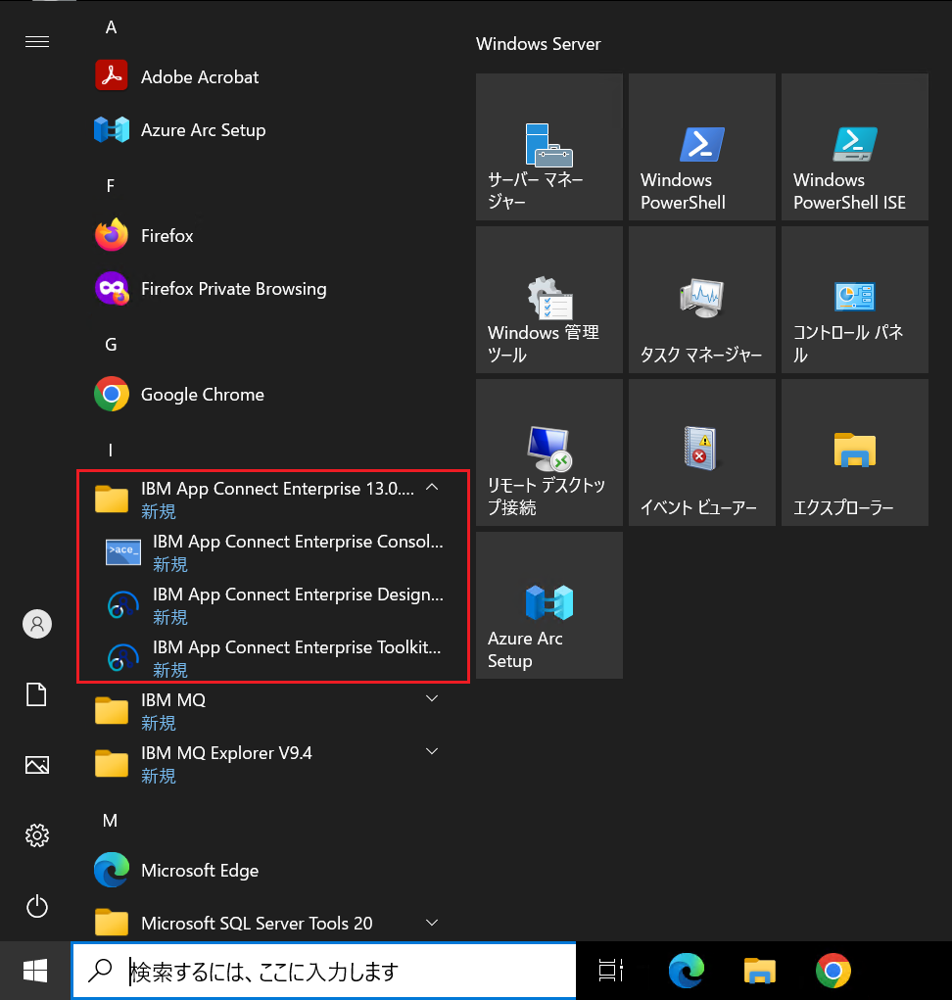
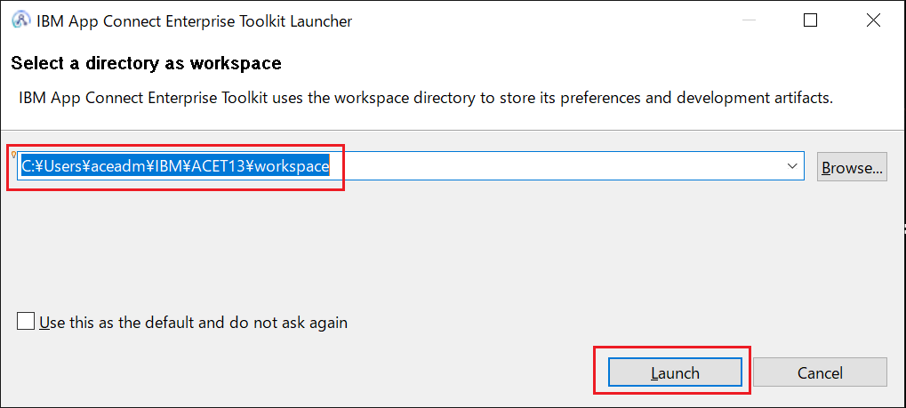
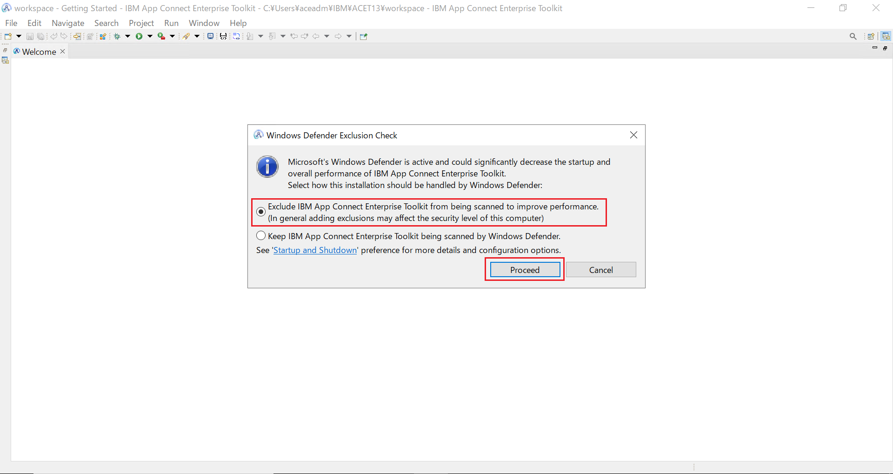
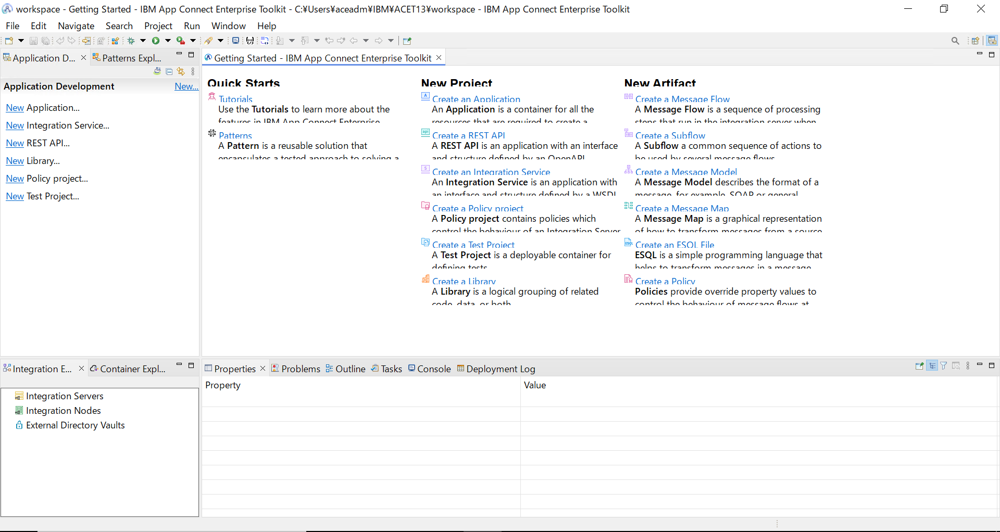

# ACEのインストール手順

本ハンズオン演習では、App Connect Enterprise（ACE 13）Evaluation Edition 13.0.6.0 を使用しています。導入作業は管理ユーザーで実施します。

① IBM App Connect Enterprise（ACE 13）Evaluation Edition 13.0.6.0 のインストール用ファイルを準備します。

Windows向けのインストールファイルは、以下のリンクからダウンロードします。
[ACE 13.0.6.0 Evaluation Edition (Windows x64)](https://www.ibm.com/docs/en/app-connect/13.0.x?topic=gsace-download-app-connect-enterprise-evaluation-edition-get-started)

② ダウンロードした「13.0.6.0-ACE-WIN64-EVALUATION.zip」ファイルを解凍します。「ACESetup13.0.6.0.exe」ファイルをダブルクリックしてインストール・ウィザードを開きます。

② チェックボックスを選択して、ライセンス条項と条件に同意します。「インストール」をクリックします。

③ IBM App Connect Enterpriseのインストールが開始します。

④ 「インストールが正常に終了しました」という旨のメッセージが表示されたら、「Close」ボタンでインストール・ウィザードを閉じます。

⑤ ACEが導入されたことを確認します。  
 フォルダー：IBM App Connect Enterprise 13.0.6.0 Evaluation Edition  
 アイテム：

- IBM App Connect Enterprise Toolkit 13.0.6.0
- IBM App Connect Enterprise Designer 13.0.6.0
- IBM App Connect Enterprise Console 13.0.6.0

⑥ 「IBM App Connect Enterprise Toolkit」を起動します。   
Windows のスタートメニューから IBM App Connect Enterprise 13.0.6.0 Evaluation Edition > IBM App Connect Enterprise Toolkit 13.0.6.0をクリックします。

⑦ ワークスペースの選択ダイアログは、デフォルトの設定値のまま「Launch」をクリックします。

⑧ Windows Defender の除外設定は除外にチェックし、「Proceed」をクリックします。

⑨ ツールキットが正常に起動することを確認します。

以上となります。
   

> 関連情報：
>
> - [IBM App Connect Enterprise のインストール](https://www.ibm.com/docs/ja/app-connect/13.0.x?topic=software-installing-windows)