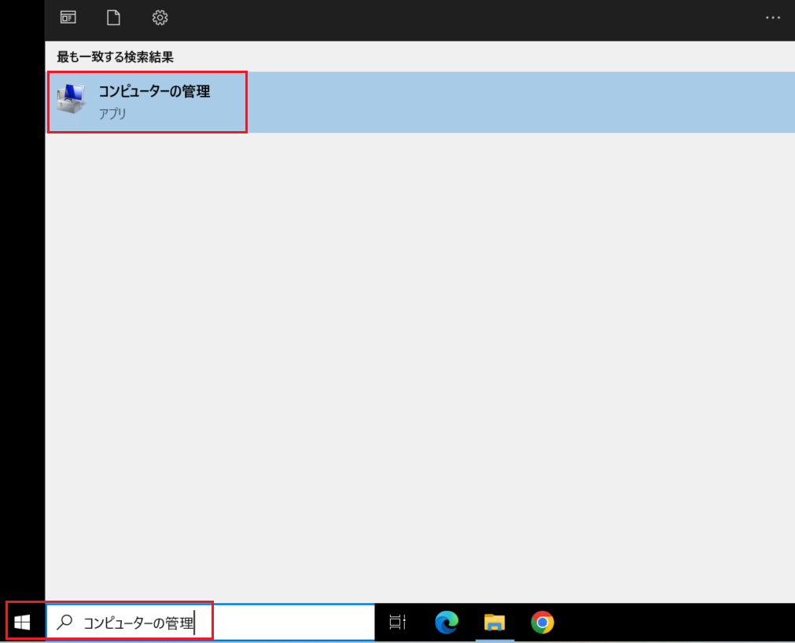
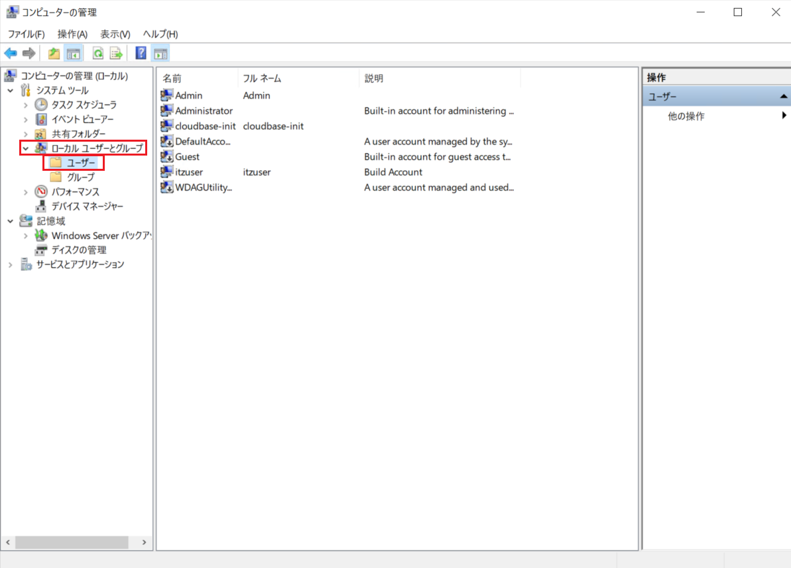
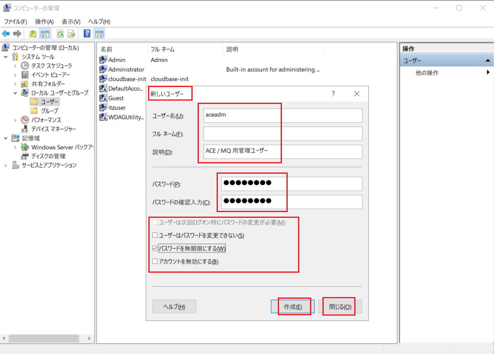
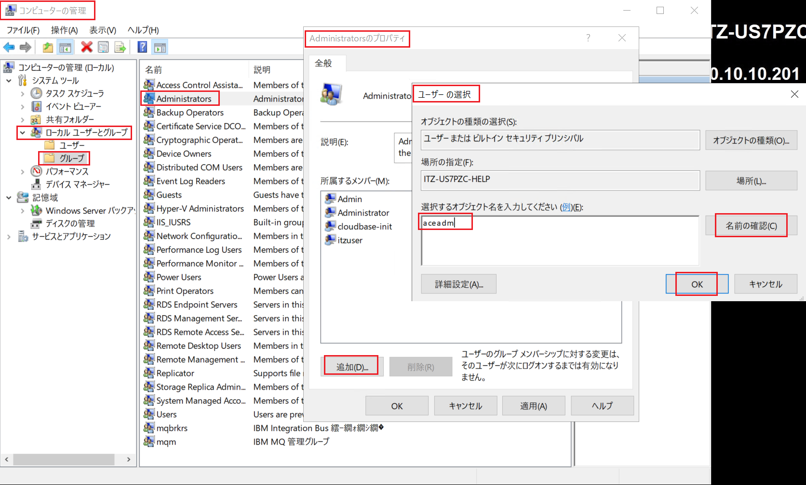
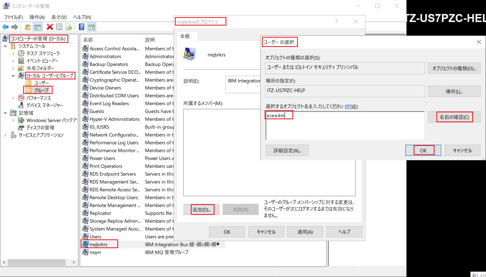
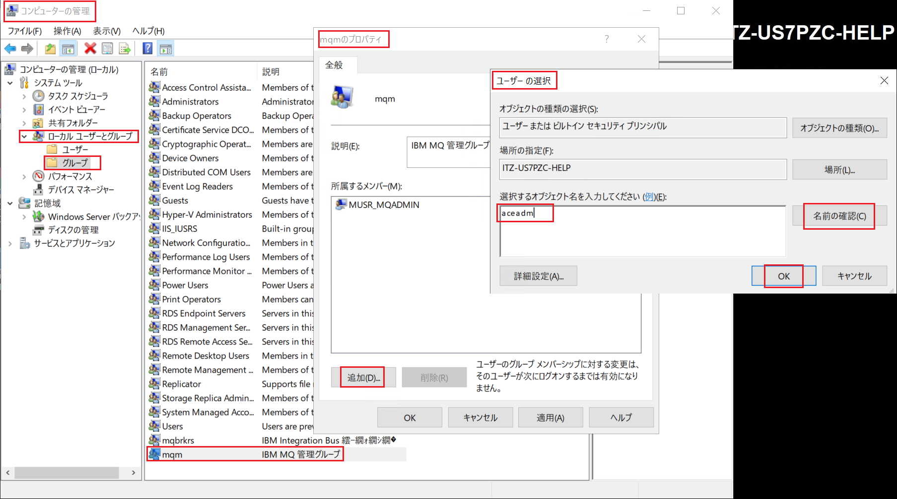
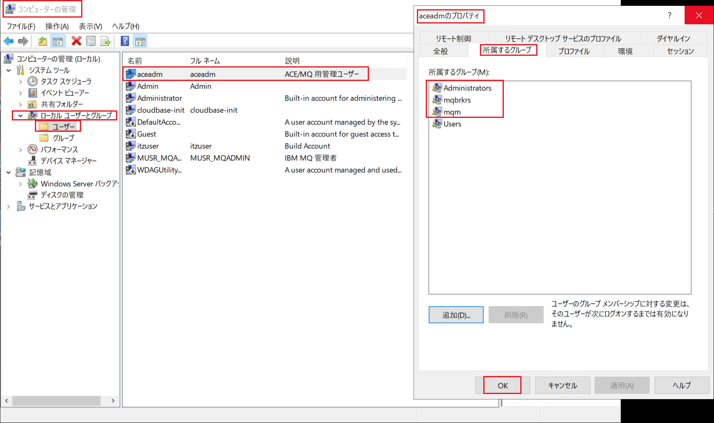
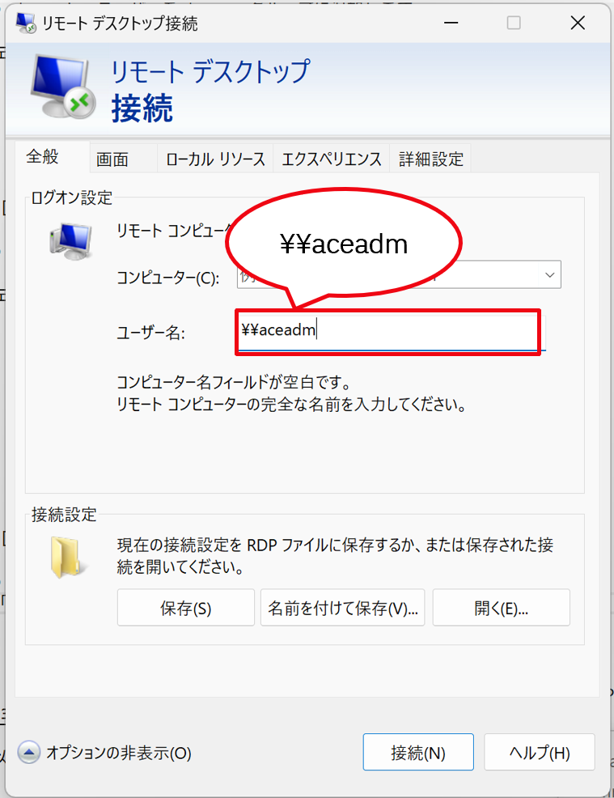

# aceadm ユーザーを作成する手順

①「コンピューターの管理」を開きます。

- スタートメニューを開きます。
- 検索欄に「コンピューターの管理」と入力します。
- 表示されたアプリをクリックして開きます。

② ローカルユーザーとグループを開きます。

- 左側のメニューから
  「ローカル ユーザーとグループ」 → 「ユーザー」を選択します。

③ 新しいユーザーを作成します。

- 「ユーザー」を右クリックします → 「新しいユーザー」を選択します。
- 以下の情報を入力します。
  - ユーザー名： aceadm
  - フルネーム：
  - 説明： ACE / MQ 用管理ユーザー
  - パスワード： (パスワード)

  チェック項目
  - 「次回ログオン時にパスワードの変更が必要」 → チェックを外します。
  - 「パスワードを無期限にする」 → チェックを入れます。

  「作成」 → 「閉じる」

④ 「aceadm」ユーザーを「Administrators」グループに追加します。

左メニューで

- 「ローカルユーザーとグループ」→「グループ」を選択します。
- 「Administrators」をダブルクリックします。
- 「追加」をクリックし、aceadm と入力 → 「名前の確認」→ OK
- 「適用」→ OK

⑤ 「aceadm」ユーザーを「mqbrkrs」 グループに追加します。

左メニューで

- 「ローカルユーザーとグループ」→「グループ」を選択します。
- 「mqbrkrs」をダブルクリックします。
- 「追加」をクリックし、aceadm と入力 → 「名前の確認」→ OK
- 「適用」→ OK

⑥ 「aceadm」ユーザーを「mqm」 グループに追加します。

左メニューで

- 「ローカルユーザーとグループ」→「グループ」を選択します。
- 「mqm」をダブルクリックします。
- 「追加」をクリックし、aceadm と入力 → 「名前の確認」→ OK
- 「適用」→ OK

⑦ 「aceadm」ユーザーが以下のグループに所属していることを確認します。

左メニューで

- 「ローカルユーザーとグループ」→「ユーザー」
- 「aceadm」をダブルクリックします。
- 「所属するグループ」タブを選択します。
- 以下のグループに所属していることを確認します：
  - Administrators（管理者グループ）
  - mqbrkrs（ACE 管理グループ）
  - mqm（MQ 管理グループ）
- 「OK」をクリックします。

⑧ 一度サインアウトし、「aceadm」ユーザーでサインインします。 
「aceadm」ユーザーはローカルユーザーであるため、ユーザー名の前に"\\\\"を入れ「\\\aceadm」としてサインインします。

> [!NOTE]
>
> 「Windows」の表示言語が「日本語」になっているかを確認します。日本語になっていない場合は [Windowsの日本語化](../準備/03-Windowsの日本語化.md) に記載の手順に従って表示言語を日本語へ変更します。

以上となります。
