# ACE Language Packのインストール

> [!CAUTION]
>
> ここから先のすべての準備作業と演習は、Administrator ではなく「aceadm」ユーザーでログインして実施します。

① App Connect Enterprise Toolkitの言語パックをダウンロードします。

本ハンズオン研修では、App Connect Enterprise v13.0.6.0を使用するため、「iit.nl.p2repo.13.0.6.0-20251216-2315.zip」をダウンロードします。

言語パックは以下のリンクからダウンロードできます。 
[ダウンロードページ](https://public.dhe.ibm.com/software/integration/hybrid_integration/app_connect_enterprise/nl/)

> ダウンロードしたファイルはZIP形式のまま保管しておきます。

② App Connect Enterprise ToolkitのHelpタブから、Install new softwareをクリックします。

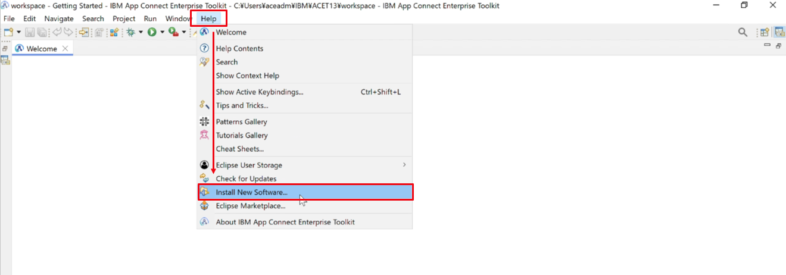

③ 「Add」をクリックし、リポジトリーの名前に「Language Packs」と入力します。

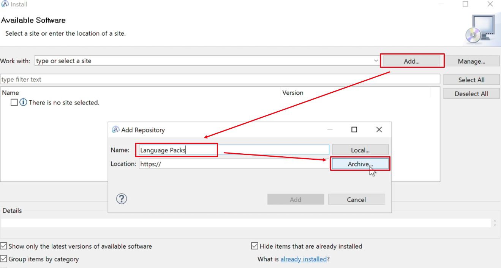

④ 「Archive」からダウンロードしたZIPファイルを選択して、「開く」をクリックし、「Add」で追加します。

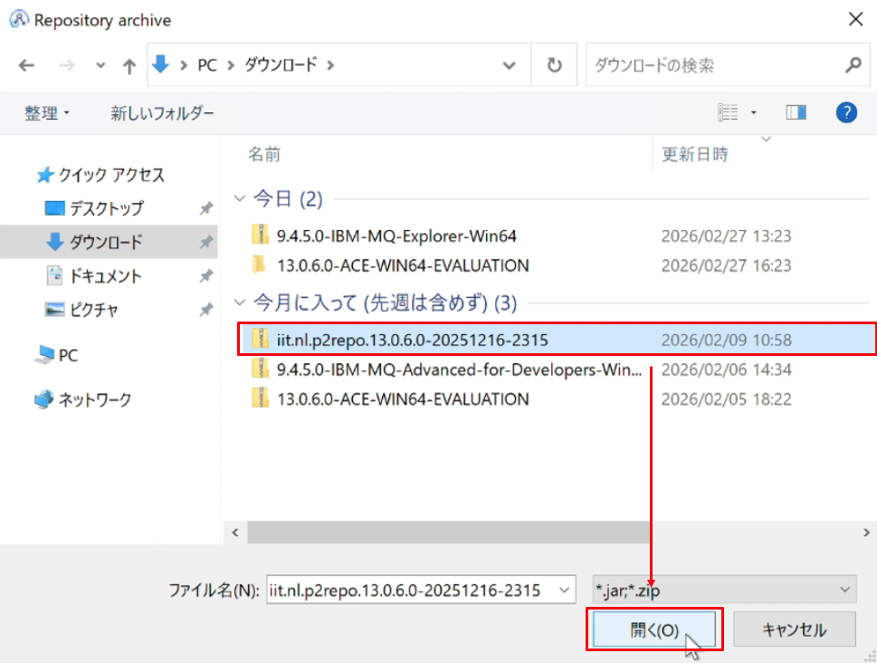

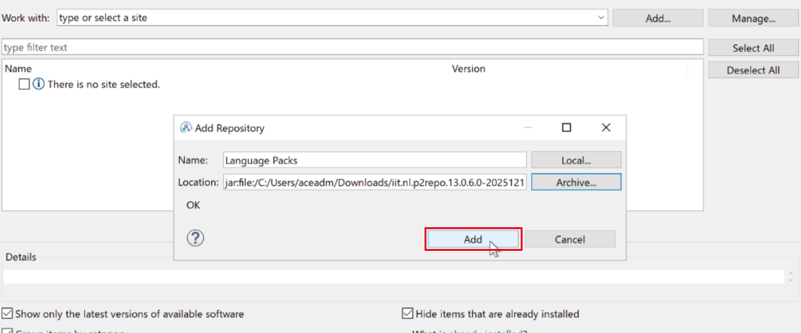

⑤ "IBM App Connect Enterprise Toolkit Language Pack"にチェックを入れ、「Next」をクリックします。

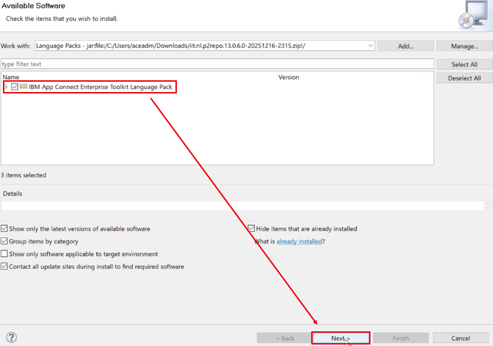

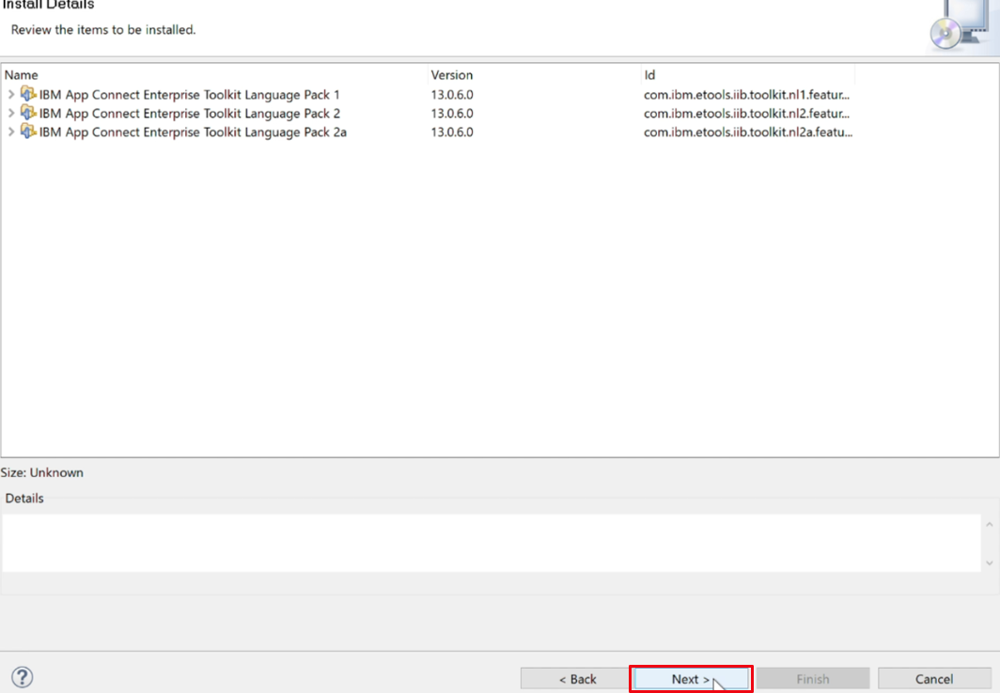

⑥ ライセンスに同意して「Finish」をクリックすると、インストールが開始されます。(インストールには5分ほどかかります)

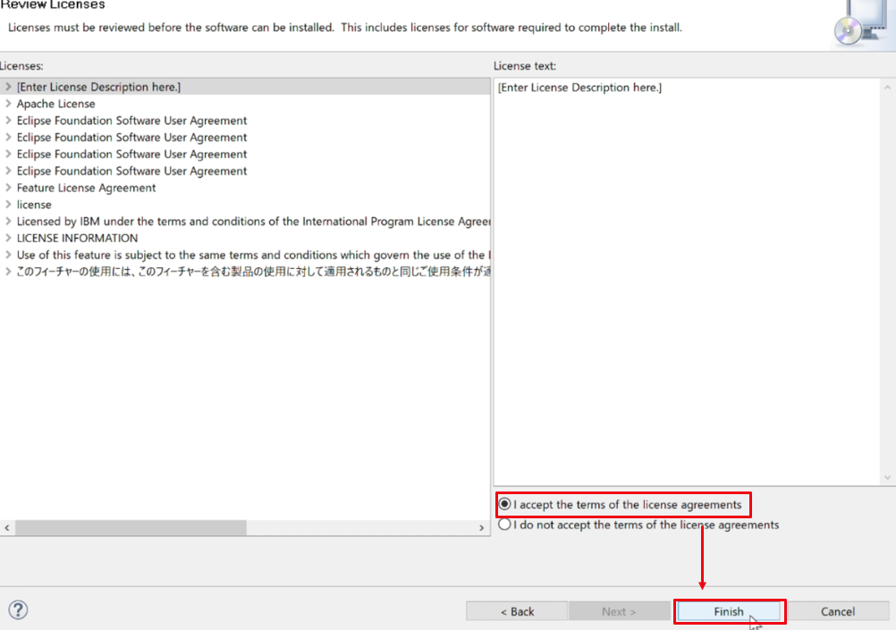

- インストールの状況はToolkit内右下のインストールバーにて確認できます。

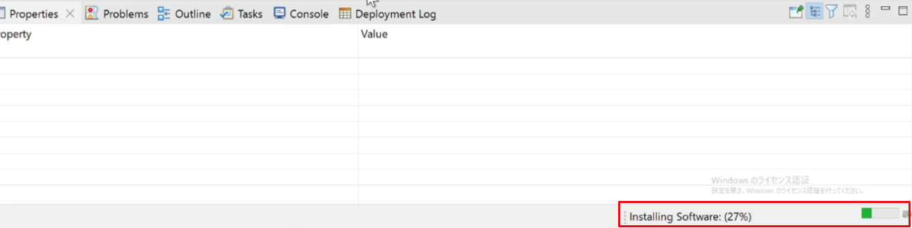

- インストール中に表示されるポップアップに「Select All」ですべてにチェックを入れ、「Trust Selected」をクリックします。

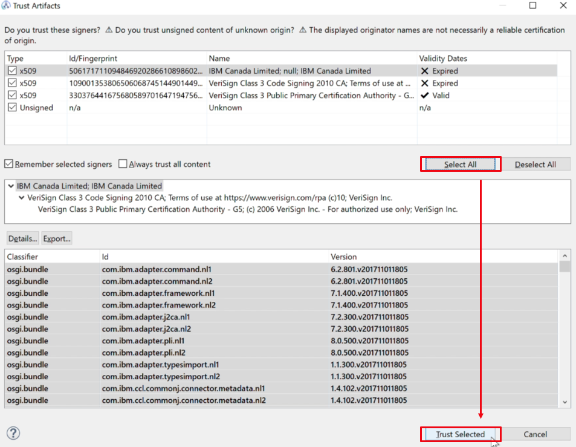

⑦ インストール終了後に表示されるポップアップで「Restart Now」をクリックします。

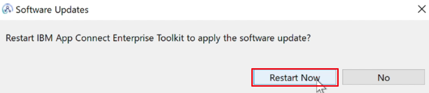

⑧ 再起動後、Toolkitが日本語表示になっていることを確認します。

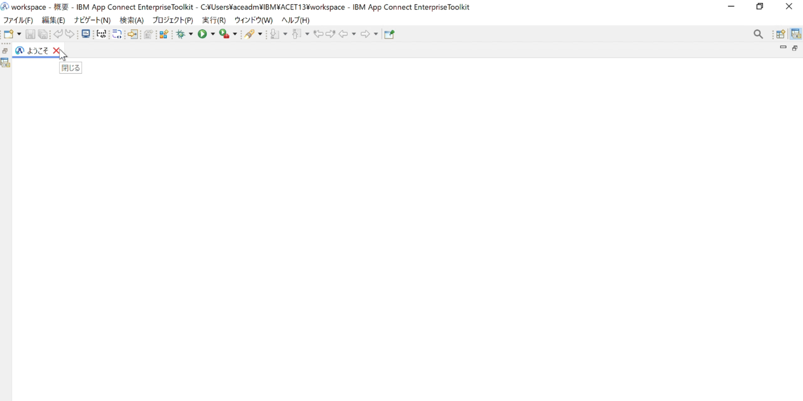

以上となります。
   

> 関連情報：
>
> [IBM App Connect Enterprise Toolkit の言語パックのインストール](https://www.ibm.com/docs/ja/app-connect/13.0.x?topic=software-installing-language-packs-app-connect-enterprise-toolkit)
