# PostgreSQL Server のインストール手順

① インストール用ファイルを準備します。
本ハンズオン演習の準備では、PostgreSQL Server 15.x をデータベースに使用します。
[公式サイト](https://www.postgresql.org/download/)からWindows用のインストーラーをダウンロードします。

② ダウンロードした「postgresql-15.x-x-windows-x64.exe」ファイルを右クリックしてメニューを開き、「管理者として実行」を選択します。「Setup」のウィザードが開きます。「Next」をクリックします。

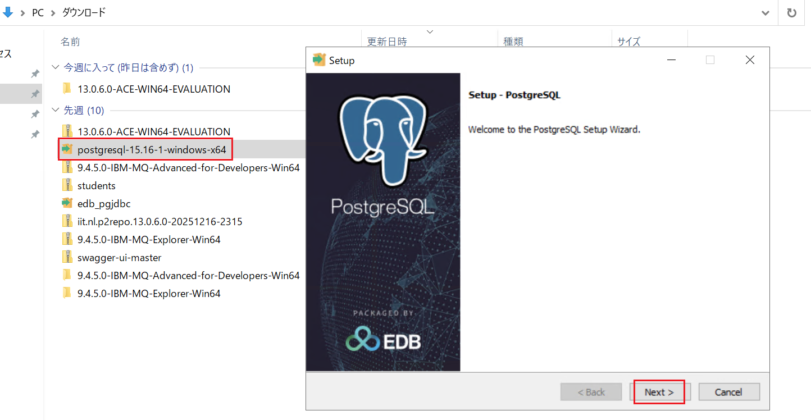

③ インストール先ディレクトリはデフォルトのまま「Next」をクリックします。

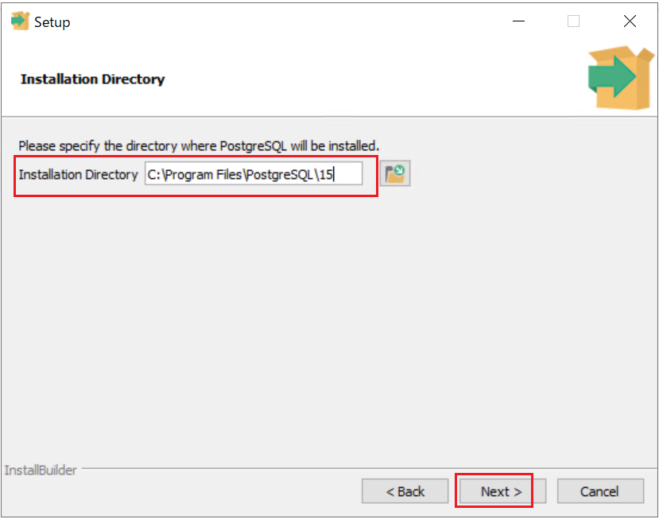

④ 「コンポーネントの選択」ダイアログではデフォルトのまま「Next」をクリックします。

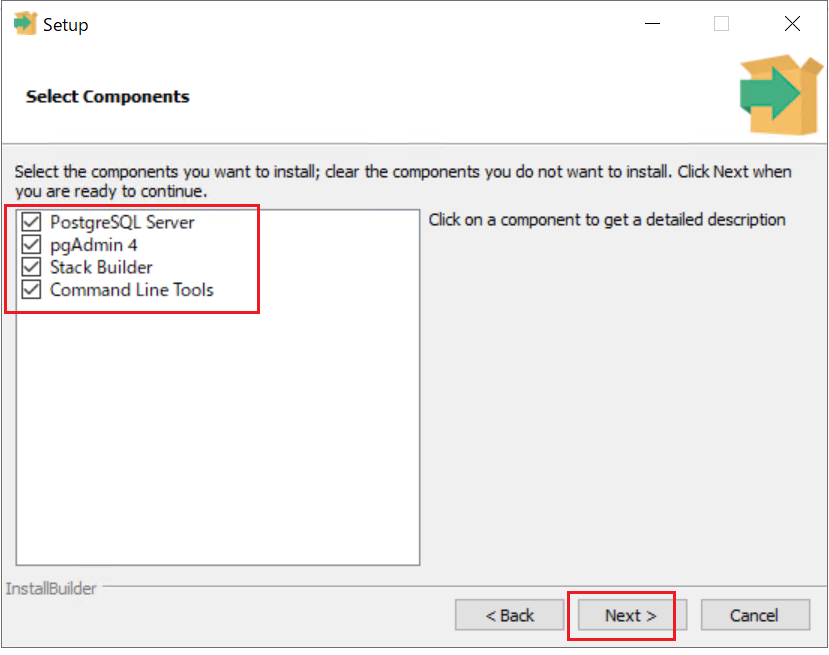

⑤ データディレクトリはデフォルトのまま「Next」をクリックします。

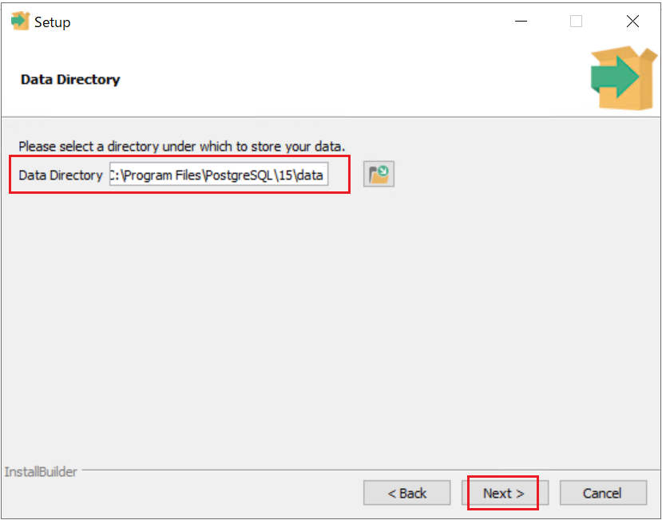

⑥ ダイアログに表示されているとおり、データベースのスーパーユーザー名は「postgres」です。パスワードは「(パスワード)」に設定し、「Next」をクリックします。

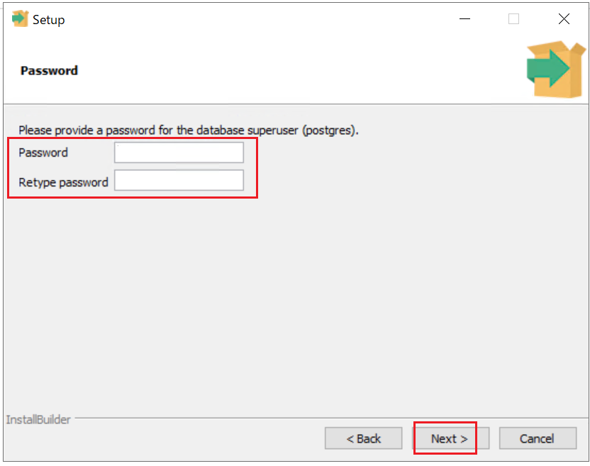

⑦ ポート番号はデフォルトのまま「Next」をクリックします。

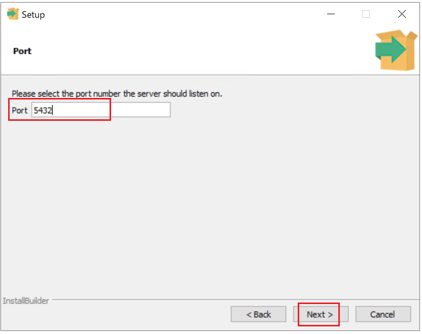

⑧ ロケールは DEFAULT のまま「Next」をクリックします。

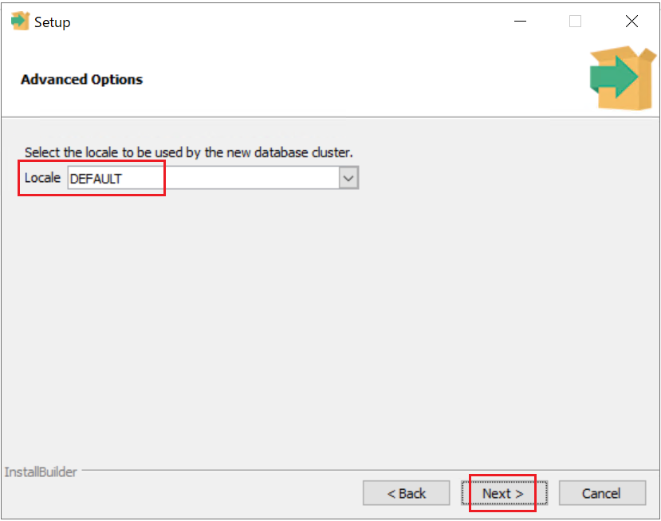

⑨ プリインストールサマリーの内容を確認し「Next」をクリックします。

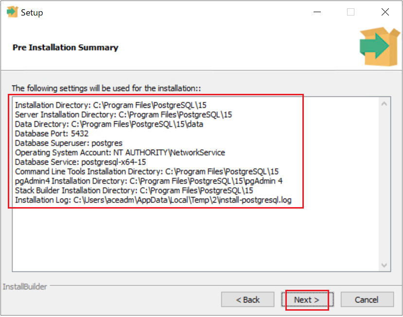

⑩ 「Ready to Install」ダイアログで「Next」をクリックします。

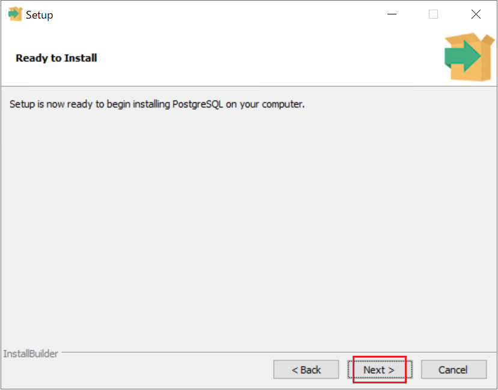

⑪ インストールが完了したら 「Finish」 をクリックします。

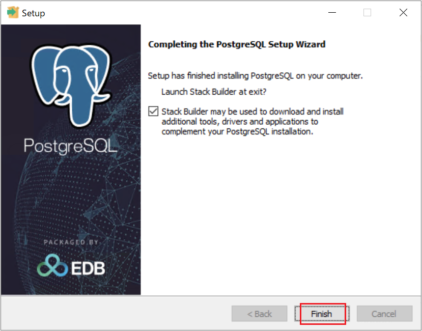

> [!NOTE]
>
> IBM ACE ツールキットからデータベースに接続するためには、JDBC ドライバーを別途ダウンロードする必要があります。
> JDBC ドライバーのダウンロードには 「Stack Builder」 を使用します。インストール完了画面で表示されるチェックボックスをオンにすると、Stack Builder を起動できます。

⑫ PostgreSQLが導入されたことを確認します。  
 　フォルダー：PostgreSQL 15

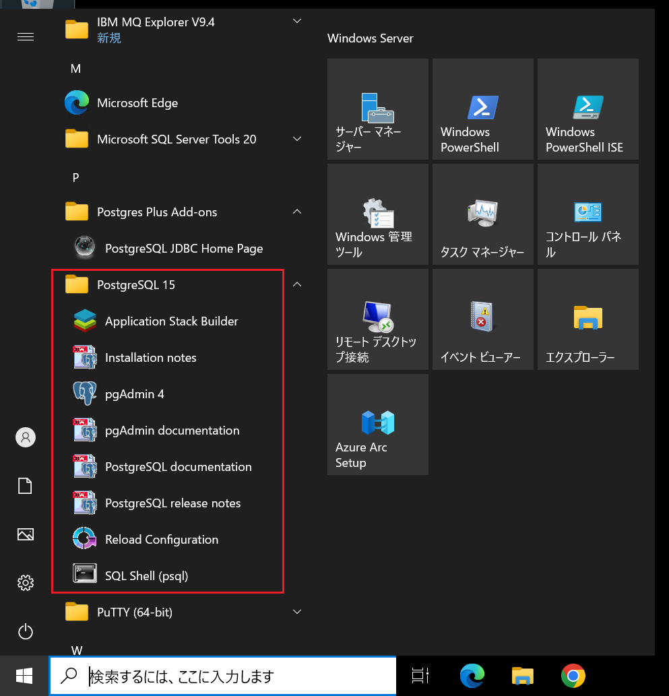

以上となります。
