# PostgreSQL JDBCドライバーのインストール手順

① PostgreSQLの「スタックビルダ」ダイアログが起動していない場合には起動します。

- 「スタート・ボタン」 →「PostgreSQL 15」→「Application Stack Builder」を選択します。

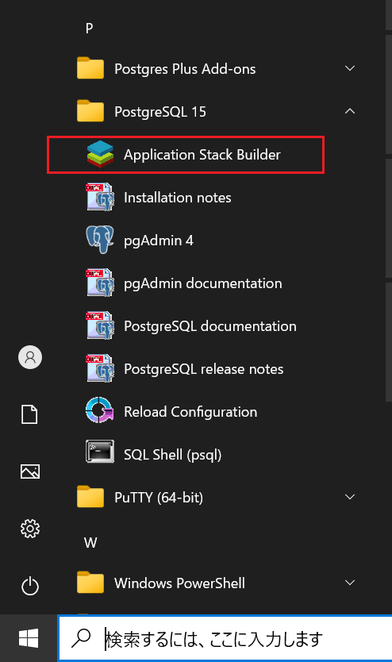

② 「スタックビルダ」のウィザードが開きます。ドロップダウンリストからインストールした「PostgreSQL 15」を選択し、「次へ」をクリックします。

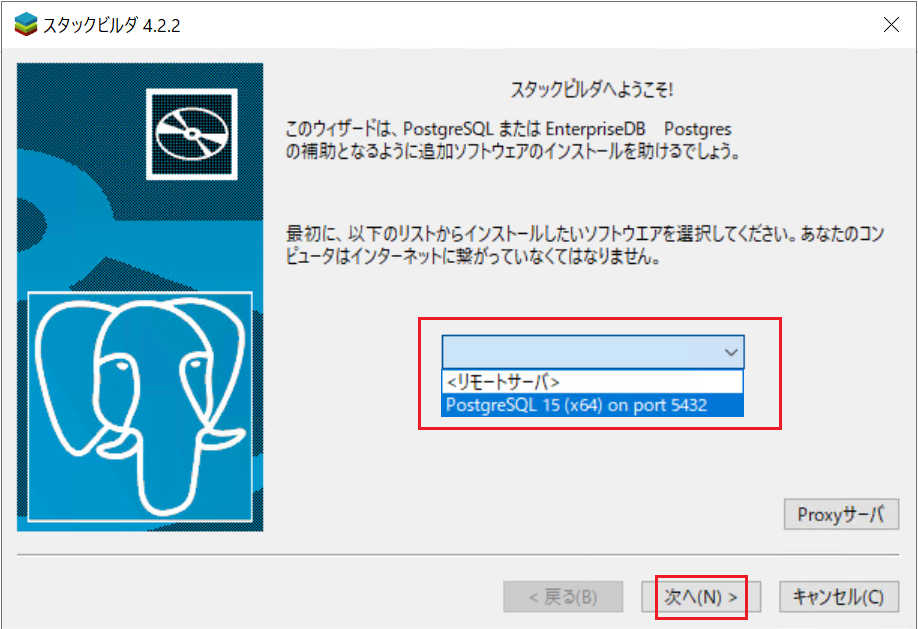

③ 「Database Drivers」→「pgJDBCv42.7.2-1」を選択し「次へ」をクリックします。

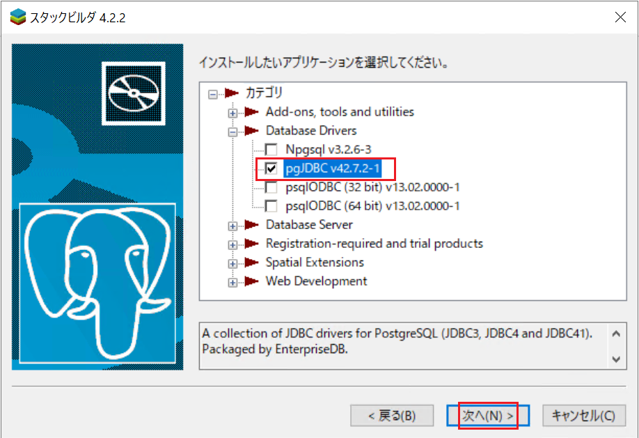

④ ダウンロードディレクトリはデフォルトのままにして、「次へ」をクリックします。

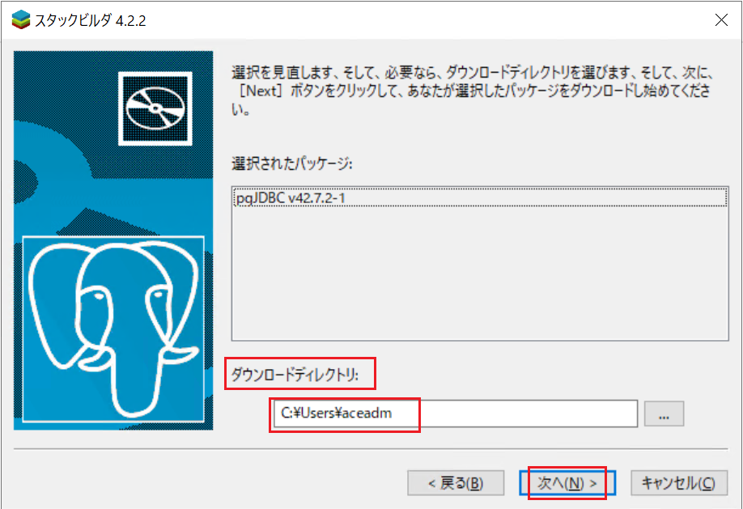

⑤ ダウンロード先ディレクトリに、「edb_pgjdbc」というファイル名のドライバーが正常にダウンロードできたことを確認します

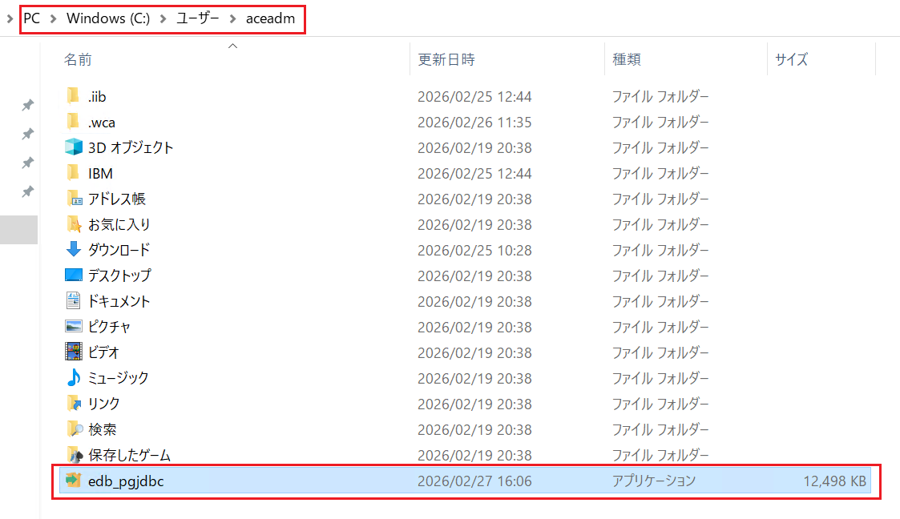

⑥ 「次へ」をクリックしてインストールを開始します。

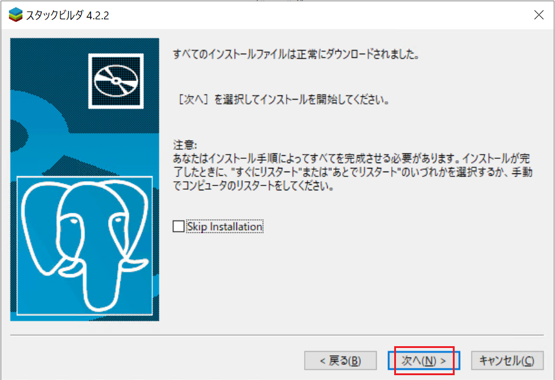

⑦ 「Setup pgJDBC」ウィザードが開きます。「Next」をクリックします。

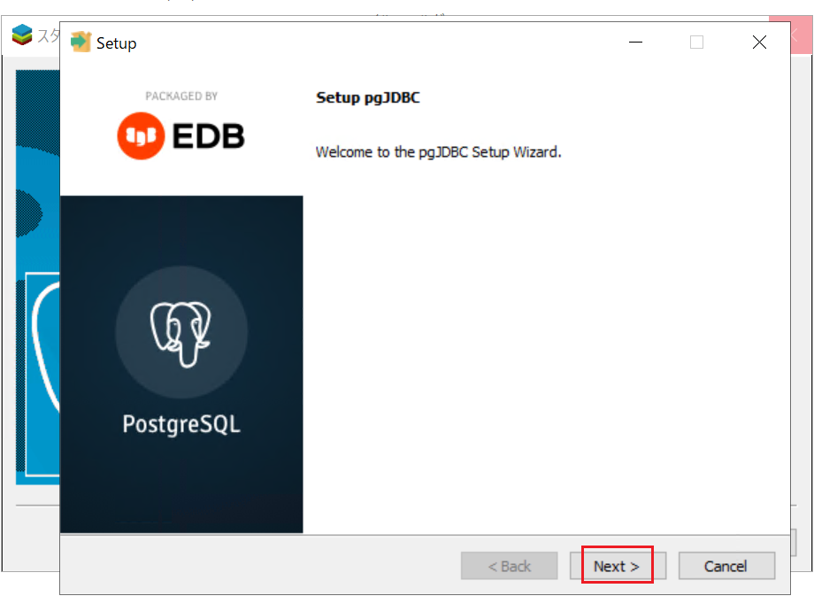

⑧ インストール先ディレクトリはデフォルトのままにし「Next」をクリックします。

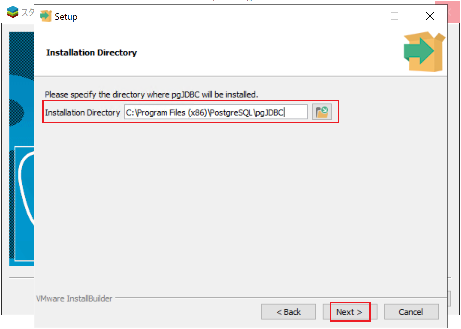

⑨ 「Next」をクリックします。

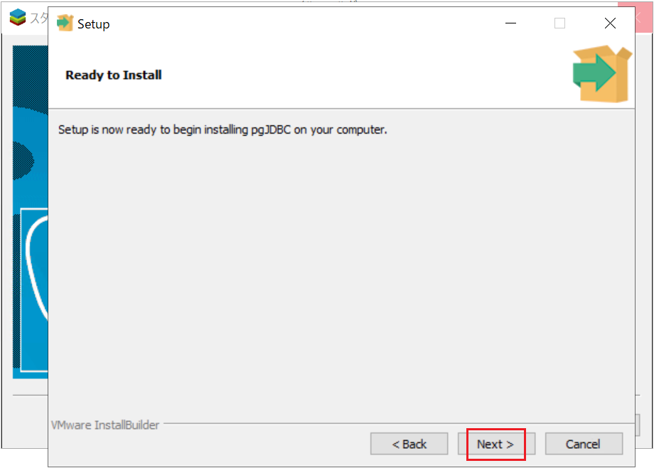

⑩ インストールが完了したら、「Finish」をクリックします。

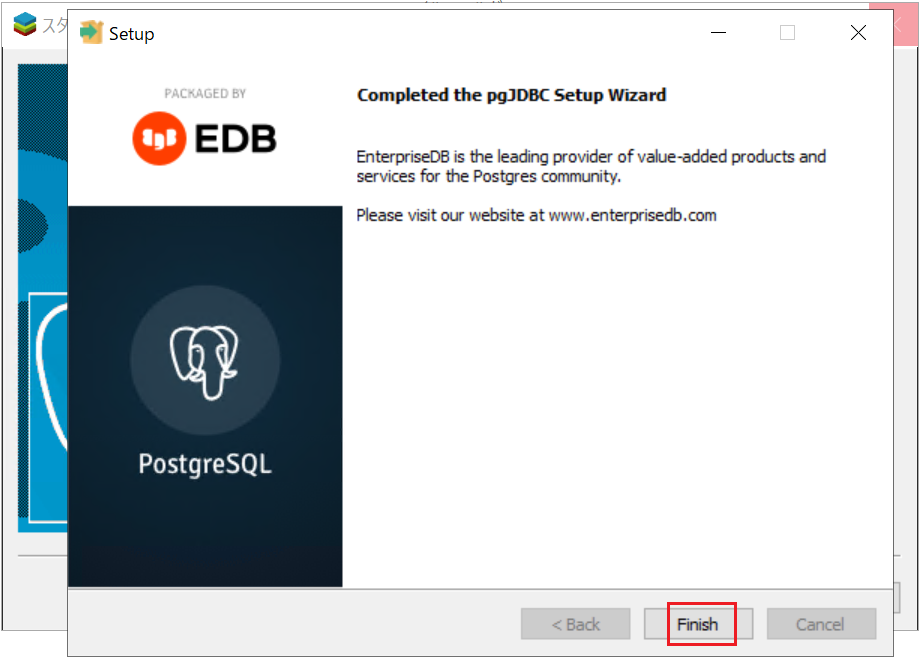

⑪　「終了」をクリックし、スタックビルダを終了します。

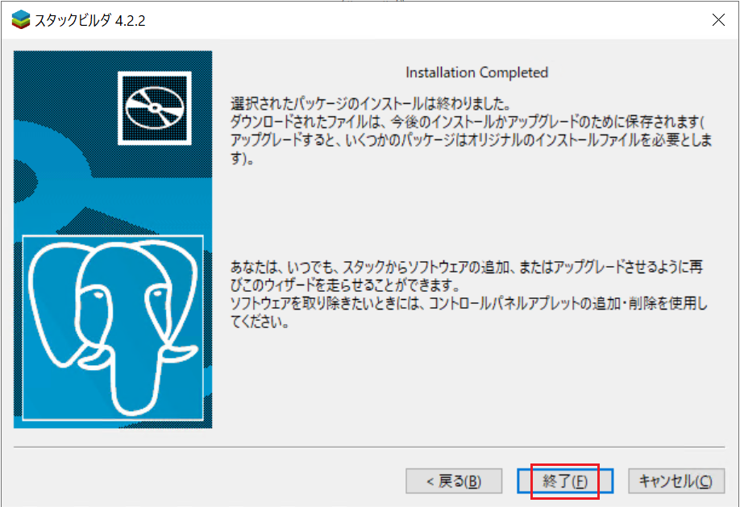

⑫ インストール先ディレクトリに「postgresql-42.7.2.jar」ファイルがあることを確認します。

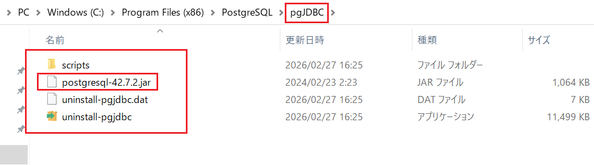

⑬ 続いて、ACE ツールキットに PostgreSQL 用の JDBC ドライバーを設定します。

- ツールキットが起動していない場合には起動します。
- 「スタート・ボタン」→「IBM App Connect Enterprise 13.0.6.0 Evaluation Edition」→「IBM App Connect Enterprise Toolkit 13.0.6.0」を選択します。
- ウィンドウ → 設定 をクリックします。

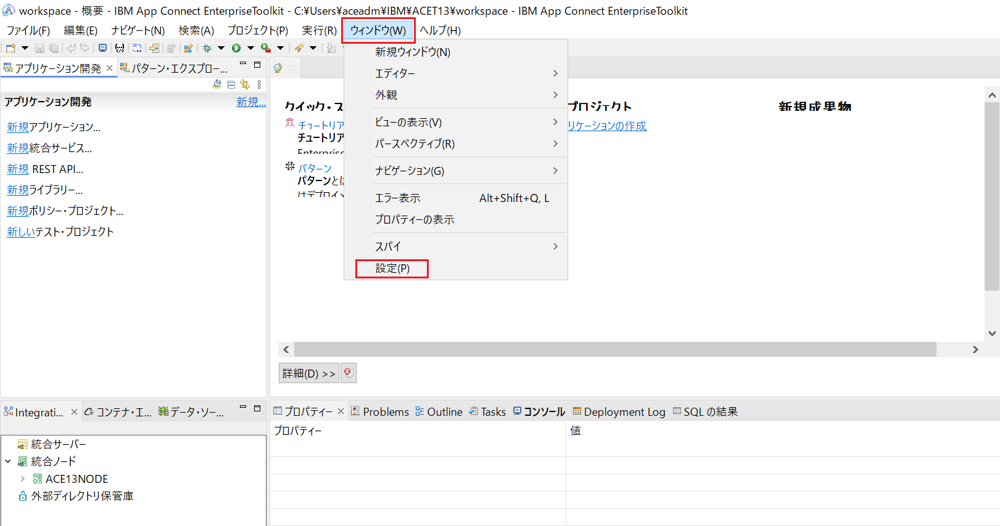

⑭ 「ドライバー」で検索して、「ドライバー定義」を選択します。

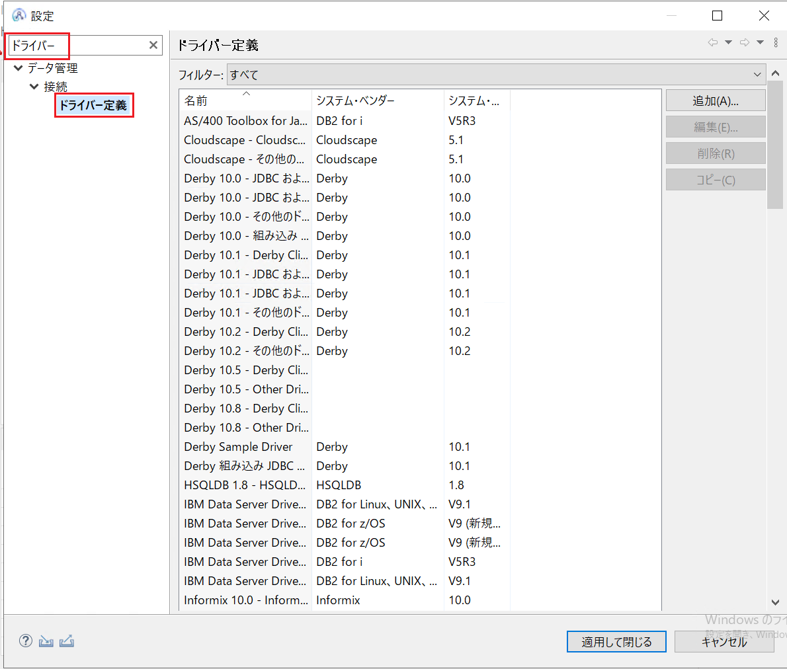

⑮ フィルターで「汎用 JDBC」を選択し、「汎用 JDBC 1.0」をクリックして「編集」をクリックします。

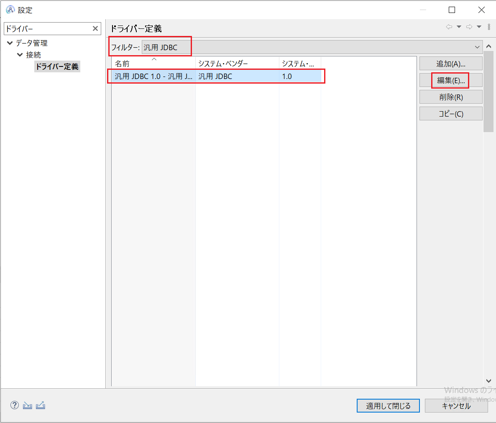

⑯ 「JARリスト」にPostgreSQLのjarを追加します。

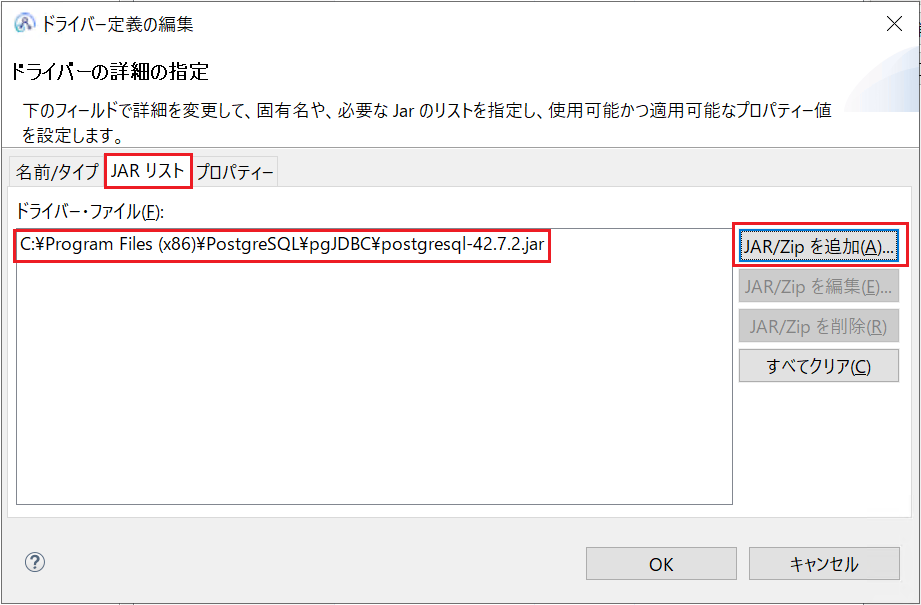

⑰ 「プロパティー」の「ドライバー・クラス」が空になっているので、右側の「…」をクリックします。

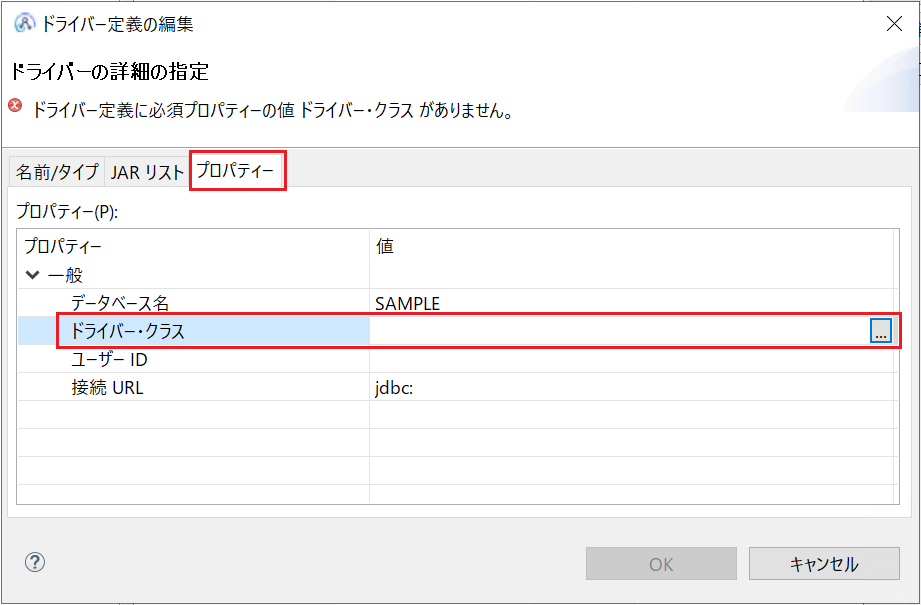

⑱ 「クラスの参照」で「org.postgresql.Driver」を選択し、「OK」をクリックします。

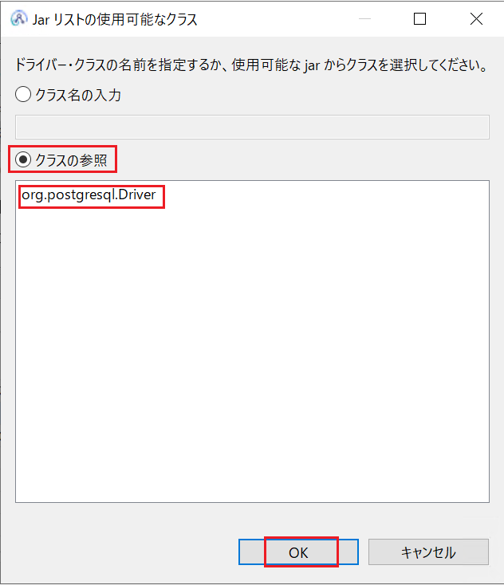

 「OK」→「適用して閉じる」をクリックして、ドライバー定義の編集を終了します。

以上となります。

