# データの作成

① PostgreSQLサーバー上にデータベースを作成します。スタートメニューを開き、検索ボックスに「pgAdmin 4」と入力します。検索結果に表示された pgAdmin 4 をクリックして起動します。

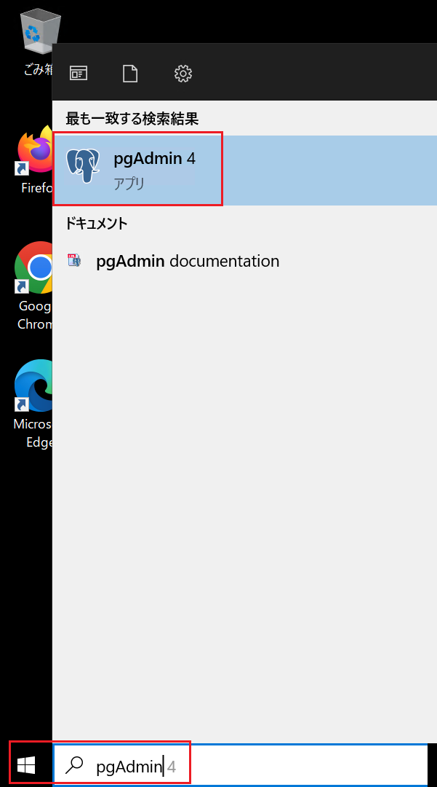

② 「Browser」ペインで Servers を展開します。ポップアップ画面でパスワードを入力し、サーバーに接続します。

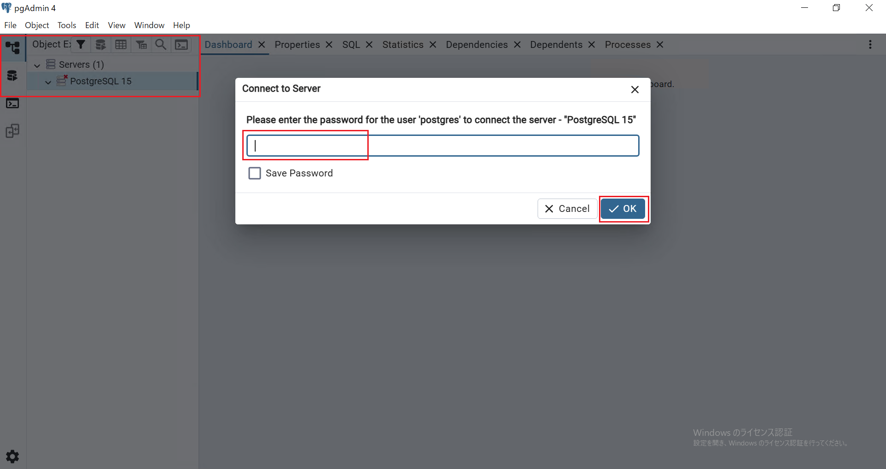

③ 「Databases」を展開します。

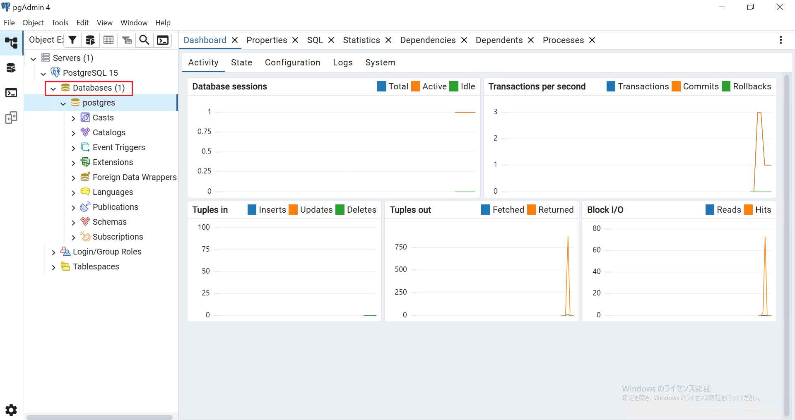

④ 「Databases」 を右クリックし、「Create」 → 「Database…」 を選択します。

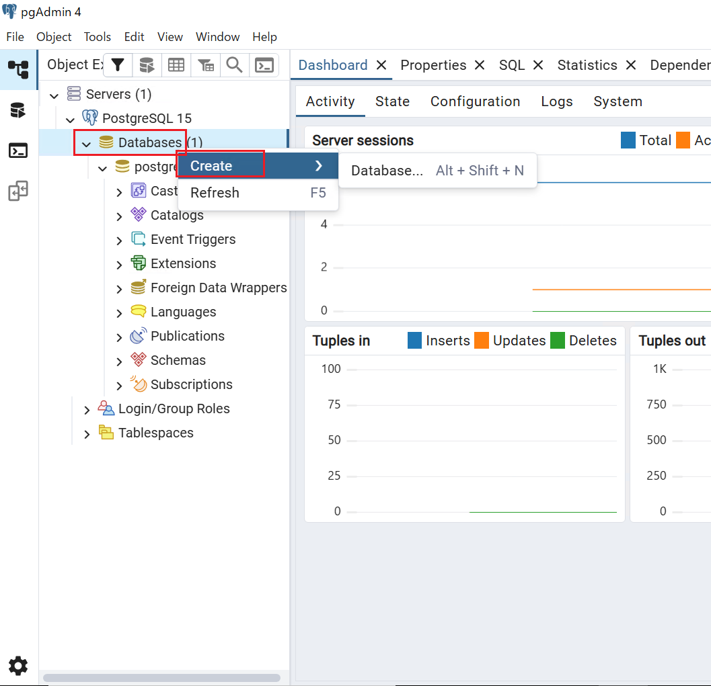

⑤ 「Database」欄に「mydb」と入力します。「Owner」はpostgres のまま、「Save」 を選択します。

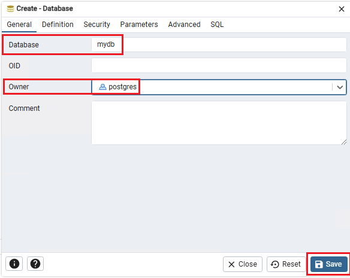

⑥ Databases 配下に mydb が作成されていることを確認します。

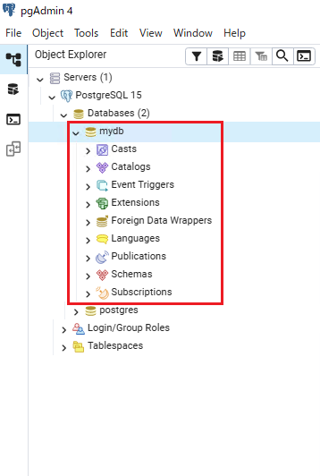

⑦ 次に演習で利用するデータベースのテーブルの構成とデータの投入を行います。mydb を右クリックし、Query Tool（クエリツール） を選択します。

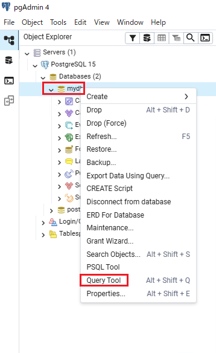

⑧ SQL を実行するためのエディタが開きます。

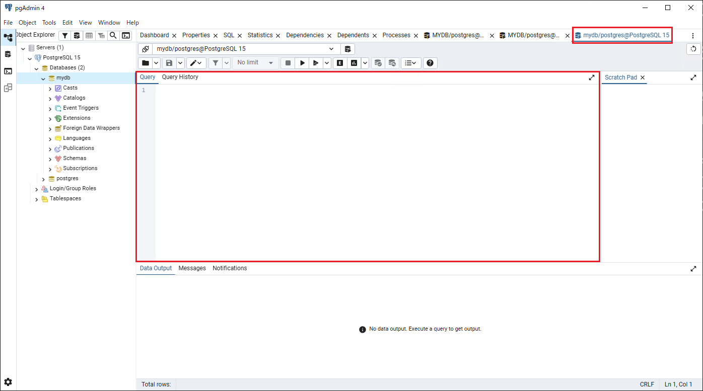

⑨ 次の DDL をクエリツールに貼り付けます。実行（▶）をクリックします。

```sql
CREATE SCHEMA myschema;

CREATE TABLE myschema.aftersales (
    sonum    CHAR(5) NOT NULL,
    customer CHAR(5),
    year     CHAR(4),
    month    CHAR(2),
    day      CHAR(2)
);

CREATE TABLE myschema.beforesales (
    sonum    CHAR(5) NOT NULL,
    customer CHAR(5),
    gendate  DATE
);

CREATE TABLE myschema.codemaster (
    beforecode CHAR(5) NOT NULL,
    aftercode  CHAR(5)
);

ALTER TABLE myschema.aftersales
  ADD CONSTRAINT aftersales_pk PRIMARY KEY (sonum);

ALTER TABLE myschema.beforesales
  ADD CONSTRAINT beforesales_pk PRIMARY KEY (sonum);

ALTER TABLE myschema.codemaster
  ADD CONSTRAINT codemaster_pk PRIMARY KEY (beforecode);
```

「Query returned successfully」 と表示されることを確認します。

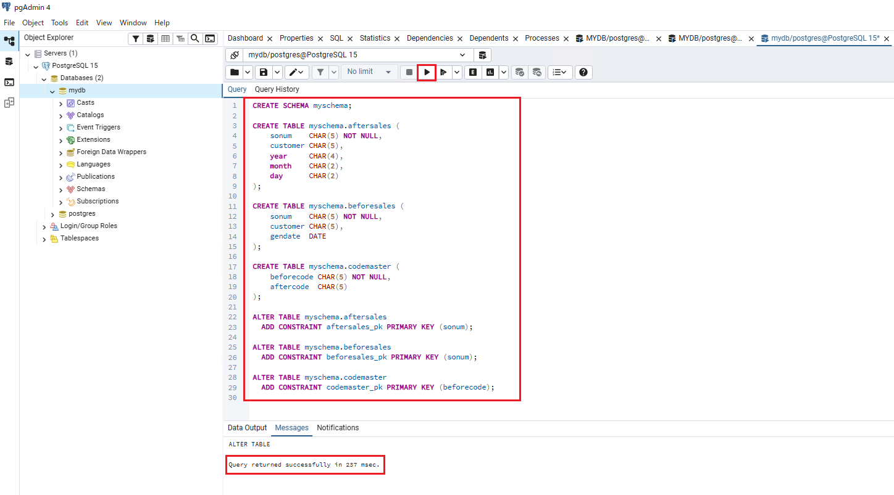

⑪ mydb を右クリック → Refresh（更新） してテーブルを確認します。

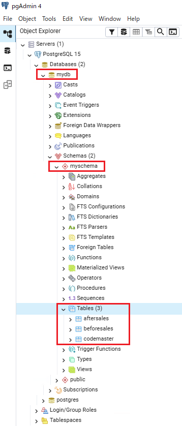

⑫ 次に、以下の DML 文を pgAdmin 4 のクエリツールに貼り付けて実行します。

BEFORESALES データ

```sql
INSERT INTO myschema.beforesales (sonum, customer, gendate) VALUES ('0001', 'AAA', '2012-04-01');
INSERT INTO myschema.beforesales (sonum, customer, gendate) VALUES ('0005', 'BBB', '2012-04-03');
INSERT INTO myschema.beforesales (sonum, customer, gendate) VALUES ('0006', 'CCC', '2012-05-03');
INSERT INTO myschema.beforesales (sonum, customer, gendate) VALUES ('0099', 'DDD', '2013-01-01');
```

CODEMASTER データ

```sql
INSERT INTO myschema.codemaster (beforecode, aftercode) VALUES ('A001', '001');
INSERT INTO myschema.codemaster (beforecode, aftercode) VALUES ('A002', '002');
INSERT INTO myschema.codemaster (beforecode, aftercode) VALUES ('A003', '003');
INSERT INTO myschema.codemaster (beforecode, aftercode) VALUES ('A011', '011');
INSERT INTO myschema.codemaster (beforecode, aftercode) VALUES ('A012', '012');
```

「Query returned successfully」と表示されことを確認します。

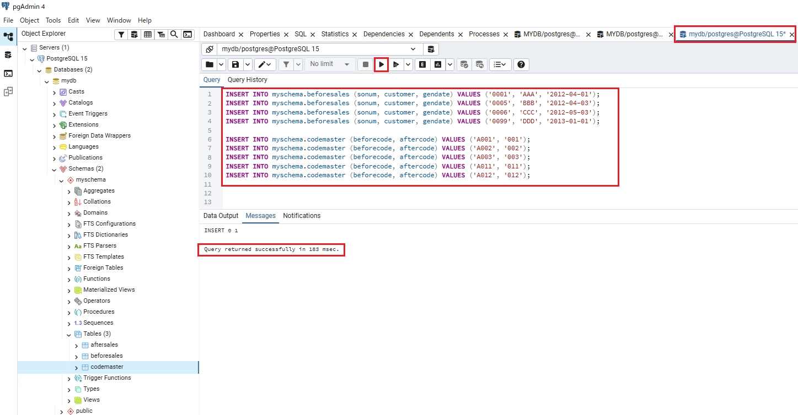

⑬ SELECT文を実行して、データが正しく挿入されたことを確認します。

```SQL
SELECT * FROM myschema.beforesales;
```
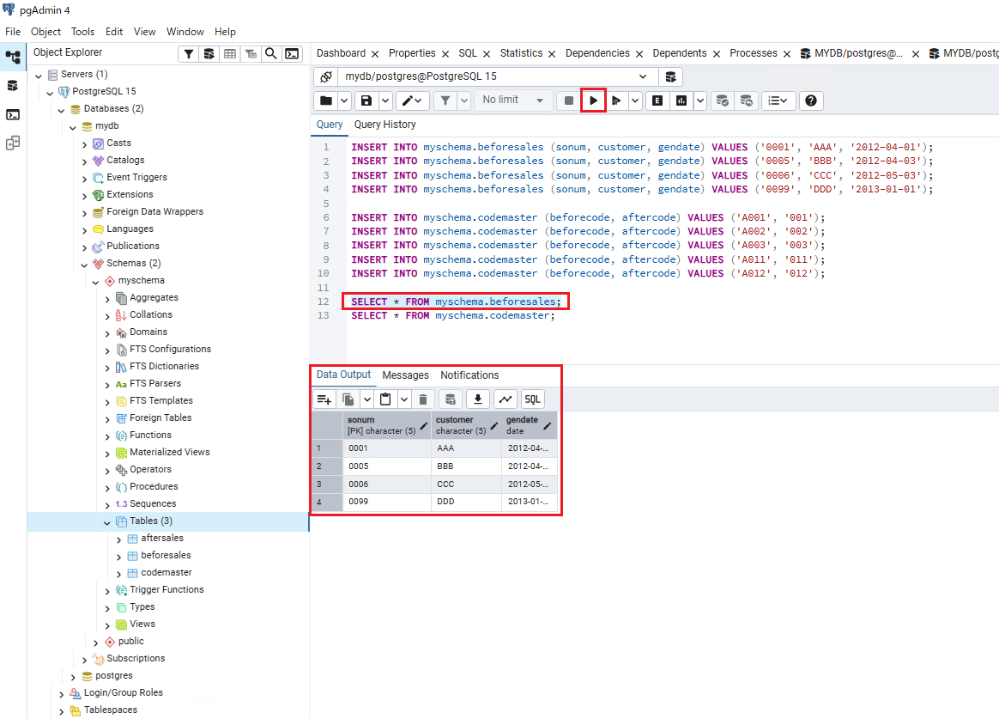

```SQL
SELECT * FROM myschema.codemaster;
```

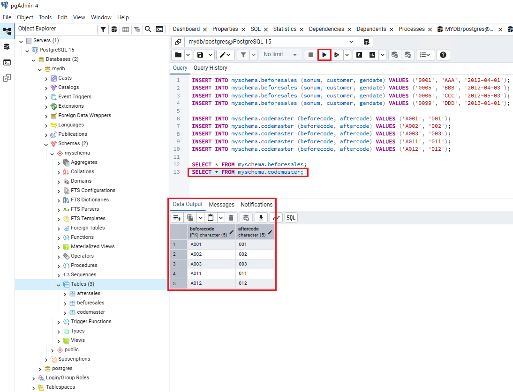

以上となります。


