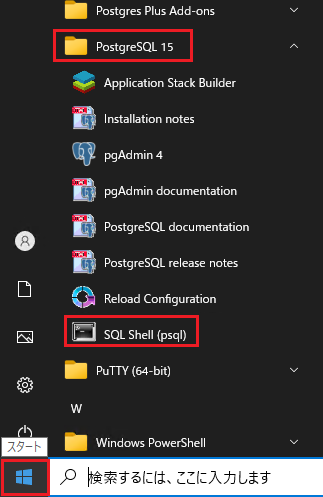
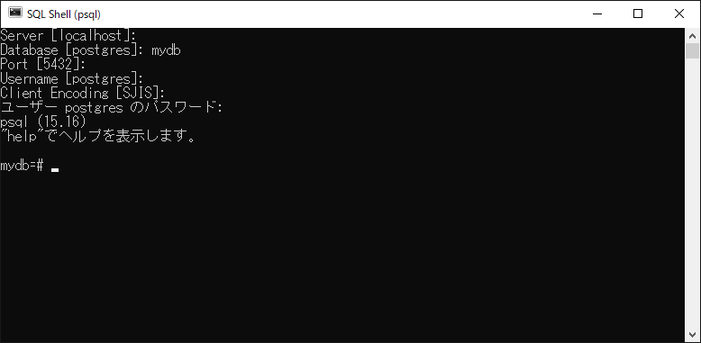
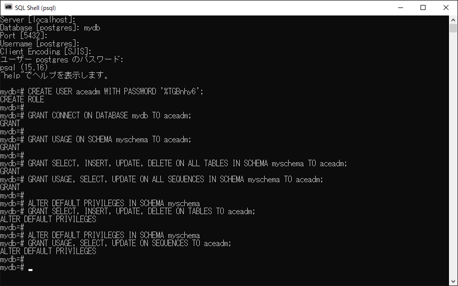
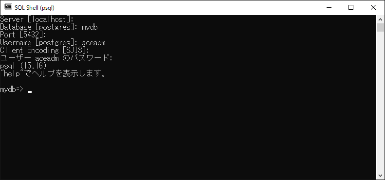

# PostgreSQL に aceadm ユーザーを作成する手順

本手順では、IBM App Connect Enterprise（ACE）が PostgreSQL データベース「mydb」にアクセスするために必要となる PostgreSQL ユーザー 「aceadm」 を作成し、適切な権限を付与します。

① SQL Shell (psql) を開きます。

スタートメニューを開く　➝　「PostgreSQL 15」　➝　「SQL Shell (psql)」 をクリックします。



② PSQLでは、データベースへ接続するために以下のような入力プロンプトが表示されます。

```CMD
Server [localhost]:
Database [postgres]:
Port [5432]:
Username [postgres]:
Client Encoding [SJIS]:
ユーザー postgres のパスワード:
```
各項目は次のように入力します。

| 項目               | 入力内容  |
| :--------------------- | :-------- |
| Server [localhost] | Enterキー押します |
| Database [postgres] | mydb |
| Port [5432]: | Enterキー押します |
| Username [postgres] | Enterキー押します |
| Client Encoding [SJIS] | Enterキー押します |
| ユーザー postgres のパスワード | %TGBnhy6 |

ログイン成功後：

```CMD
psql (15.16)
"help"でヘルプを表示します。

mydb=#
```



③ psql にて次のコマンドを実行します。

> [!NOTE]
> **注意**  
> Windows のローカルユーザー *aceadm* と PostgreSQL 内の *aceadm* ユーザーは、同じ名前を使っていますが まったく別のアカウントです。  
> ACE がデータベースに接続するためには、PostgreSQL 側にもユーザーを作成する必要があります。   
> なお、PostgreSQL のユーザー名は Windows ユーザー名と同じである必要はありません。

> [!NOTE]
>  
> PostgreSQL では、**'（シングルクォート）** は文字列リテラル（パスワードなど）、**"（ダブルクォート）** は識別子（スキーマ名・テーブル名など）を表すため、用途に応じて使い分ける必要があります


- 「aceadm」 PostgreSQL ユーザーを作成します。
```SQL
CREATE USER aceadm WITH PASSWORD '%TGBnhy6';
```

- データベース「mydb」に接続権限を付与します。
```SQL
GRANT CONNECT ON DATABASE mydb TO aceadm;
```

- スキーマ 「myschema」 の使用権限を付与します。
```SQL
GRANT USAGE ON SCHEMA myschema TO aceadm;
```

- myschema 内の既存テーブルへの権限を付与します。
```SQL
GRANT SELECT, INSERT, UPDATE, DELETE ON ALL TABLES IN SCHEMA myschema TO aceadm;
```

- myschema 内のシーケンスへの権限を付与します。
```SQL
GRANT USAGE, SELECT, UPDATE ON ALL SEQUENCES IN SCHEMA myschema TO aceadm;
```

- myschema に将来作成されるテーブルへのデフォルト権限を設定します。
```SQL
ALTER DEFAULT PRIVILEGES IN SCHEMA myschema
GRANT SELECT, INSERT, UPDATE, DELETE ON TABLES TO aceadm;
```

- myschema に将来作成されるシーケンスへのデフォルト権限を設定します。
```SQL
ALTER DEFAULT PRIVILEGES IN SCHEMA myschema
GRANT USAGE, SELECT, UPDATE ON SEQUENCES TO aceadm;
```



⑤ 次に、aceadm ユーザーでデータベースにログインします。

一度 SQL Shell（psql）を終了し、再度起動してから、ステップ②と同じ手順で「Username」と「Password」に aceadm のユーザー名とパスワードを入力します。



ログインできたことを確認します。

以上となります。


