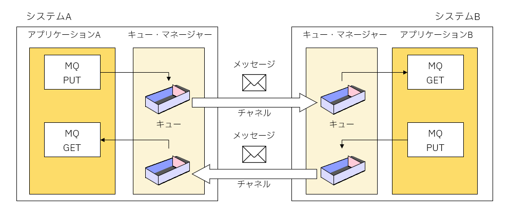
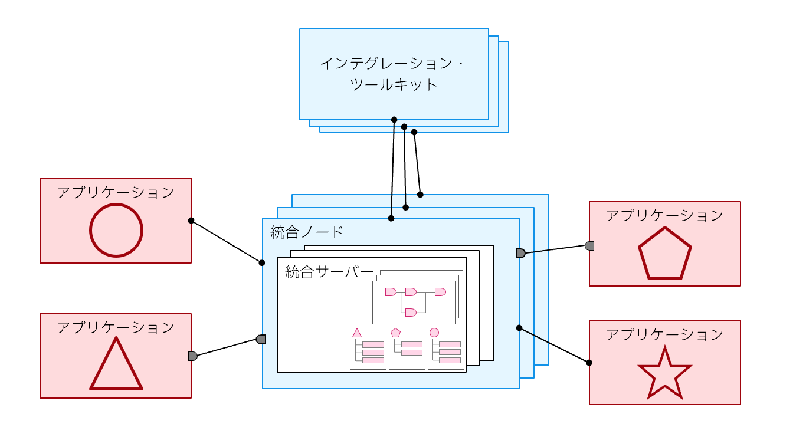
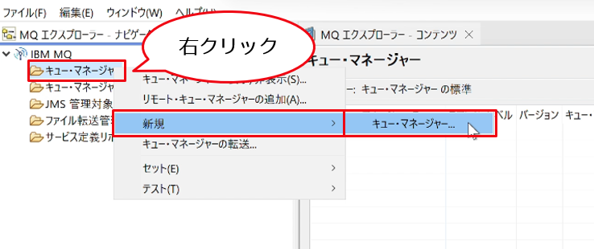
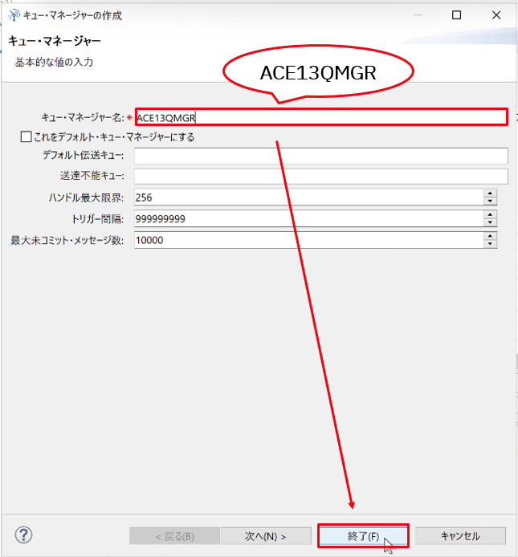
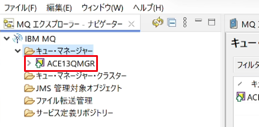

# 演習 1 MQ, ACEの基礎と環境確認・セットアップ

**演習の目的：**  
この演習では、IBM MQおよびACEの基礎を学習し、演習環境の確認とセットアップ作業を行います。

<a id="ex0"></a>

## 目次

- [1.1 IBM MQの概要](#ex1.1)
- [1.2 ACEの概要](#ex1.2)
- [1.3 MQ/ACE環境のセットアップ](#ex1.3)

<a id="ex1.1"></a>

## 1.1 IBM MQの概要



### 1.1.1 IBM MQの構成要素

> **キュー・マネージャー**  
> &nbsp;&nbsp;&nbsp;&nbsp;IBM MQのサービスを提供するプロセスで、キューやチャネルなどのMQオブジェクトの管理を行います。

> **キュー**  
> &nbsp;&nbsp;&nbsp;&nbsp;メッセージを保持する論理的な箱を提供します。

> **メッセージ**  
> &nbsp;&nbsp;&nbsp;&nbsp;キューを介してプログラム間で渡されるデータです。

> **メッセージ･チャネル**  
> &nbsp;&nbsp;&nbsp;&nbsp;キュー・マネージャー間のコミュニケーション･リンクです。

[戻る](#ex0)
<a id="ex1.2"></a>

## 1.2 ACEの概要



### 1.2.1 IBM App Connect Enterpriseの構成コンポーネント

> **統合サーバー（必須）**  
> &nbsp;&nbsp;&nbsp;&nbsp;ツールキット上で開発した処理定義の実行環境を提供します。

> **統合ノード**  
> &nbsp;&nbsp;&nbsp;&nbsp;統合サーバを管理する機能を提供します。

> **インテグレーション・ツールキット**（開発/テスト環境で必須）  
> &nbsp;&nbsp;&nbsp;&nbsp;ACEで実行する処理を開発するためのGUIツールを提供します。

[戻る](#ex0)
<a id="ex1.3"></a>

## 1.3 MQ/ ACE環境のセットアップ

ACEのコンポーネントや演習に必要となるオブジェクトと、ACEの開発環境および実行環境を確認します。

### 1.3.1 セキュリティの確認

ACEの管理ユーザー「aceadm」に適切な権限が付与されていることを確認します。

① 演習用マシンにユーザー名「aceadm」、パスワード「%TGBnhy6」でログオンしてください。

② 「スタート」→「Windows 管理ツール」→「コンピュータの管理」を開きます。　

③ 「ローカル ユーザーとグループ」を展開し、「ユーザー」をクリックします。

④ 「aceadm｣ をダブルクリックします。

⑤ 「所属するグループ」タブで以下のグループに属していることを確認します。

- Administrators　（管理者グループ）
- mqbrkrs （ACE管理グループ）
- mqm（MQ管理グループ）

⑥ 「OK」を押し、画面を閉じます。

### 1.3.2 演習環境の情報

今回の演習環境には、演習に必要なキュー・マネージャーと統合ノードの定義を作成します。

- キュー・マネージャー情報：

| 構成要素               | 構成情報  |
| :--------------------- | :-------- |
| キュー・マネージャー名 | ACE13QMGR |

- ACE情報：

| コンポーネント種別 | コンポーネント名 | 構成情報                        |
| :----------------- | :--------------- | :------------------------------ |
| 統合ノード         | ACE13NODE        | キュー・マネージャー：ACE13QMGR |
| 統合サーバー       | ACE13SERVER      |

### 1.3.3 キュー・マネージャーの作成

今回の演習で利用するMQキュー・マネージャーを作成します。

① 「スタート」→「IBM MQ Explorer V9.4」→「IBM MQ Explorer」を選択して、MQエクスプローラーを起動します。

② 「MQエクスプローラー・ナビゲーター」ビューより「キュー・マネージャー」を右クリックし、「新規」→「キュー・マネージャー」の順に選択します。



③ キュー・マネージャーの作成ウィザードの「キュー・マネージャー名」に“ACE13QMGR”を入力して「終了」をクリックします。



④ キュー・マネージャーが作成されていることを確認します。



### 1.3.4 統合ノードの作成

次に演習で利用するACEのランタイムである統合ノードを作成します。

① ACEコンソールを起動します。

「スタート」→「IBM App Connect Enterprise 13.0.6.0 Evaluation Edition」→「IBM App Connect Enterprise Console 13.0.6.0」を選択します。

② コンソールにて以下のコマンドを入力します。

<blockquote>

- キュー・マネージャー`ACE13QMGR`を関連付けた統合ノード`ACE13NODE`を作成
  ```
  mqsicreatebroker ACE13NODE –q ACE13QMGR
  ```
- 作成した`ACE13NODE`を開始
  ```
  mqsistart ACE13NODE
  ```
- 統合ノードに新規統合サーバー`ACE13SERVER`を追加
  ```
  mqsicreateexecutiongroup ACE13NODE –e ACE13SERVER
  ```

</blockquote>


③ ACEツールキットを起動します。

スタート・ボタン→「IBM App Connect Enterprise 13.0.x.0」→「IBM App Connect Enterprise Toolkit 13.0.x.0」を選択します（スタートメニューにショートカットも作成されています）。

ワークスペースの選択画面が表示された場合は任意の場所を指定して「OK」をクリックします。<br>デフォルトは`C:\Users\aceadm\IBM\ACET13\workspace`です。

Welcome画面が表示されている場合には「×」ボタンで閉じます。

④ ツールキット左下のIntegration Explorerビュー上に構成した統合ノード、統合サーバーが表示されていることを確認します。


以上で構成の確認とセットアップは完了です。

[戻る](#ex0)

---
