# 演習4. ファイル連携とデータベース・アクセス

**演習の目的：**  
ここでは、ファイルを扱うACEのアプリケーション開発の流れを学習します。

<a id="ex4"></a>

## 目次

- [4.1 シナリオの概要](#ex4.1)
- [4.2 データベースの構成](#ex4.2)
- [4.3 演習用アプリケーションの定義](#ex4.3)
- [4.4 入力用メッセージ・モデルの作成](#ex4.4)
- [4.5 モデルのテスト](#ex4.5)
- [4.6 CSV用メッセージ・モデルの作成](#ex4.6)
- [4.7 メッセージ･フローの作成](#ex4.7)
- [4.8 開発物のデプロイ](#ex4.8)
- [4.9 メッセージ･フローのテスト](#ex4.9)

<a id="ex4.1"></a>

## 4.1 シナリオの概要

この演習ではヘッダー、明細、トレーラーで構成されるファイルからフラットな構造のCSVファイルへの変換を行います。

> **入力ファイル**  
> &nbsp;&nbsp;&nbsp;&nbsp;1つのヘッダーと可変個の明細、トレーラーで構成されたレコード。

> **出力ファイル**  
> &nbsp;&nbsp;&nbsp;&nbsp;フラットなCSV形式。

今回扱うデータ形式はウィザードに従って簡単に作成することができます。

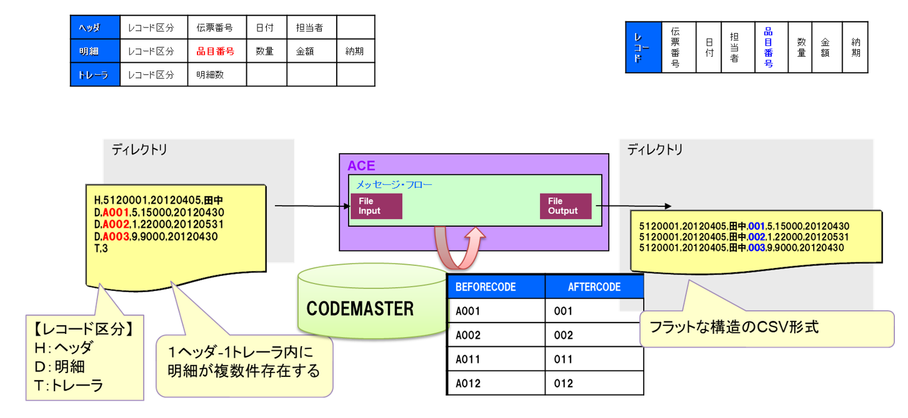

入力ファイルと出力ファイルでは、”品目番号“のID体系が異なるため、マッピング・テーブル（CODEMASTERテーブル）を利用してIDのマッピングを行います。  
メッセージ･フロー内のメッセージ変換にはESQLを利用し、変換処理、およびデータベース・アクセスを行います。

[戻る](#ex4)

<a id="ex4.2"></a>

## 4.2 データベースの構成

この演習を実施する前に、あらかじめ PostgreSQL 15.16 を導入し、データベースを「mydb」という名前で作成しておきます。ここではODBCデータ・ソースの登録と、ACEのツールキットからデータベースへの接続が行えるように設定を行います。

### 4.2.1 PostgreSQL の権限付与

PostgreSQL には、ACE がデータベースへ接続するための専用ユーザーとして aceadm を作成しておきます。
ACE の動作に必要となる権限はすべて本ユーザーに付与済みです。詳細は、[PostgreSQL に aceadm ユーザーを作成する手順](../準備/14-PostgreSQLにaceadmユーザー作成.md)を参照します。

### 4.2.2 利用するデータベースのODBCデータ・ソース登録

① 演習用のユーザデータベースと統合ノードのODBC設定を行います。

「スタート」メニューの検索ボックスに「odbc」と入力して、「ODBCデータ ソース（64ビット）」を選択します。

② 「システムDSN」タブで「追加」をクリックします。

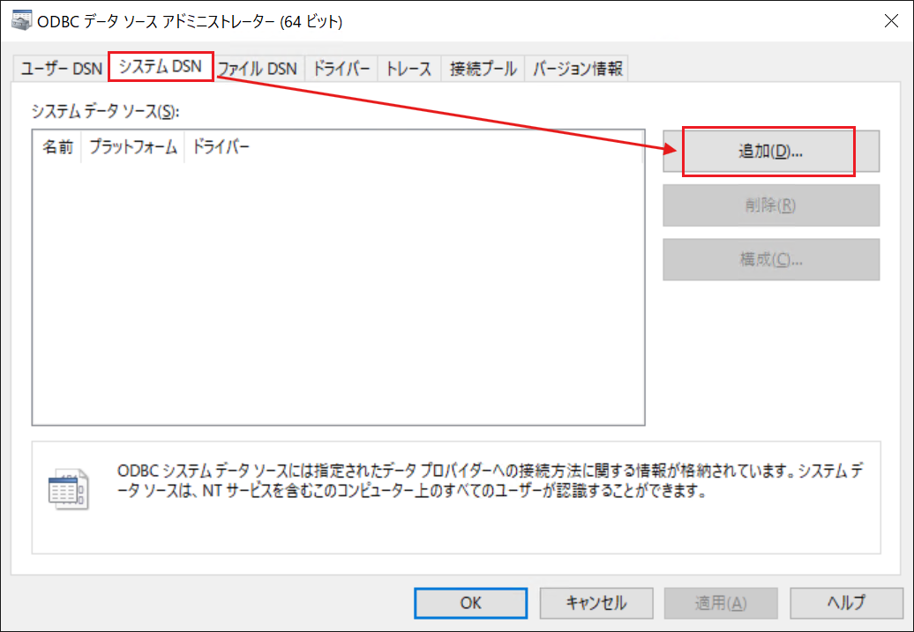

③ 「IBM App Connect Enterprise 13.0.6.0 Evaluation Edition - PostgreSQL Wire Protocol (DataDirect)」　を選択し、「完了」をクリックします。

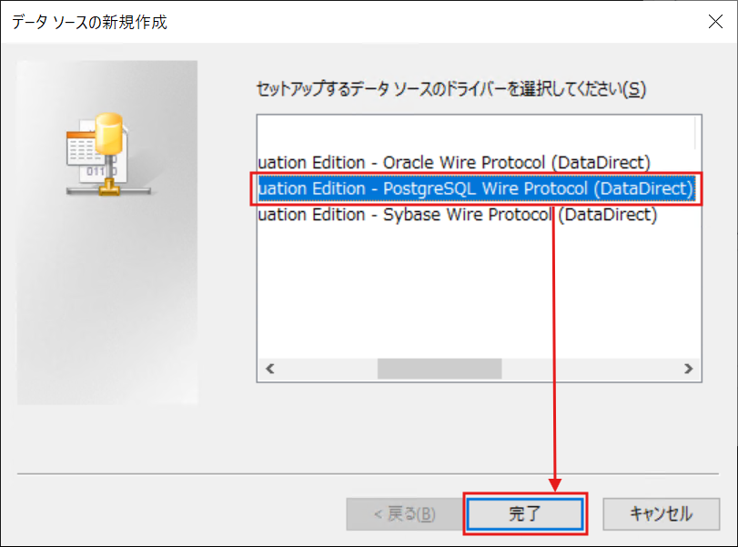

④ 各項目は次のように入力し、OKを押します。

| 項目             | 入力内容  |
| :--------------- | :-------- |
| Data Source Name | mydb      |
| Host Name        | localhost |
| Port Number      | 5432      |
| Database Name    | mydb      |

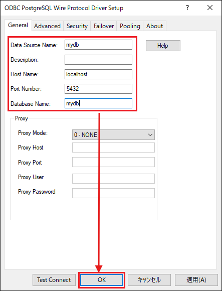

⑤ ODBCデータ・ソースにmydbが登録されたことを確認します。

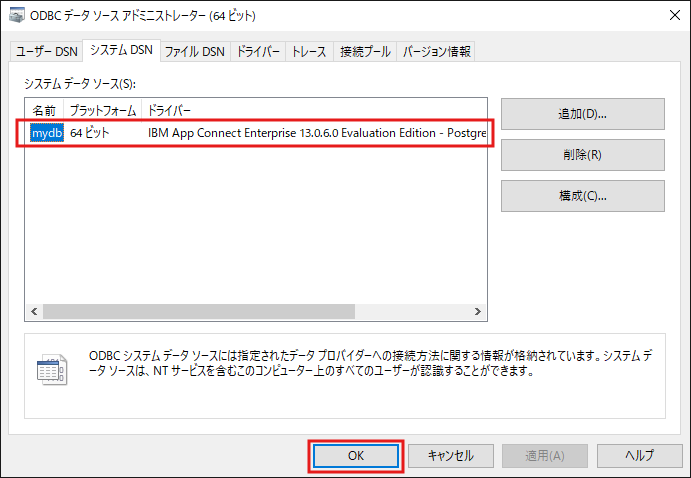

### 4.2.3 統合ノードがアクセスするデータベース・ユーザーの登録

統合ノードがアクセスするデータベース・ユーザーを登録します。

ACE コンソールを起動します。

> 「スタートメニュー」 →「IBM App Connect Enterprise 13.0.6.0 Evaluation Edition」→「IBM App Connect Enterprise Console 13.0.6.0」を選択します

次の 2 つのコマンドを実行します。

```cmd
mqsisetdbparms ACE13NODE -n mydb -u aceadm -p (パスワード)
```

```cmd
mqsireload ACE13NODE -e ACE13SERVER
```

### 4.2.4 インテグレーション・ツールキットからのデータベース・アクセス

ここでは作成したテーブルに対してツールキットからアクセスできるように接続の構成を行います。

① ツールキットが起動していない場合には起動します。

スタート・ボタン →「IBM App Connect Enterprise 13.0.6.0 Evaluation Edition」→「IBM App Connect Enterprise Toolkit 13.0.6.0」を選択します。
Welcome画面が表示されている場合には「×」ボタンで閉じます。

② 画面左下の「データ・ソース・エクスプローラー」ビューより、「データベース接続」を右クリックして「New…」を選択します。

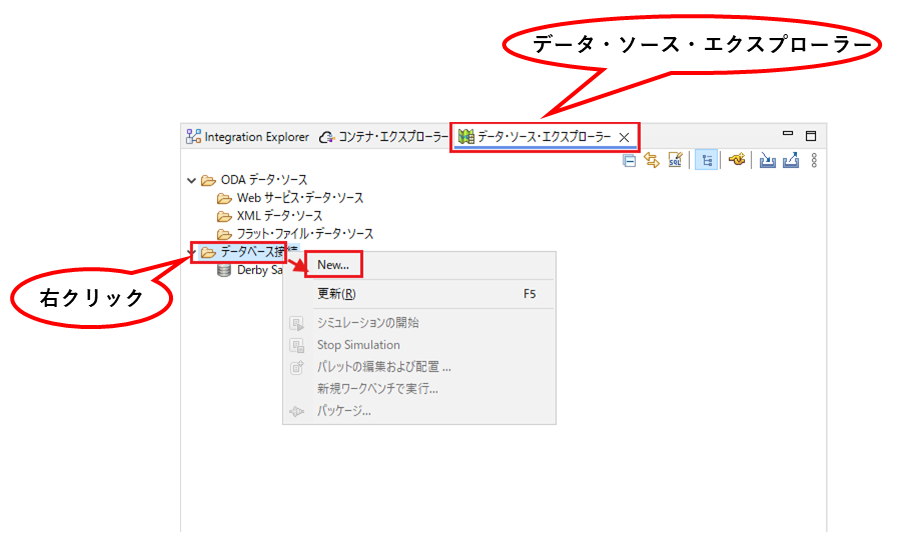

③ 次の画面でDBに必要な下記の情報を入力し、「終了」をクリックします。

| 項目                      | 設定値                                                       |
| :------------------------ | :----------------------------------------------------------- |
| Select a database manager | 汎用 JDBC                                                    |
| データベース              | mydb                                                         |
| URL                       | jdbc:postgresql://localhost:5432/mydb?currentSchema=myschema |
| ユーザー名                | aceadm                                                       |
| パスワード                | (パスワード)                                                     |
| パスワードの保存          | チェック                                                     |

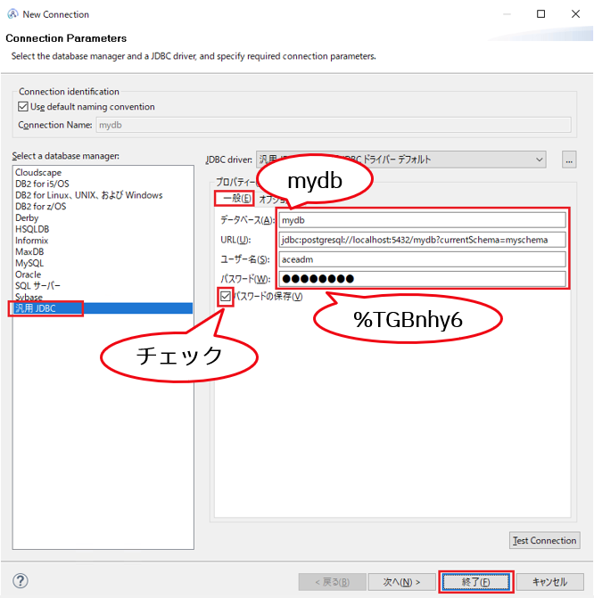

以上の操作で「データ・ソース・エクスプローラー」ビューにmydbデータベースへの接続プロファイルが作成され、ツールキットからテーブルへのアクセスが可能になりました。データベース接続は「mydb」という名前で作成されています。

[戻る](#ex4)
<a id="ex4.3"></a>

## 4.3 演習用アプリケーションの定義

IBM App Connect Enterprise では連携シナリオに関連する各種開発物を「アプリケーション」と呼ばれる単位でまとめることができます。アプリケーションは開発の単位であるとともにデプロイや起動・停止等の運用の単位でもあります。

① ツールキットの「Integration Development」パースペクティブを開きます。

② 「アプリケーション開発」ビューより、「新規…」→「アプリケーション」をクリックします。

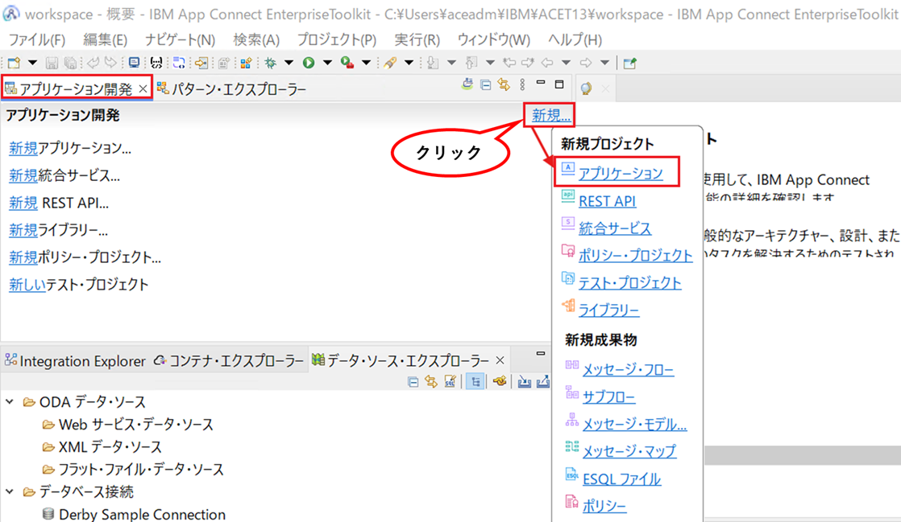

③ 「アプリケーション名」を”FileScenario”として、「終了」をクリックします。

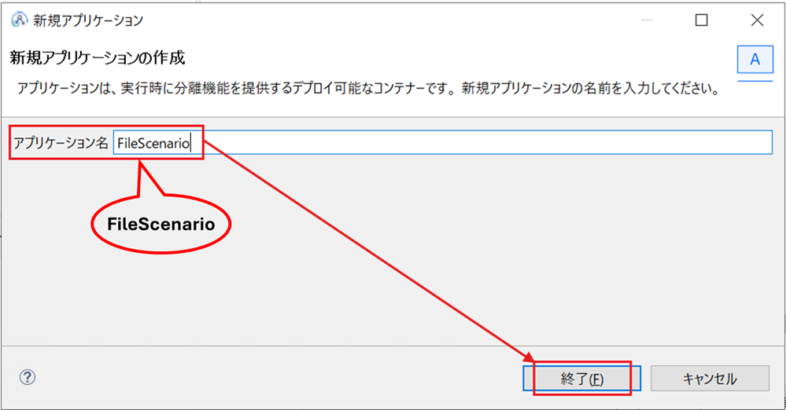

「アプリケーション開発」ビューに”FileScenario”という名前でアプリケーションが作成されます。

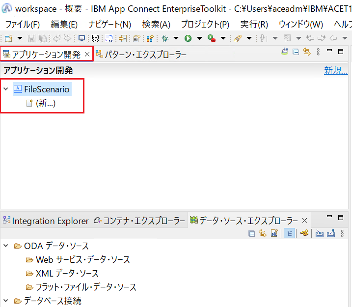

[戻る](#ex4)
<a id="ex4.4"></a>

## 4.4 入力用メッセージ・モデルの作成

ファイルで扱うデータ形式を規定するDFDLのメッセージ・モデルを作成します。

### 4.4.1 ウィザードからのメッセージ・モデル作成

① アプリケーション配下の「新…」をクリックして、ポップアップより「メッセージ・モデル…」をクリックします。

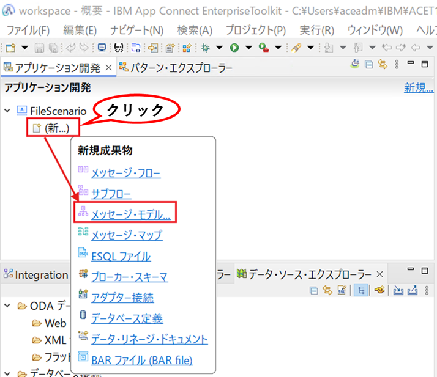

DFDLのデータ・モデル作成用のウィザードが開きます。

② 「レコード単位テキスト」を選択して「次へ」をクリックします。

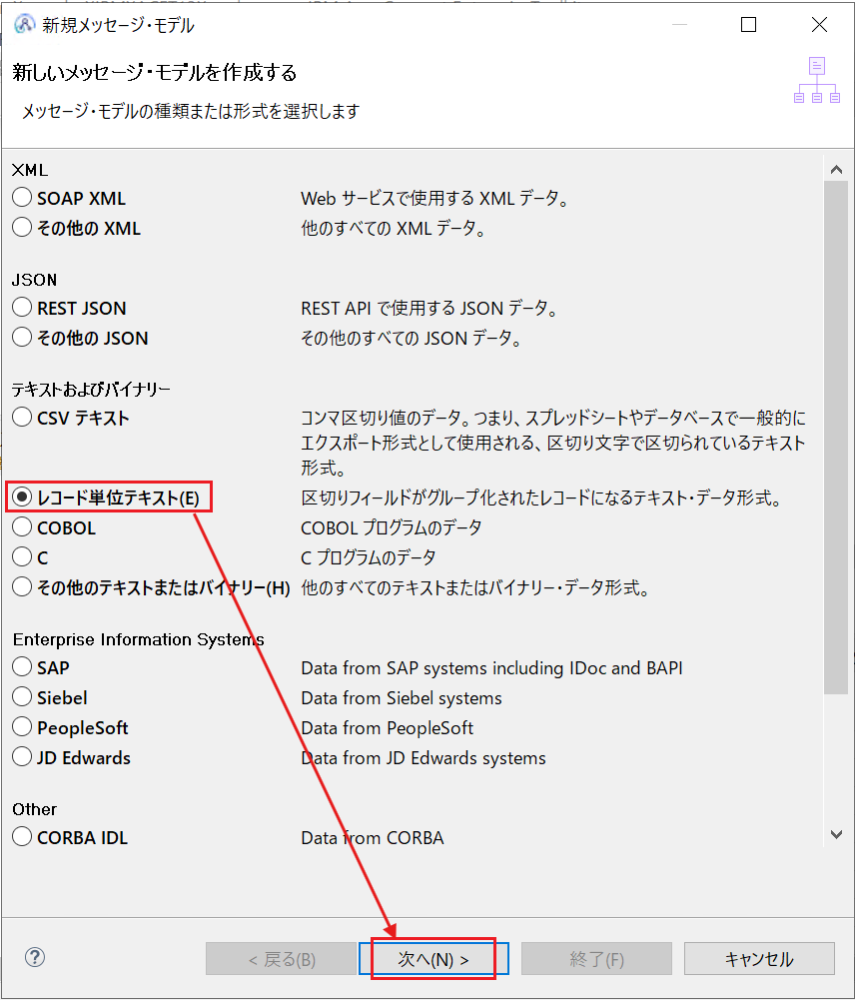

③ 「このウィザードに従ってDFDLスキーマ・ファイルを作成する」を選択して「次へ」をクリックします。

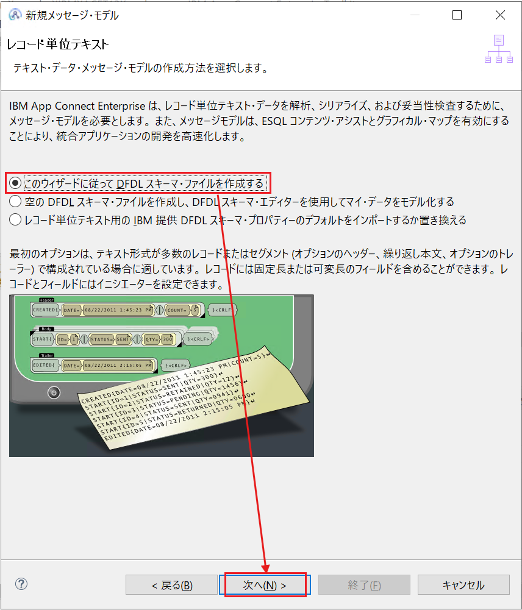

④ 「DFDL スキーマ・ファイル名」に”orderIn”と入力して「次へ」をクリックします。

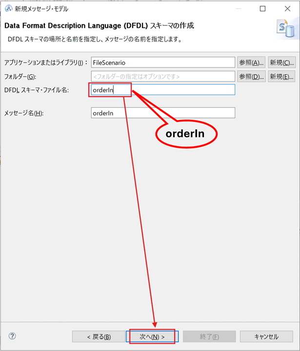

⑤ レコードの物理的なデータ構造を設定するための画面が開きます。レコードの終了文字はデフォルトの「復帰および改行 -%CR;%LF;」を受け入れます。フィールドのセパレーターについては、入力データのフィールドはカンマ区切りですので、　「セパレーター」が選択されていることを確認し、カンマ（%#44;）を選択します。また、「すべてのフィールドがイニシエーターを持つ」のチェックを外します。

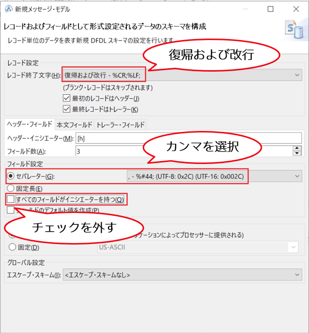

⑥ 次にヘッダーの構造を設定します。ヘッダー・レコードは先頭の”H,”で識別される３つのフィールドを持つデータです。「ヘッダー・フィールド」タブより、「ヘッダー・イニシエーター」に”H,”を、「フィールド数」に”3”を設定します。

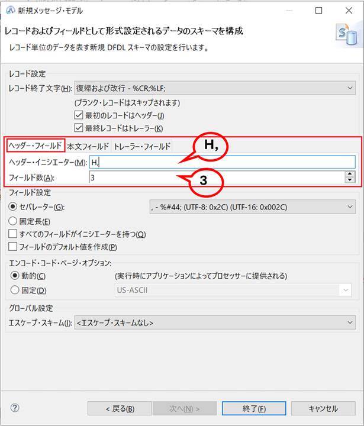

⑦ 同様に「本文フィールド」、｢トレーラー・フィールド｣についても次のように設定して、「終了」ボタンをクリックします。

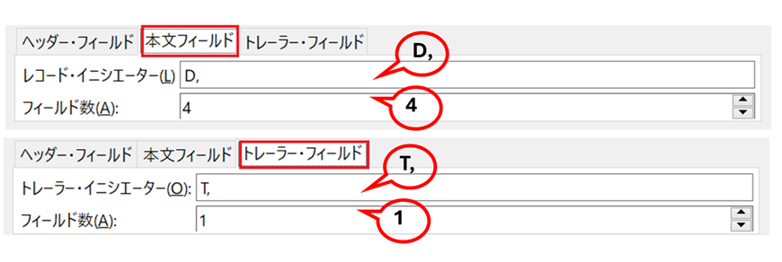

メッセージ・モデルが作成され、DFDLスキーマ・エディターが開きます。

### 4.4.2 DFDLスキーマの編集

DFDLスキーマ・エディターは２種類のペインに分かれています。左側のエディター・ペインでは単純化されたXMLスキーマの形式でメッセージの論理構造を規定します。
右側のDFDLプロパティー・ペインではXMLスキーマに付与されるデータの物理表現を規定します。

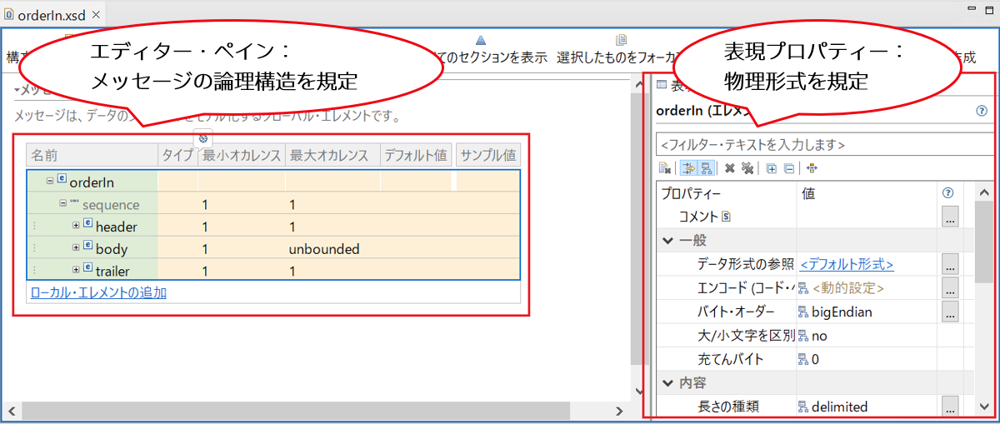

① エディター・ペインよりメッセージの論理構造を編集していきます。既にウィザードによって大部分の構造が定義されていますのでメッセージのフィールド名とデータ型（「Type」列はクリックするとメニューが出てきます）だけ編集します。下の画面の通りになるように編集してください。（body の dlvDate の最初の三文字はディー・エル・ヴィです。ご注意ください。）

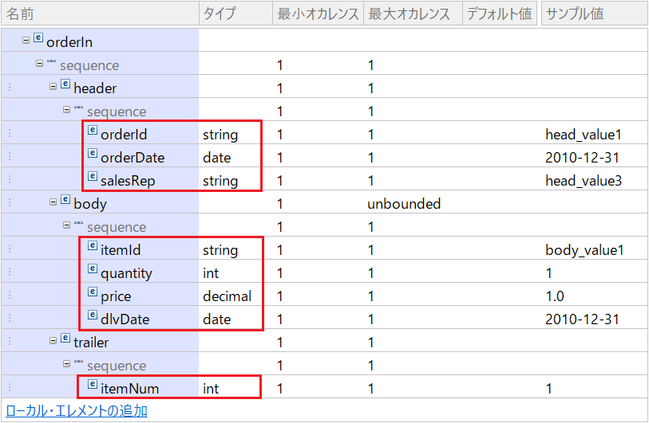

② DFDLプロパティー・ペインよりメッセージの物理表現を編集していきます。DFDLプロパティーも大部分の項目が既にウィザードによって設定されています。ここではdate型で定義したフィールドのカレンダー表現とデフォルトの文字エンコーディングだけ変更します。

下の画面のとおりにカレンダー表現の編集を行います。

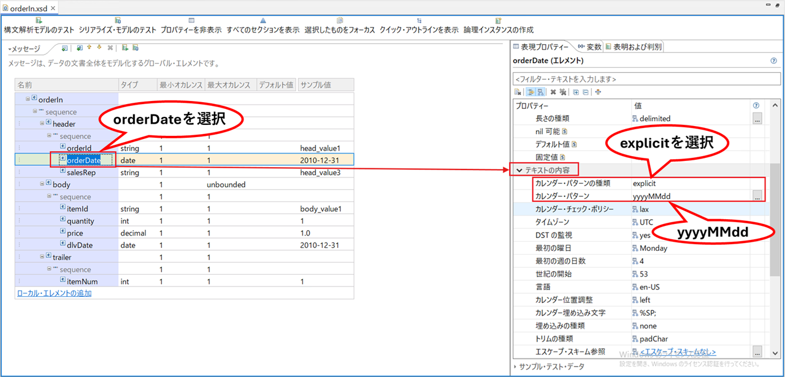

③ 同様にdlvDateフィールドについてもカレンダー表現をyyyyMMddに変更します。

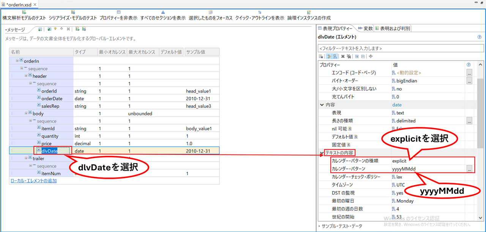

④ 下記の通りにデフォルトの文字エンコーディングを変更します。

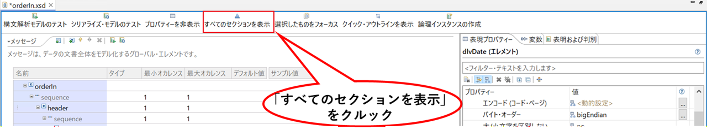
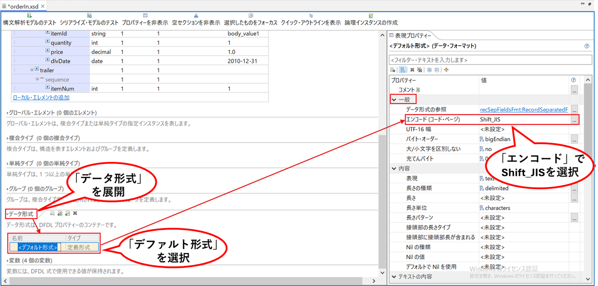

Ctrl + s　で保存します。

[戻る](#ex4)
<a id="ex4.5"></a>

## 4.5 モデルのテスト

データのモデリングにDFDLを利用する場合、作成したデータ・モデルの検証をツール上で行うことができます。

具体的には次のことが行えます。

> **シリアライズの検証**  
> &nbsp;&nbsp;&nbsp;&nbsp;DFDLで定義した各フィールドには「サンプル値」が定義されています。これを利用してシリアライズのテストを行うための論理インスタンスを作成することができます。作成した論理インスタンスからDFDLスキーマに基づく物理形式を生成することができます。生成された物理形式を見ることでDFDLスキーマが実際のデータ形式に合ったものになっているかを確認することができます。

> **パースの検証**  
> &nbsp;&nbsp;&nbsp;&nbsp;実際のテストデータが保存された物理ファイルを読み込み、正しくパースが行えることを確認できます。

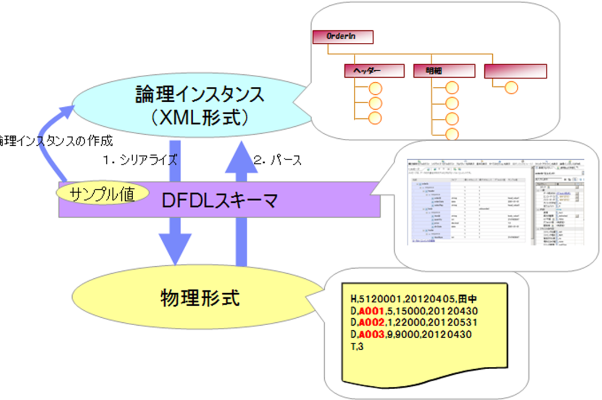

### 4.5.1 シリアライズの検証

作成したDFDLモデルには「サンプル値」が設定されていることが分かります。

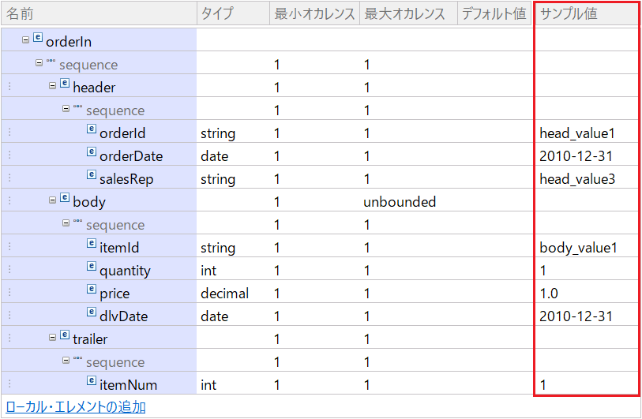

このサンプル値からシリアライズの検証に必要となる論理インスタンスを生成します。

① DFDLスキーマ・エディターより「論理インスタンスの作成」ボタンをクリックし、ポップアップ画面上で「orderIn:」のエレメントを選択して「OK」をクリックします。

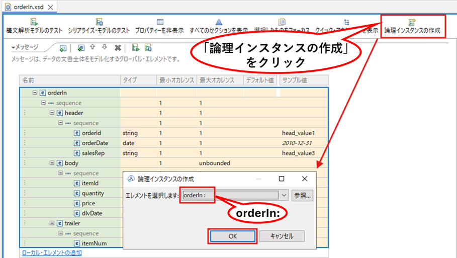

② パースペクティブ切替の確認のポップアップで「はい」をクリックします。

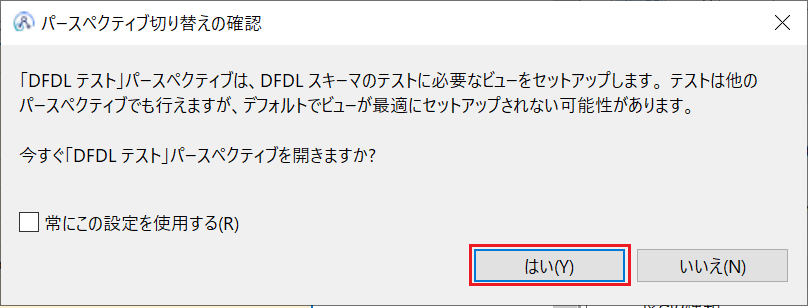

③ 「DFDL テスト」パースペクティブが開き、右上の「論理インスタンス」ビューにDFDLのサンプルデータができていることが確認できます。

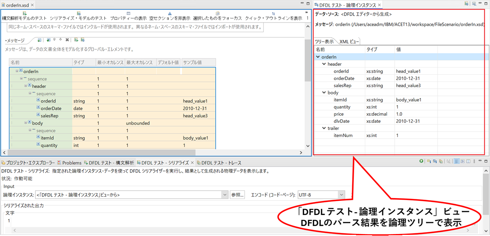

この論理インスタンスを基にシリアライズのテストを行います。この論理インスタンスはXML形式でエクスポートすることも可能です。

④ 「DFDL テスト - シリアライズ」ビューを選択し、「論理インスタンス」に「<「DFDL テスト – 論理インスタンス」ビューから>」が選択されていることを確認します（ファイルからエクスポートされた論理インスタンスのXMLファイルを読み込ませることも可能です）。
「シリアライザーの実行」ボタンをクリックすると、論理インスタンスからDFDLスキーマによってシリアライズされた物理データが生成されます。

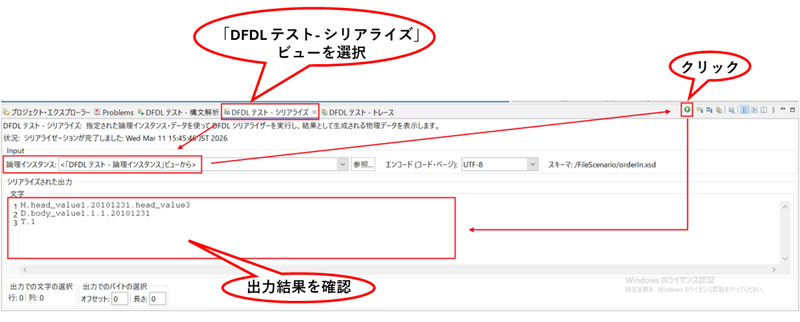

### 4.5.2 パースの検証

実際のテストデータを利用してDFDLスキーマが正しく設計されているかを確認することができます。

① テストデータの読込みを行います。「DFDL テスト - 構文解析」ビューを選択し、「参照…」ボタンをクリックします。

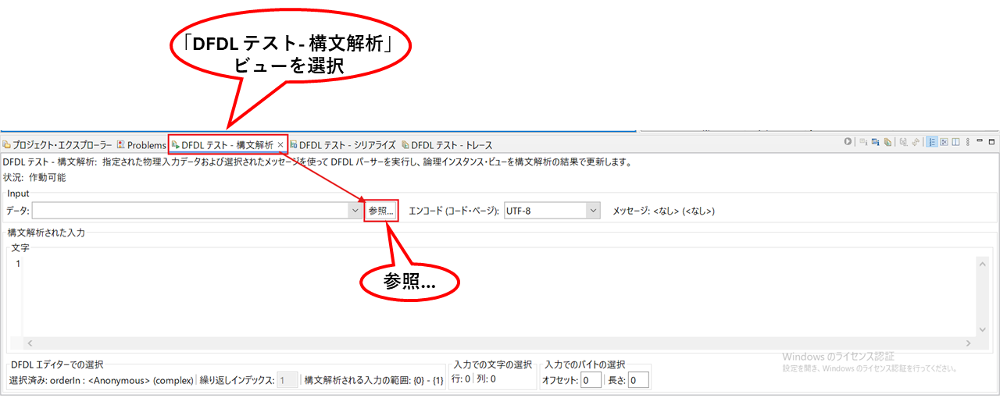

② ファイル選択のポップアップ画面で、students.zipで提供しているテスト用データファイルを選択して「OK」をクリックします。

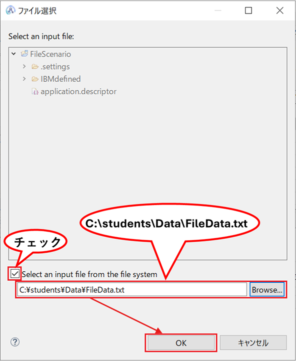

③ 読み込んだデータのエンコーディングを下記のようにしてShift_JISに設定し、パーサーによるデータの解析を実行します。

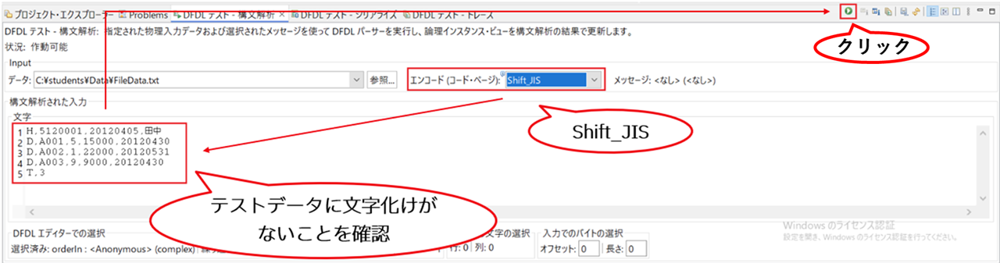

④ 下の画面のとおりにパースが正しく行えていることを確認します。

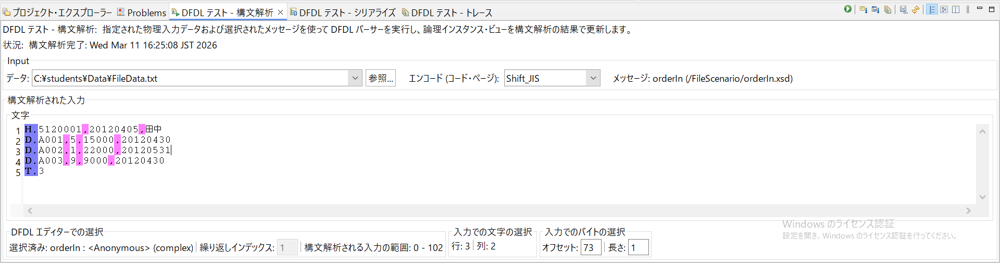

パースやシリアライズで問題が発生した場合は「DFDL テスト - トレース」ビューより問題判別に役立つ情報が確認できます。

⑤ 以上でシリアライズの検証は完了です。画面右上のボタンから「Integration Development」をクリックして統合開発パースペクティブに戻ります。

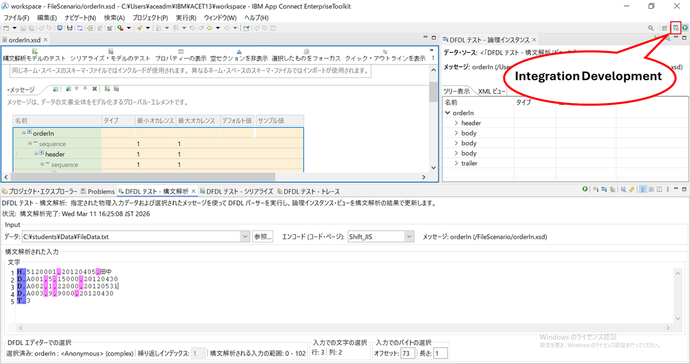

[戻る](#ex4)
<a id="ex4.6"></a>

## 4.6 CSV用メッセージ・モデルの作成

出力のCSV用のメッセージ･モデルも同様にDFDLを利用してモデル化します。
定義するCSVファイルは次のような形式で、７つのフィールドを持ちます。


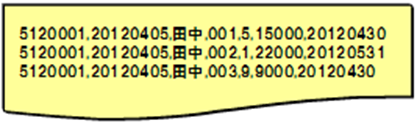

### 4.6.1 ウィザードからのメッセージ・モデルの作成

① CSV用メッセージ･モデルの作成をウィザードに従って作成していきます。アプリケーション「FileScenario」を右クリックし→「新規」→「メッセージ・モデル…」を選択します。

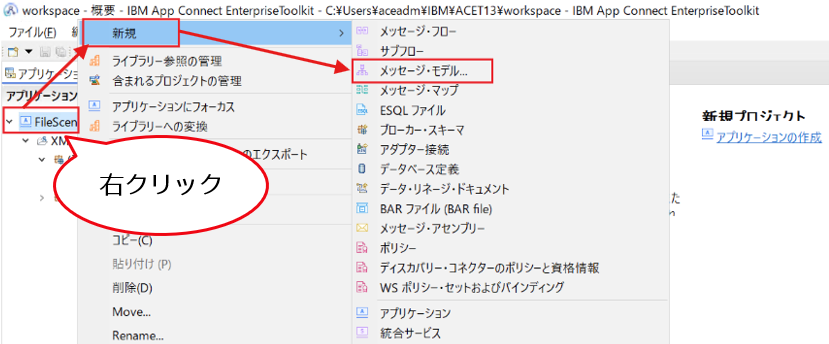

② ウィザードが起動しますので、「CSV テキスト」を選択し、「次へ」をクリックします。

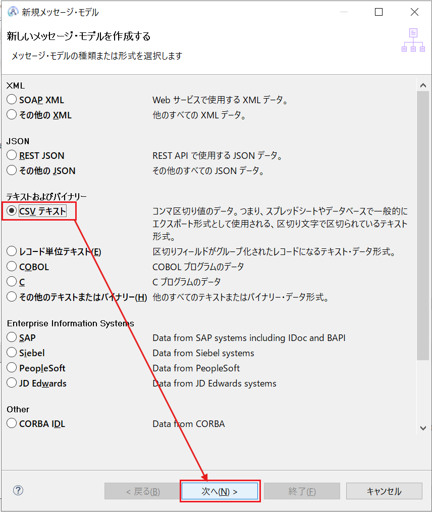

③ 「このウィザードに従ってDFDLスキーマ・ファイルを作成する」を選択して「次へ」をクリックします。

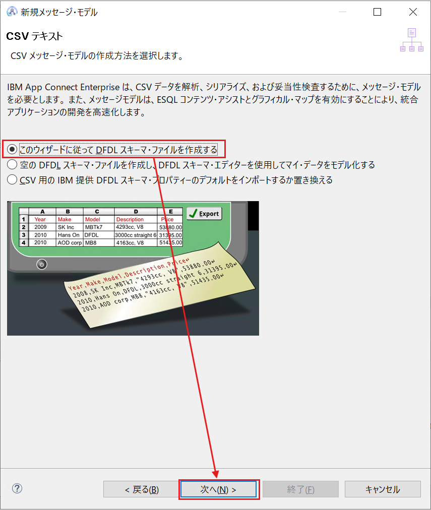

④ 「DFDL スキーマ・ファイル名」に”orderOut”と設定して「次へ」をクリックします。

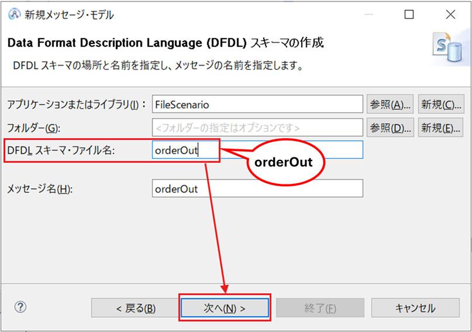

⑤ 「フィールド数」に”7”を設定して「終了」をクリックします。

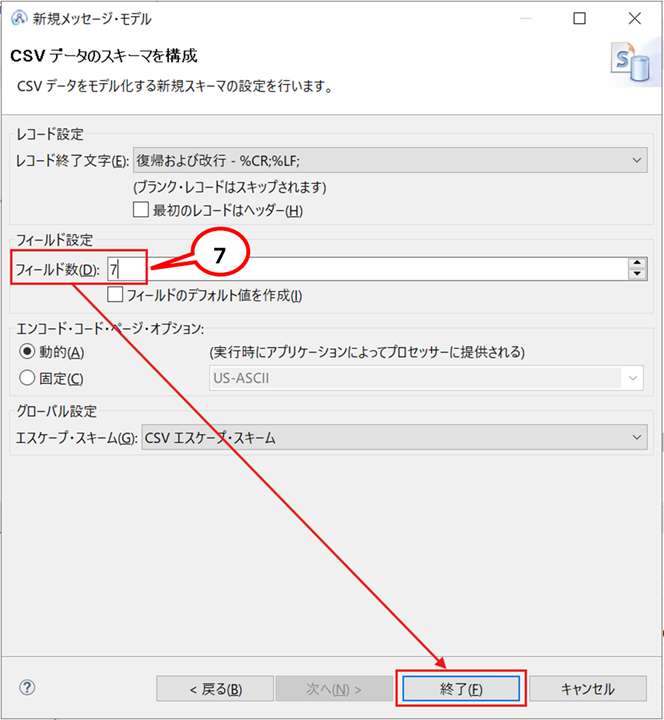

メッセージ・モデルが作成され、DFDLスキーマ・エディターが開きます。

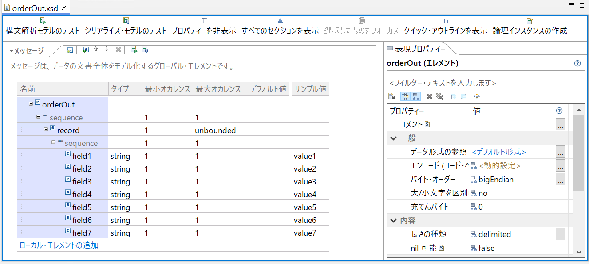

### 4.6.2 DFDLスキーマの編集

CSV形式のメッセージの場合も大部分のモデルがウィザードによって生成されています。生成されたDFDLスキーマを修正していきます。

① フィールド名とデータ型を下の画面のとおりに編集します。

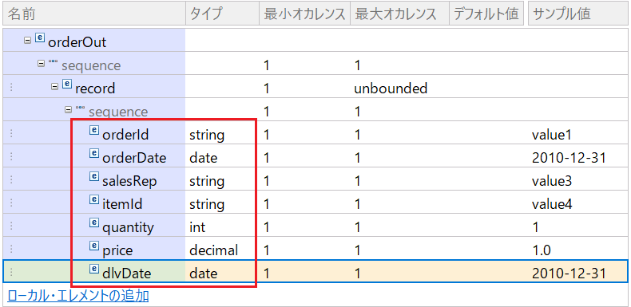

② デフォルトの文字エンコードとカレンダー形式を設定します

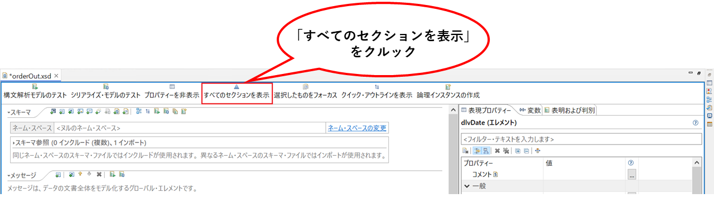
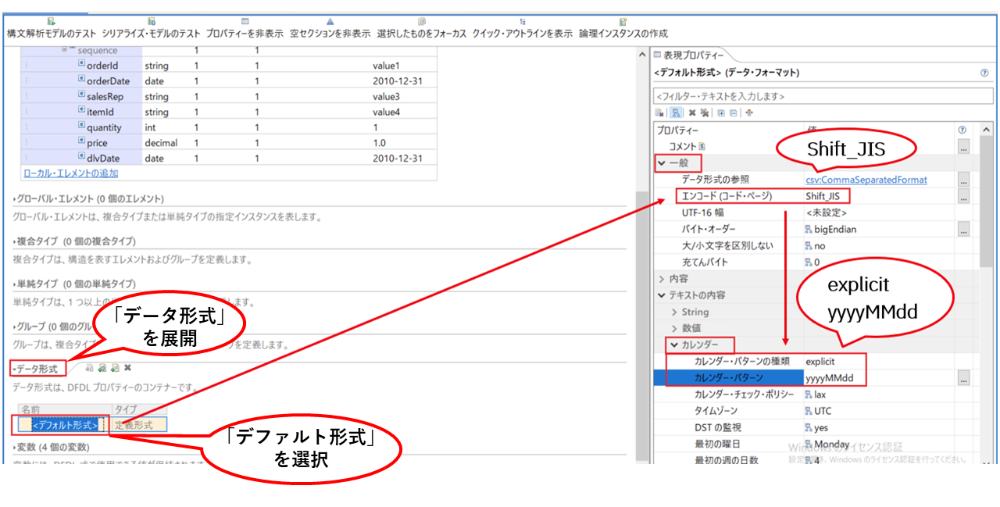

③ Ctrl + s で保存します。

[戻る](#ex4)
<a id="ex4.7"></a>

## 4.7 メッセージ･フローの作成

ここまで作成してきたメッセージ・モデルを使い、ファイル変換処理を行うためのメッセージ・フローを作成していきます。

### 4.7.1 データベース定義の作成

メッセージ・フローの作成に入る前にメッセージ・フローから利用するデータベース定義を作成します。

① 「ファイル」→「新規」→「データベース定義」を選択します。

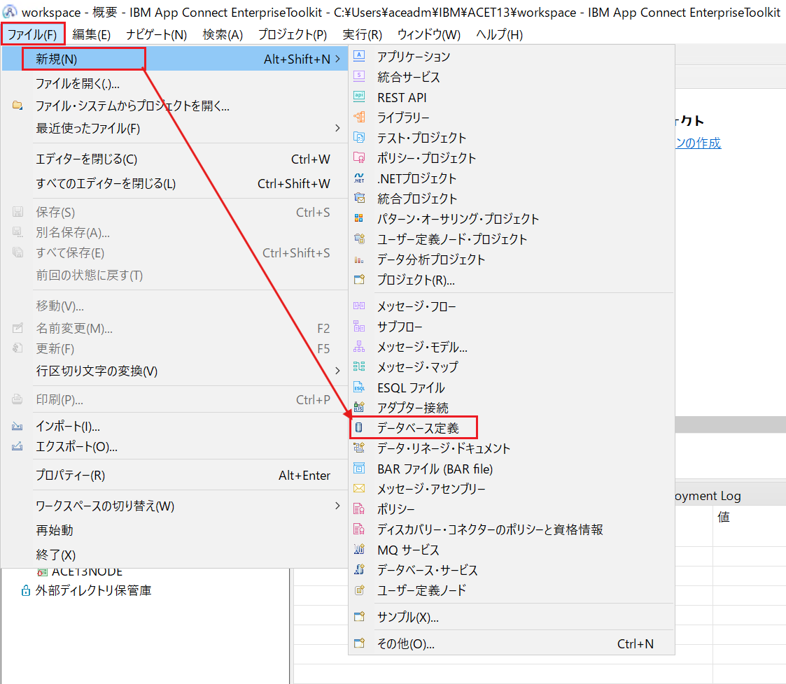

② ウィザードが起動したら「Database」に「汎用 JDBC」を選択し、「Version」を「V1.0」に設定します。データ設計プロジェクトは、「ニュー…」ボタンをクリックして新たに作成します。

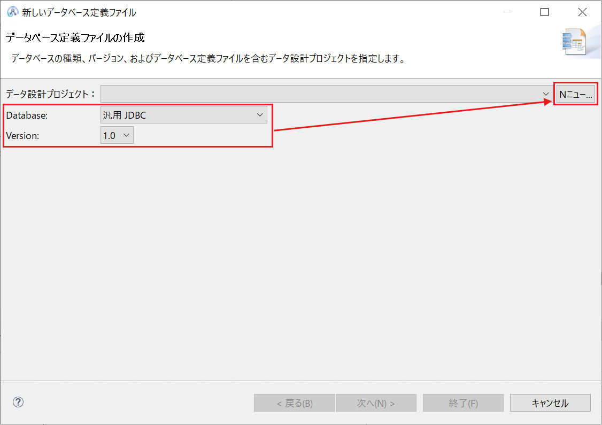

③ 「New Data Design Project」のウィザードでは、下記のとおり｢プロジェクト名｣に”dbm_mydb”と設定して「終了」をクリックします。

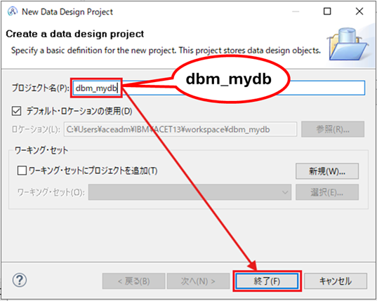

④ 「データ設計プロジェクト」に「dbm_mydb」が設定されていることを確認して「次へ」をクリックします。

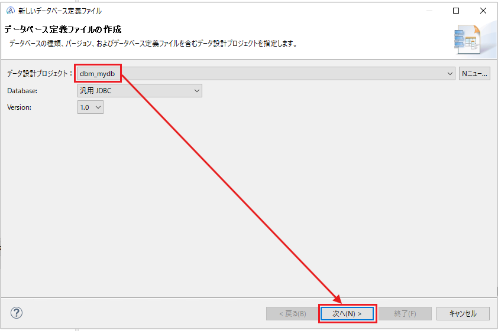

⑤ 接続の「mydb」を選択して「次へ」をクリックします。

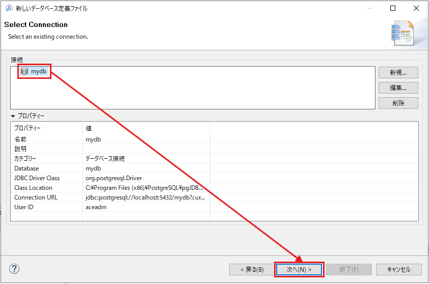

⑥ スキーマ「myschema」にチェックを入れて「次へ」をクリックします。

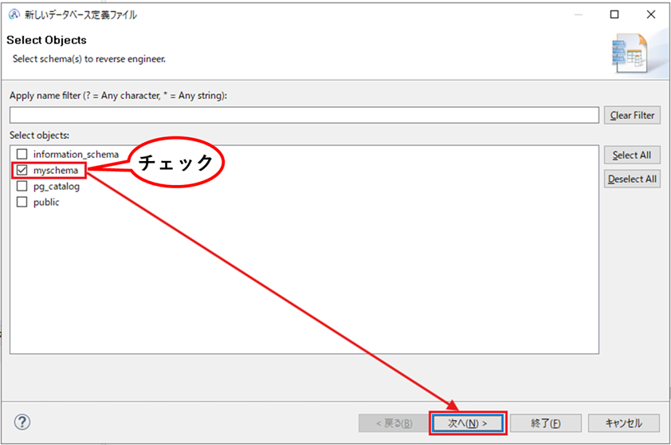

⑦ 「終了」をクリックします。


⑧ 「データ・プロジェクト・エクスプローラー」ビューにデータベース定義が作成されていることを確認します。<br>
ビューが表示されていない場合には、メニューから「ウィンドウ」→「ビューの表示」→「データ・プロジェクト・エクスプローラー」を選択します。


⑨ 作成したデータベース定義をアプリケーションに追加します。アプリケーション「FileScenario」を右クリック→「含まれるプロジェクトの管理」を選択し、開いたウィンドウ上で「dbm_mydb」を選択して「OK」をクリックします。


以上の操作でアプリケーション内のメッセージ・フローからデータベース・アクセスを行う準備ができました。

### 4.7.2 メッセージ･フローの作成

① 「FileScenario」アプリケーションを右クリックして「新規」→「メッセージ・フロー」を選択します。


② メッセージ・フロー名に”fileTransformFlow”を入力して「終了」をクリックします。


③ 下記のとおりにFileInputノード、Computeノード、FileOutputノードを配置して接続します。<br>
FileInputノード、FileOutputノードは「コネクター」セクションの「ファイル」ドロアー、Computeノードは「ツールボックス」セクションの「変換」ドロアーから選択します。


各ノードでプロパティを設定します。

④ File Inputノードで以下のように指定します。<br>
File Inputノードを選択した状態でプロパティーを設定していきます。


- 基本タブ
  

- 入力メッセージの構文解析タブ
  

⑤ Computeノードで以下のように指定します。<br>
Computeノードを選択した状態でプロパティーを設定していきます。


- 基本タブ
  

⑥ File Outputノードで以下のように指定します。<br>
File Outputノードを選択した状態でプロパティーを設定していきます。


- 基本タブ
  

### 4.7.3 ESQLによるマッピング

① Computeノードをダブルクリックして、ESQLエディターを開きます。


② 下記のようにESQLを編集します。
ESQLのコードは`C:\students\ESQL\fileTransformFlow_Compute.esql`にも準備されていますので、コピーも可能です。


以下はコードのサンプルです。文字の綴りを確認する際に使用してください。

```SQL
CREATE COMPUTE MODULE fileTransformFlow_Compute
  CREATE FUNCTION Main() RETURNS BOOLEAN
    BEGIN
      CALL CopyMessageHeaders();
      -- CALL CopyEntireMessage();

      -- ループで利用するカウンター用変数
      DECLARE i INTEGER 1;

      -- 入力メッセージのbody要素（明細要素）の数だけループをまわす
      FOR b AS InputRoot.DFDL.orderIn.body[] DO
        -- 伝票番号のマッピング
        SET OutputRoot.DFDL.orderOut.record[i].orderId = InputRoot.DFDL.orderIn.header.orderId;
        -- 日付のマッピング
        SET OutputRoot.DFDL.orderOut.record[i].orderDate = InputRoot.DFDL.orderIn.header.orderDate;
        -- 営業担当者名のマッピング
        SET OutputRoot.DFDL.orderOut.record[i].salesRep = InputRoot.DFDL.orderIn.header.salesRep;

        -- 品目番号のマッピングは変換テーブルから参照した値を設定します。
        ---- THE()ステートメントはSELECTの戻りが一意に決まることを指定する関数です
        ----- SELECTに続くITEM構文は戻り値をリテラル型（レコードではなく通常のCHARやINT等）として扱うために必要な構文です
        SET OutputRoot.DFDL.orderOut.record[i].itemId = THE(SELECT ITEM T.aftercode
            FROM Database.myschema.codemaster AS T WHERE T.beforecode = b.itemId);
        -- 数量のマッピング
        SET OutputRoot.DFDL.orderOut.record[i].quantity = b.quantity;
        -- 価格のマッピング
        SET OutputRoot.DFDL.orderOut.record[i].price = b.price;
        -- 納期のマッピング
        SET OutputRoot.DFDL.orderOut.record[i].dlvDate = b.dlvDate;
        SET i = i + 1;
      END FOR;

      RETURN TRUE;
    END;
```

③ ESQL、およびメッセージ・フローをCtrl + sで保存します。

[戻る](#ex4)
<a id="ex4.8"></a>

## 4.8 開発物のデプロイ

作成したフローのデプロイを行います。

① 下記の操作でアプリケーション「FileScenario」にBARファイルを追加します。


② “fileScenarioBAR”という名前でBARファイルを作成します。


③ アプリケーション「FileScenario」にチェックを入れて「ビルドして保存…」をクリックします。


④ 成功メッセージが表示されるので、「OK」をクリックします。


⑤ 下記の操作で、作成したBARファイルをデプロイします。


⑥ 正常にデプロイできることを確認し、ポップアップ画面を「閉じる」ボタンで閉じます。


[戻る](#ex4)

<a id="ex4.9"></a>

## 4.9 メッセージ･フローのテスト

作成したメッセージ･フローをテストします。
入力ファイルは下記の場所に保存されています。
```
C:\students\Data\FileData.txt
```
入力ファイルの内容：
```
H,5120001,20120405,田中
D,AAA,5,15000,20120430
D,BBB,1,22000,20120531
D,CCC,9,9000,20120430
T,3
```

① 入力データ・ファイルを、メッセージ･フローがポーリングしている下記のディレクトリに配置します。

```
C:\students\File\In
```

数秒後にファイルがメッセージ･フローにより取得されることを確認します。

② メッセージ・フローがファイルを書き出す出力ディレクトリに、ファイルが出現することを確認します。

```
C:\students\File\Out\FileData.csv
```

③ 出力データの内容を確認し、項目のマッピングが正しく行えていることを確認します。

出力されるファイルは下記の内容となります。
```
5120001,20120405,田中,001  ,5,15000,20120430
5120001,20120405,田中,002  ,1,22000,20120531
5120001,20120405,田中,003  ,9,9000,20120430
```

[戻る](#ex4)

---
