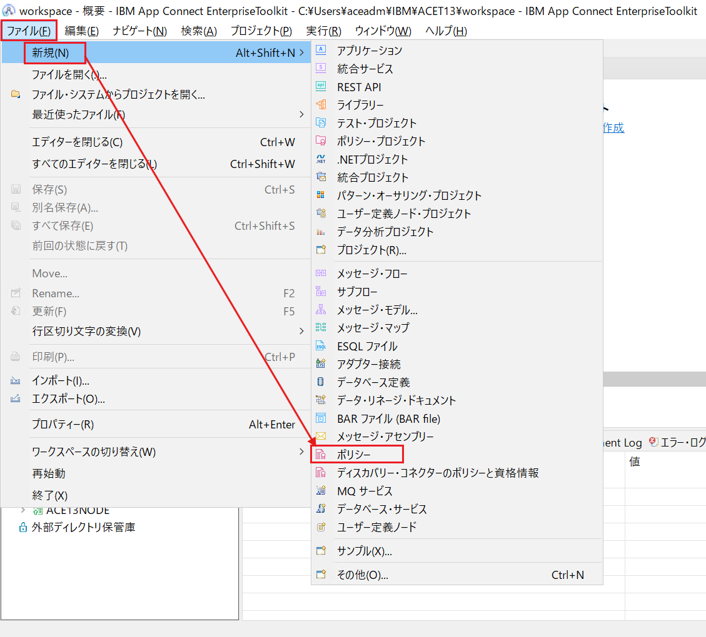
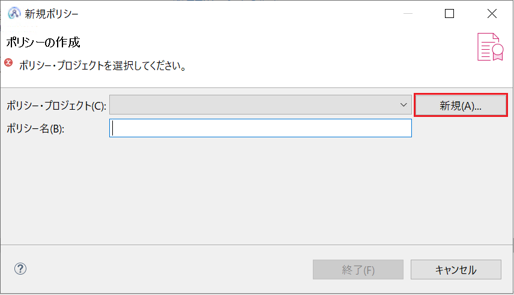
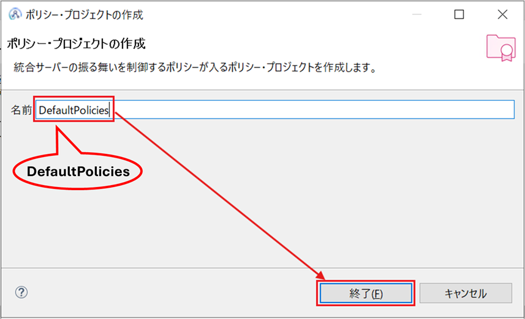
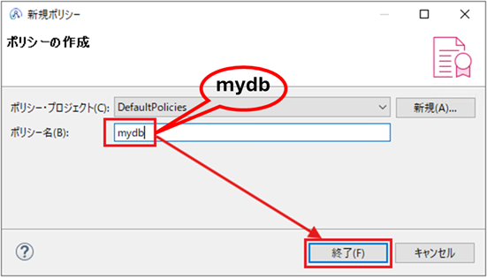
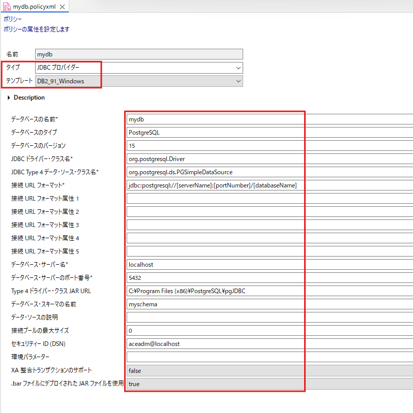
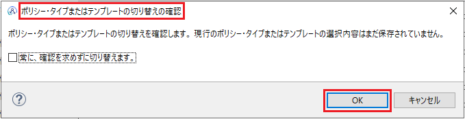
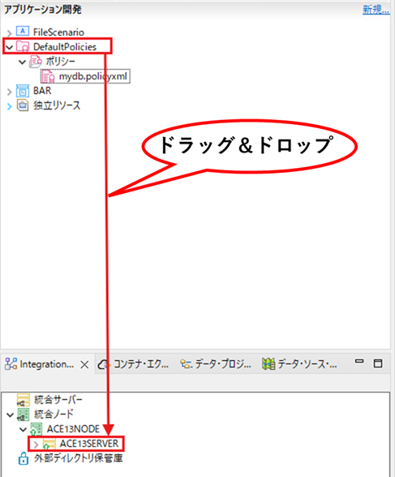
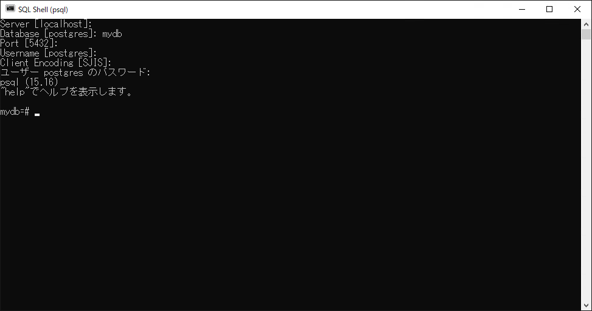
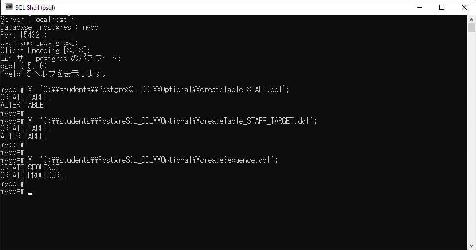

# 演習 5（オプション）追加演習の準備

以降の演習はオプションの追加演習です。各演習1時間程度かかるため、時間に余裕のある方のみ実施してください。

**演習の目的：**  

ここでは以降の演習で必要となる追加のデータベースの構成を行います。  
 
- ODBC接続の構成（既に演習4を実施している場合には不要）   
- JDBC接続の構成   
- 追加のデータベース・オブジェクト定義   

ハンズオン環境にはあらかじめPostgreSQL Server 15.16が導入済みでデータベースがmydbという名前で作成されています。以降の演習を実施される方は下記の手順でデータベース構成を行ってください。


<a id="ex5"></a>

## 目次

- [5.1 ODBC接続の構成](#ex5.1)
- [5.2 JDBC接続の構成](#ex5.2)
- [5.3 追加のデータベース・オブジェクトの定義](#ex5.3)

<a id="ex5.1"></a>

## 5.1 ODBC接続の構成

[演習3](../演習/3-Webサービス連携処理の開発.md)をスキップされたかたは[演習4](../演習/4-ファイル連携とデータベース・アクセス.md)の[4.2 データベースの構成](../演習/4-ファイル連携とデータベース・アクセス.md#ex4.2)手順に従い、ODBC設定を行ってください。

[戻る](#ex5)

<a id="ex5.2"></a>

## 5.2 JDBC接続の構成

ここではGUIマッピングからデータベース操作を行うためにJDBCデータ・ソースの登録を行います。

① IBM App Connect Enterprise Toolkit で、メニューの「ファイル」→「新規…」をクリックし、次に「ポリシー」を選択します。



② 「新規…」をクリックします。



③ 「名前」に「DefaultPolicies」と入力し、「終了」をクリックします。ACEがデフォルトのポリシーとして認識する名前であるためスペルミスに注意してください。



④ 「ポリシー名」に「mydb」と入力し、「終了」をクリックします。このポリシー名もデータソース名と一致する必要があるためスペルミスに注意してください。



### 5.2.1 ポリシー定義ファイルの編集

① ポリシー定義ファイルが作成され、ポリシー・エディターが開きます。
「タイプ」リストから 「JDBC プロバイダー」 を選択し、「テンプレート」リストから 「DB2_91_Windows」 を選択します。
ポリシー・タイプまたはテンプレートを切り替える際に表示される確認ダイアログで 「OK」 をクリックします。





② ポリシーの各項目に以下の値を入力します。以下以外はデフォルトを受け入れます。

| 項目 | 値 |
| :--- | :--- |
| データベースの名前 | mydb |
| データベースのタイプ | PostgreSQL |
| データベースのバージョン |15 |
| JDBC ドライバー・クラス名 | org.postgresql.Driver |
| JDBC Type 4 データ・ソース・クラス名 | org.postgresql.ds.PGSimpleDataSource |
| 接続 URL フォーマット | jdbc:postgresql://[serverName]:[portNumber]/[databaseName] |
| データベース・サーバ名 |localhost |
| データベース・サーバーのポート番号| 5432|
| Type 4 ドライバー・クラス JAR URL| C:\Program Files (x86)\PostgreSQL\pgJDBC |
| データベース・スキーマの名前| myschema |
| セキュリティーID(DSN) | aceadm@localhost |
| XA整合トランザクションのサポート | false |
| .barファイルにデポロイされたJARファイルを使用 | true |

③ ポリシーを保存します。

④ 作成したポリシー・プロジェクト「Default Policies」を、「Integration Explorer」ビューの「統合ノード」→「ACE13NODE」→「ACE13SERVER」へドラッグ＆ドロップしてデプロイします。



⑤ JDBC接続のユーザーID、パスワードの登録を行います。ACEのコマンド・コンソールより下記のコマンドを入力します。

```CMD
mqsisetdbparms ACE13NODE –n jdbc::aceadm@localhost -u aceadm -p %TGBnhy6
mqsireload ACE13NODE –e ACE13SERVER
```

以上でJDBC接続の構成は完了です。

[戻る](#ex5)

<a id="ex5.3"></a>

## 5.3 追加のデータベース・オブジェクトの定義

オプションの演習で利用するデータベース・オブジェクトを定義します。

① 「スタート」→「PostgreSQL 15」→「SQL Shell (psql)」 を選択し、「SQL Shell (psql)」を起動します。

② 「SQL Shell (psql)」では、データベースへ接続するために以下のような入力プロンプトが表示されます。

```CMD
Server [localhost]:
Database [postgres]:
Port [5432]:
Username [postgres]:
Client Encoding [SJIS]:
ユーザー postgres のパスワード:
```
各項目は次のように入力します。

| 項目               | 入力内容  |
| :--------------------- | :-------- |
| Server [localhost] | Enterキー押します |
| Database [postgres] | mydb |
| Port [5432]: | Enterキー押します |
| Username [postgres] | Enterキー押します |
| Client Encoding [SJIS] | Enterキー押します |
| ユーザー postgres のパスワード | %TGBnhy6 |

ログイン成功後：

```CMD
psql (15.16)
"help"でヘルプを表示します。

mydb=#
```



③ 「SQL Shell (psql)」より、下記のように入力します。

**staffテーブル定義**
```SQL
\i 'C:\\students\\PostgreSQL_DDL\\Optional\\createTable_STAFF.ddl';
```
**staff_targetテーブル定義**
```SQL
\i 'C:\\students\\PostgreSQL_DDL\\Optional\\createTable_STAFF_TARGET.ddl';
```
**staff_seqシーケンス定義**
```SQL
\i 'C:\\students\\PostgreSQL_DDL\\Optional\\createSequence.ddl';
```



**(参考) createTable_STAFF.ddl の内容**

```SQL
CREATE SCHEMA myschema;

CREATE TABLE myschema.staff (
    staffnum    varchar(10)  NOT NULL,
    lastchange  date,
    firstname   varchar(30),
    lastname    varchar(30),
    mail        varchar(100)
);

ALTER TABLE myschema.staff 
    ADD CONSTRAINT staff_pk PRIMARY KEY (staffnum);
```

**(参考) createTable_STAFF_TARGET.ddl の内容**
```SQL
CREATE SCHEMA myschema;

CREATE TABLE myschema.staff_target (
    staffid     varchar(10)  NOT NULL,
    lastchange  date,
    staffname   varchar(80),
    mail        varchar(100)
);

ALTER TABLE myschema.staff_target 
    ADD CONSTRAINT staff_target_pk PRIMARY KEY (staffid);
```

**(参考) createSequence.ddlの内容**
```SQL
CREATE SCHEMA myschema;

CREATE SEQUENCE myschema.staff_seq
    AS integer
    START WITH 1
    INCREMENT BY 1
    MINVALUE 1
    NO MAXVALUE
    NO CYCLE
    CACHE 1;

CREATE PROCEDURE myschema.generate_staff_id(OUT staff_seq integer)
LANGUAGE plpgsql
AS $$
BEGIN
    staff_seq := nextval('myschema.staff_seq');
END;
$$;
```

このDDLにはシーケンス・オブジェクトとともに、シーケンスを利用して一意なIDを生成するストアド・プロシージャーが含まれます。

以上で追加演習のための準備は完了です。

[戻る](#ex5)

---
