# 演習 6（オプション）データベース連携シナリオ

> [!NOTE]
> **注意：**
> この演習はオプションです。時間に余裕のある方のみ実施ください。
> 演習に当たっては、追加の構成が必要となりますので[演習4](../演習/4-ファイル連携とデータベース・アクセス.md)と[演習5](../演習/5-（オプション）追加演習の準備.md)を実施してから始めてください。

<a id="ex6"></a>

## 目次

- [6.1 シナリオ概要](#ex6.1)
- [6.2 アプリケーションの開発手順概要](#ex6.2)
- [6.3 イベント表の作成](#ex6.3)
- [6.4 データベース・トリガーの準備](#ex6.4)
- [6.5 データベース定義の作成](#ex6.5)
- [6.6 メッセージ・モデルの作成](#ex6.6)
- [6.7 メッセージ・フローの作成](#ex6.7)
- [6.8 デプロイ・テスト](#ex6.8)

<a id="ex6.1"></a>

## 6.1 シナリオ概要

DatabaseInputノードの役割はテーブルに対してINSERTやUPDATE, DELETE等の変更が加えられたことをトリガーに、メッセージ・フローの処理を起動することです。同時に加えられた変更をメッセージ・ツリーにパースして後続のノードに伝播させます。   

以下の図は今回構築するシナリオの概要図です。

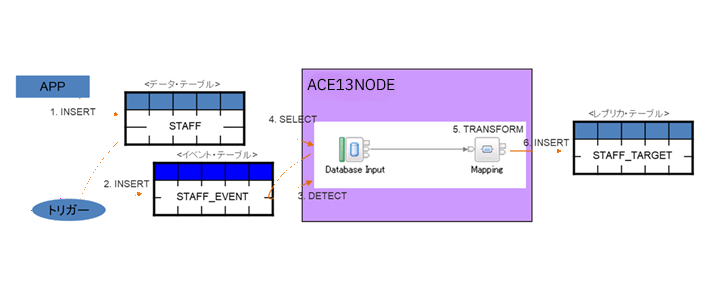

- 外部アプリケーションがデータ・テーブル「STAFF」に対してレコードをINSERTします。

- あらかじめデータ・テーブル「STAFF」に設定しておいたDBトリガーの機能により、変更内容がイベント・テーブル「STAFF_EVENT」に挿入されます。

- DatabaseInputノードはイベント・テーブルを定期的にポーリングすることにより、イベント・テーブルに挿入されたレコードを検知します。

- DatabaseInputノードはイベント・テーブルに書き込まれたレコードから、後続のノードに伝播すべきデータ・テーブル内のレコードを特定し、テーブルよりデータを取得します。

- メッセージ・フローでは、MappingノードによりGUIで、テーブルから取得された情報をレプリカ・テーブルのデータ形式に変換します。

- Mappingノードがレプリカ・テーブルに対してデータをINSERTします。

- イベント・テーブルの内容を更新し、レコードが処理済であることをマークします。

- イベント・テーブル、レプリカ・テーブルに対するトランザクションをコミットします。

[戻る](#ex6)

<a id="ex6.2"></a>

## 6.2 アプリケーションの開発手順概要

今回構築するデータベース連携アプリケーションの構築手順は下記の通りです。

- イベント表の作成
- データ・テーブルにトリガーを作成
- データベース定義の作成
- メッセージ・モデルの作成
- メッセージ・フローの作成
- デプロイ・テスト

[戻る](#ex6)

<a id="ex6.3"></a>

## 6.3 イベント表の作成

今回作成するイベント表の内容を記載します。

**作成するイベント表(STAFF_EVENT)の説明**

| 列名 | 列の機能 | 値の例 |
| :------------- | :-------- |:-------- |
| EVENT_ID       | 必須。処理中のイベントを識別するキー。 | 1 |
| OBJECT_KEY     | 必須。データ・テーブルで変更された行を識別。通常はデータ・テーブル内の１次キー。 | cust1 |
| OBJECT_VERB    | オプション。データ・テーブルに対して行われた操作を識別する。通常CREATE, DELETE, UPDATEのいずれか。DELETEの場合にはデータ・テーブルから参照する行が無いことになるので注意。 | CREATE |
| OBJECT_NAME    | オプション。変更されたデータ・テーブルの名前。複数のデータ・テーブルに対する更新をサポートするために必要となる。 | Customer |
| EVENT_PRIORITY | オプション。 | 1b |
| EVENT_TIME     | オプション。操作が実行された時刻。 | 2026-03-17T17:10:00 |
| EVENT_STATUS   | オプション。イベントが既に処理されたかどうかを判別する。処理後にレコードを削除しない場合には必要となる。 | 0  |
| EVENT_COMMENT  | オプション。フリー・フォームのフィールド。例えば処理の後にイベントが削除されない場合に、メッセージ処理の出力を保管するために使用される。 | 処理されましたが例外が発生しました。 |

<a id="ex6.3.1"></a>

### 6.3.1 イベント表の作成

① 「スタート」→「PostgreSQL 15」→「SQL Shell (psql)」 を選択し、「SQL Shell (psql)」を起動します。

② 「SQL Shell (psql)」では、データベースへ接続するために以下のような入力プロンプトが表示されます。

```CMD
Server [localhost]:
Database [postgres]:
Port [5432]:
Username [postgres]:
Client Encoding [SJIS]:
ユーザー postgres のパスワード:
```
各項目は次のように入力します。

| 項目               | 入力内容  |
| :--------------------- | :-------- |
| Server [localhost] | Enterキー押します |
| Database [postgres] | mydb |
| Port [5432]: | Enterキー押します |
| Username [postgres] | Enterキー押します |
| Client Encoding [SJIS] | Enterキー押します |
| ユーザー postgres のパスワード | %TGBnhy6 |

ログイン成功後：

```CMD
psql (15.16)
"help"でヘルプを表示します。

mydb=#
```

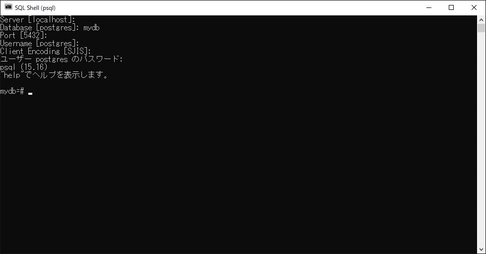

③ C:\students\PostgreSQL_DDL\Optional\createTable_STAFF_EVENT.ddlを使用して、イベント表を作成します。

**STAFF_EVENTテーブル定義**
```CMD
\i 'C:\\students\\PostgreSQL_DDL\\Optional\\createTable_STAFF_EVENT.ddl';
```

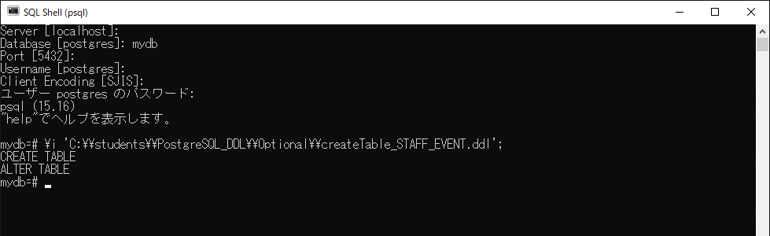

**(参考)　createTable_STAFF_EVENT.ddlの内容**
```SQL
CREATE TABLE myschema.staff_event (
    event_id integer NOT NULL
        GENERATED ALWAYS AS IDENTITY (
            START WITH 1
            INCREMENT BY 1
            MINVALUE 1
            MAXVALUE 2147483647
            NO CYCLE
            CACHE 1
        ),
    object_key  varchar(10) NOT NULL,
    object_verb varchar(10) NOT NULL
);

ALTER TABLE myschema.staff_event 
    ADD CONSTRAINT event_pk PRIMARY KEY (event_id);
```

[戻る](#ex6)

<a id="ex6.4"></a>

## 6.4 データベース・トリガーの準備

### 6.4.1 トリガーの作成

①  [6.3.1](#ex6.3.1)の手順のとおり、SQL Shell (psql) を起動し、mydb に接続します。

② C:\students\PostgreSQL_DDL\Optional\createTriggers_EVENT.ddlを使用して、イベント・テーブルへレコードを追加・削除・変更するトリガーを作成します。

**トリガー定義**
```CMD
\i 'C:\\students\\PostgreSQL_DDL\\Optional\\createTriggers_EVENT.ddl';
```
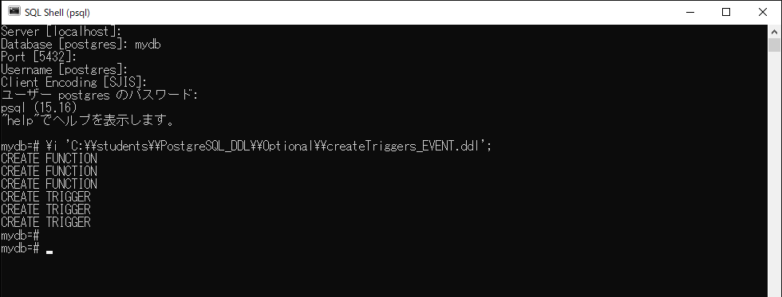

**(参考) createTriggers_EVENT.ddlの内容**
```SQL
-- 1) INSERT（Create）用トリガ関数
CREATE OR REPLACE FUNCTION myschema.trg_staff_create_fn()
RETURNS trigger
LANGUAGE plpgsql
AS $$
BEGIN
    INSERT INTO myschema.staff_event (object_key, object_verb)
    VALUES (NEW.staffnum, 'Create');
    RETURN NEW;
END;
$$;

-- 2) DELETE 用トリガ関数
CREATE OR REPLACE FUNCTION myschema.trg_staff_delete_fn()
RETURNS trigger
LANGUAGE plpgsql
AS $$
BEGIN
    INSERT INTO myschema.staff_event (object_key, object_verb)
    VALUES (OLD.staffnum, 'Delete');
    RETURN OLD;
END;
$$;

-- 3) UPDATE 用トリガ関数
CREATE OR REPLACE FUNCTION myschema.trg_staff_update_fn()
RETURNS trigger
LANGUAGE plpgsql
AS $$
BEGIN
    INSERT INTO myschema.staff_event (object_key, object_verb)
    VALUES (NEW.staffnum, 'Update');
    RETURN NEW;
END;
$$;

-- === TRIGGER 本体 ===
-- AFTER INSERT
CREATE TRIGGER staff_create
AFTER INSERT ON myschema.staff
FOR EACH ROW
EXECUTE FUNCTION myschema.trg_staff_create_fn();

-- AFTER DELETE
CREATE TRIGGER staff_delete
AFTER DELETE ON myschema.staff
FOR EACH ROW
EXECUTE FUNCTION myschema.trg_staff_delete_fn();

-- AFTER UPDATE
CREATE TRIGGER staff_update
AFTER UPDATE ON myschema.staff
FOR EACH ROW
EXECUTE FUNCTION myschema.trg_staff_update_fn();
```

### 6.4.2 トリガーのテスト

① 下記のSQLを利用して、作成したトリガーが正しく動作していることを確認します。

**データ挿入用のSQL文**
```SQL
INSERT INTO myschema.staff VALUES ('12345', '2011-10-02', 'Taro', 'Yamada', 'yamada@example.com');
```

**データ更新用のSQL文**
```SQL
UPDATE myschema.STAFF SET lastchange='2011-11-02', firstname='Hanako', lastname='Suzuki', mail='suzuki@example.com' WHERE staffnum='12345';
```

**データ削除のSQL文**
```SQL
DELETE FROM myschema.staff WHERE staffnum='12345';
```

**トリガーによって作成されたイベント・テーブルのレコードの確認**
```SQL
SELECT * FROM myschema.staff_event;
```

上記のコマンドで下記3行のレコードが追加されていれば正しくトリガーが構成されています。

| EVENT_ID | OBJECT_KEY | OBJECT_VERB |
|----------|------------|-------------|
| 1        | 12345      | Create      |
| 2        | 12345      | Update      |
| 3        | 12345      | Delete      |

② 下記のSQLを発行してイベント表に作成されたレコードを削除しておきます。

```SQL
DELETE FROM myschema.staff_event;
```

[戻る](#ex6)

<a id="ex6.5"></a>

## 6.5 データベース定義の作成

追加演習のために定義したデータベース定義をデータベース・モデルとしてライブラリーに追加していきます。

① ツールキットのメニューより「ファイル」→「新規」→「データベース定義」を選択します。

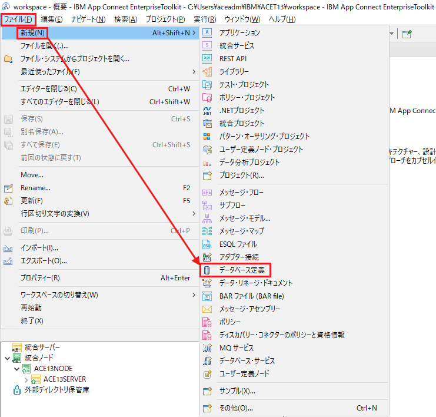

② 下記画面で「ニュー…」ボタンをクリックし、新規のデータベース定義プロジェクトを作成します。

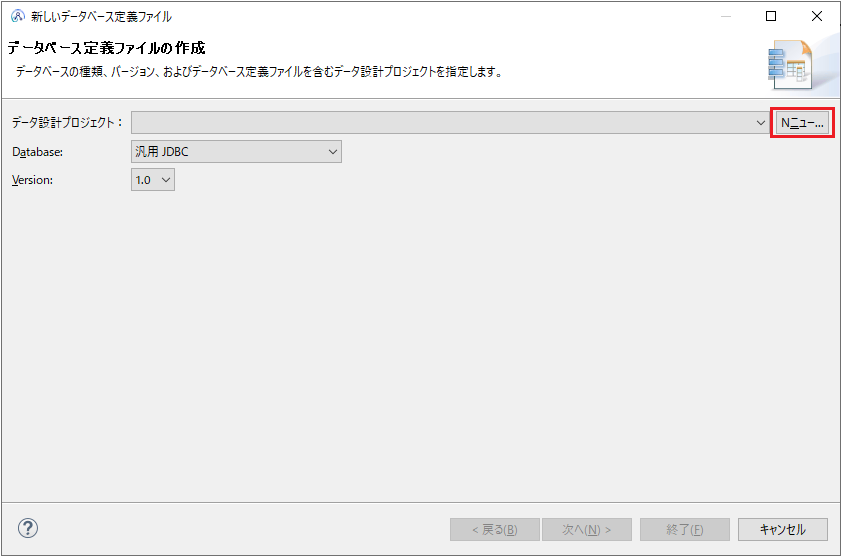

③ 「プロジェクト名」に”dbm_staff”を入力し、「終了」をクリックします。

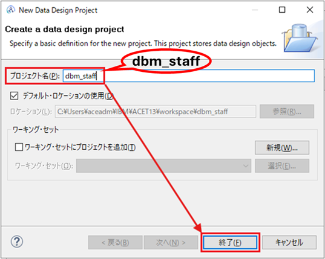

④ 「次へ」をクリックします。

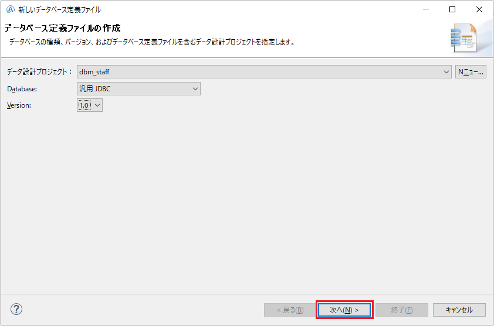

⑤ データベース定義の作成に利用するデータベース接続として「mydb」を選択し、「次へ」をクリックします。

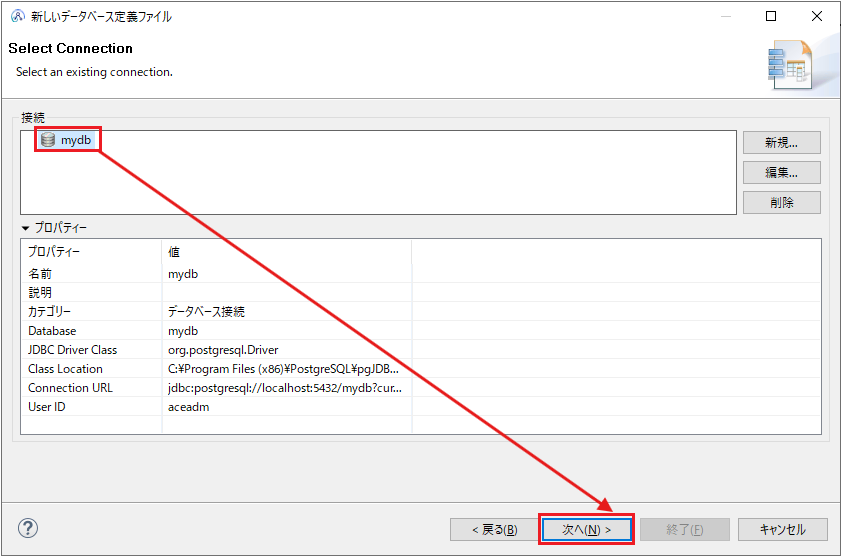

⑥ データベース定義の作成に利用するスキーマとして「myschema」を選択し、「次へ」をクリックします。

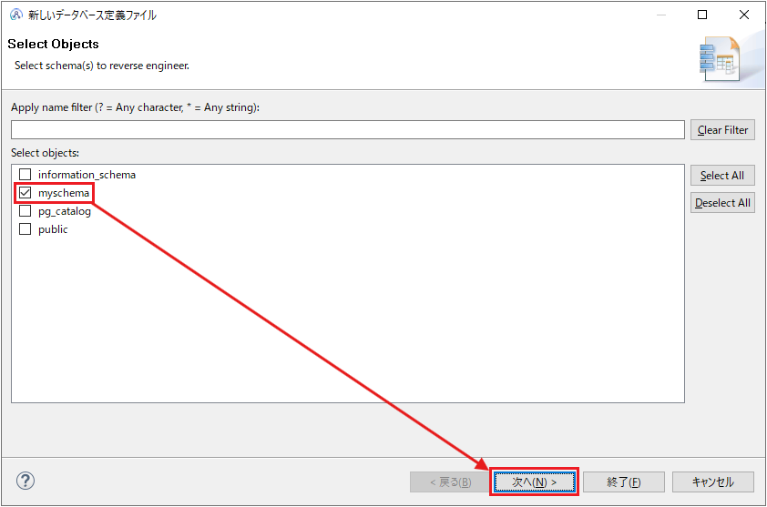

⑦ 下記の画面では「Routines」にチェックを入れ、「終了」をクリックします。

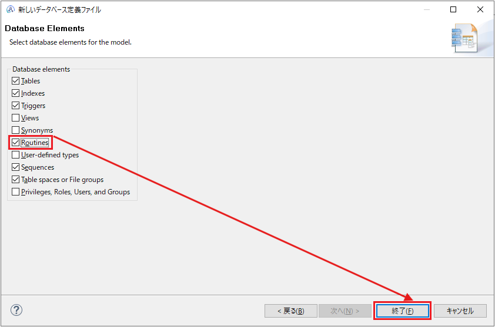

### 6.5.1 演習用ライブラリーの作成

この演習では複数のアプリケーションから利用するモジュールをライブラリーとして管理します。
データベース・モデルをライブラリーに登録して、複数のアプリケーションから利用できるようにします。

① 「アプリケーション開発」ビューから、「新規…」→「ライブラリー」をクリックします。

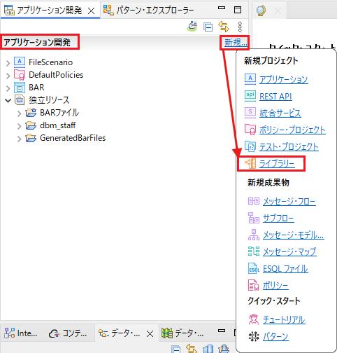

② 「ライブラリ名」に”Lib_Staff”を入力し、「タイプ」は「静的ライブラリー」を選択し、「終了」をクリックします。

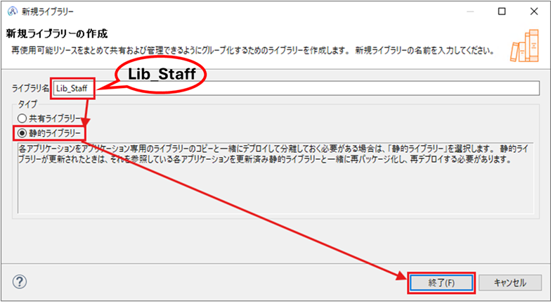

③ ライブラリーにデータベース定義プロジェクトを取り込みます。作成したライブラリー「Lib_Staff」を右クリックし,「含まれるプロジェクトの管理」を選択します。

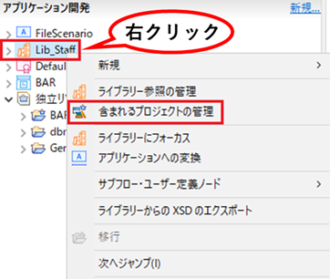

④ データベース定義プロジェクト「dbm_staff」にチェックを入れ「OK」をクリックします。ライブラリーに「dbm_staff」プロジェクトが取り込まれます。

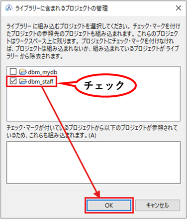
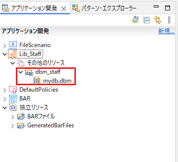

[戻る](#ex6)

<a id="ex6.6"></a>

## 6.6 メッセージ・モデルの作成

データベース定義からメッセージ・モデルを作成していきます。

① 「アプリケーション開発」ビューで「Lib_Staff」を右クリックし、「新規」→「メッセージ・モデル…」を選択し、「新規メッセージ・モデル」ウィザードを起動します。

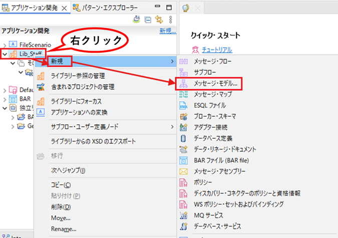

② 「新規メッセージ・モデル」ウィザードで、「データベース・レコード」を選択し、「次へ」をクリックします。

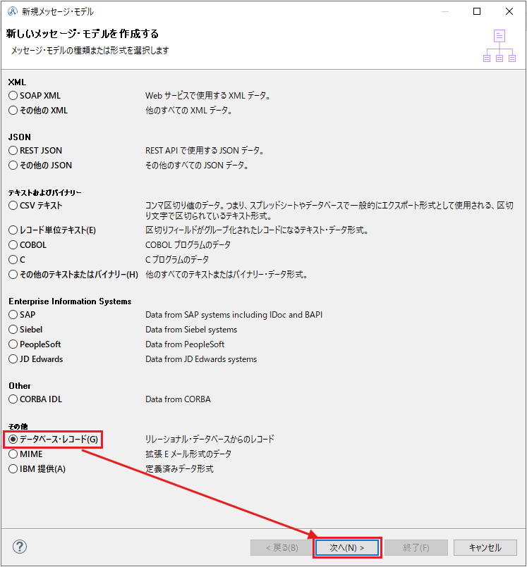

③ 「データベース定義からXMLスキーマ・ファイルを作成します。」を選択し、「次へ」をクリックします。

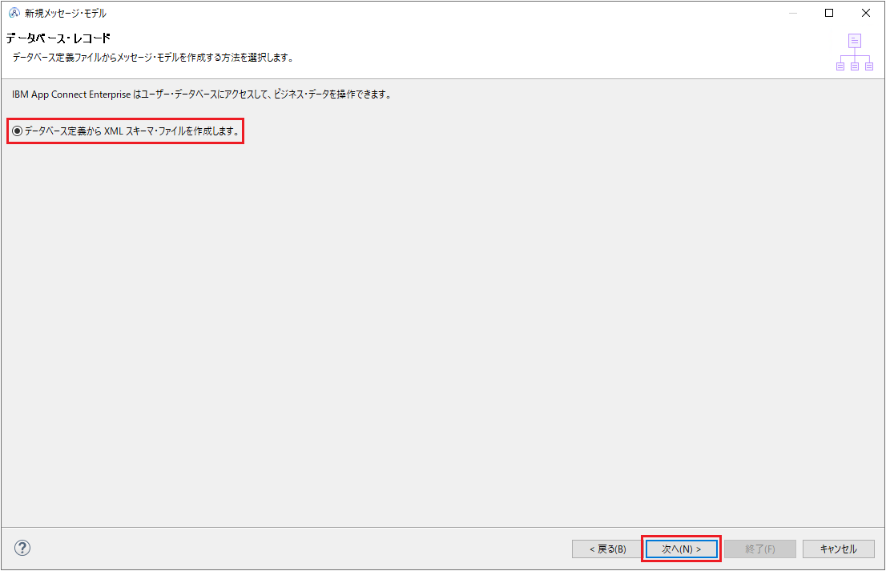

④ 「ワークスペースからファイルを選択します。」を選択し、データ・モデルの生成元として「Lib_Staff」→「その他のリソース」→「dbm_staff」→「mydb.dbm」を選択し、「次へ」をクリックします。

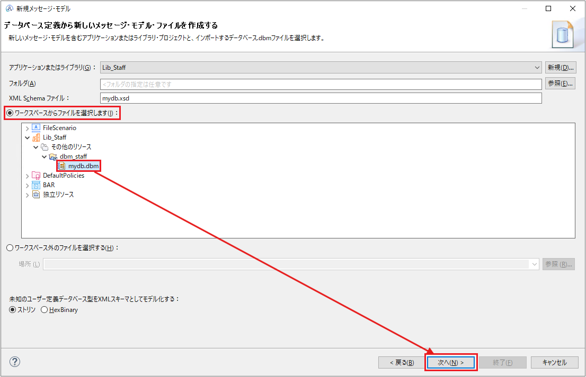

⑤ 次の画面でテーブル「staff」にチェックをいれ、「次へ」をクリックします。

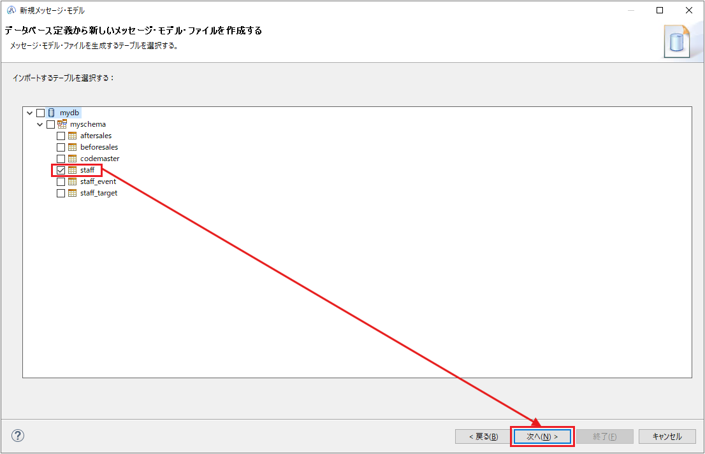

⑥ 次の画面でエラーが見当たらないことを確認し、「終了」をクリックします。

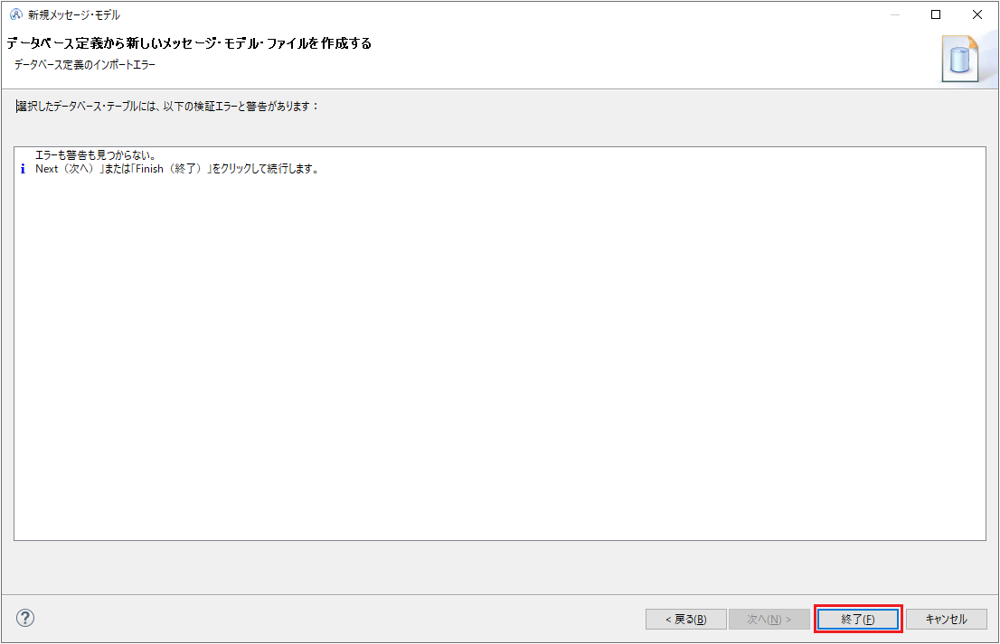

⑦ 下記のようにメッセージ・モデルが作成されます。

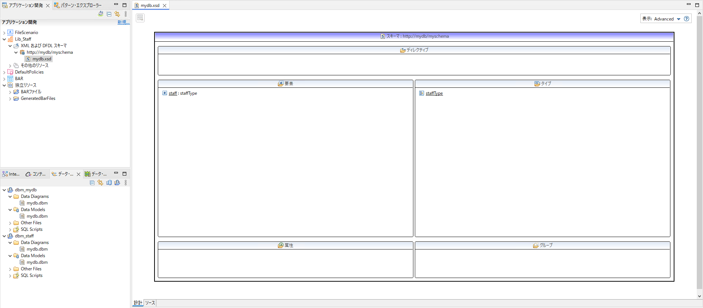

以上でメッセージ・モデルの作成は完了です。

[戻る](#ex6)

<a id="ex6.7"></a>

## 6.7 メッセージ・フローの作成

### 6.7.1 演習用アプリケーションの作成

データベース連携を行うために必要なアプリケーションを作成していきます。

① 「アプリケーション開発」ビューから、「新規…」→「アプリケーション」をクリックします。

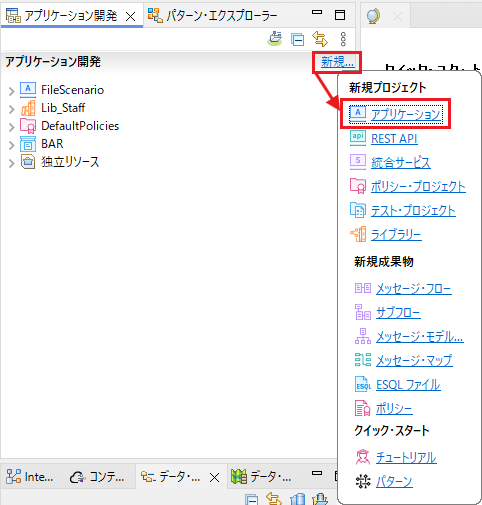

② ウィザードに従い、以下の項目をセットして「終了」をクリックし、新規アプリケーションを作成します。

|        項目       |      設定値     |
|------------------|----------------|
| アプリケーション名 | DBInputDemoApp |

③ 作成したアプリケーションにライブラリーへの参照を追加します。作成したアプリケーションを右クリックし、「ライブラリー参照の管理」を選択します。

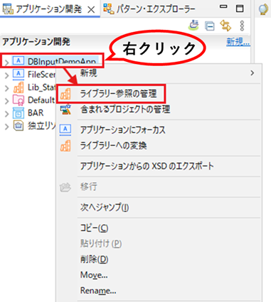

④ 「Lib_Staff」を選択し、「OK」をクリックします。これで作成したアプリケーションからライブラリーに含まれるデータベース定義が利用できるようになります。

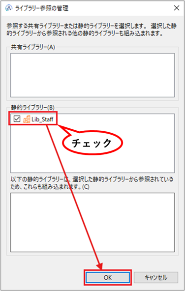
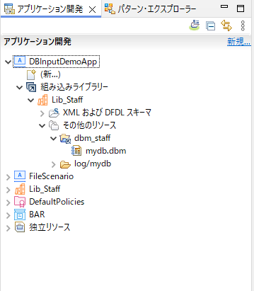

### 6.7.2 メッセージ・フローの作成

”DBInputDemoApp”プロジェクト内に、”DBInputDemoFlow”という名前でメッセージ・フローを作成します。本手順で作成するフローの概観は以下の通りです。

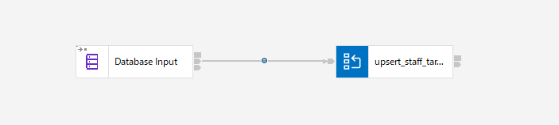

① DBInputDemoAppアプリケーション配下の「新…」をクリックし、「メッセージ・フロー」を選択します。

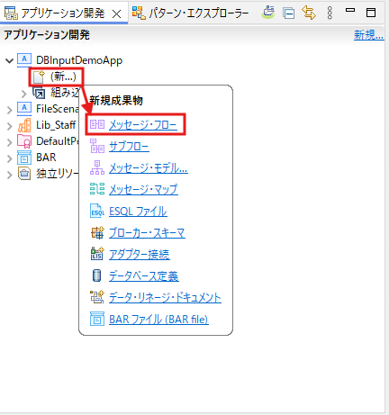

② 「新規メッセージ・フロー」ウィザードで、「メッセージ・フロー名」に”DBInputDemoFlow”を入力し「終了」をクリックします。

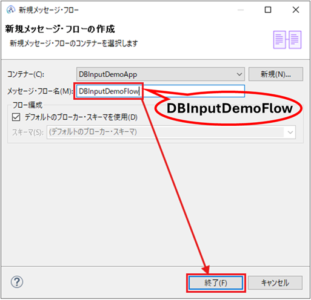

③ 空の新規メッセージ・フロー DBInputDemoFlowが作成され、メッセージ・フロー・エディターが起動します。

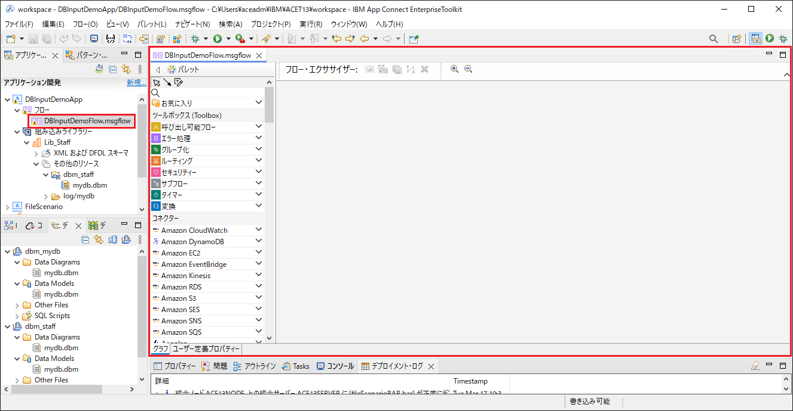

### 6.7.3 ノードの配置

メッセージ・フロー・エディターを使用して、メッセージ・フローを実装します。
以下の手順で、上記のようにノードを配置します。

① パレットから「コネクター」セクションの「データベース」→「DatabaseInput」を選択し、ドラッグ＆ドロップでキャンバスへ配置します。さらにプロパティー・ビューでDatabase Inputノード・プロパティーに下表の値を設定します。

|  タブ |      項目    |  値  |
|------|--------------|-------|
| 基本 | データ・ソース | mydb  |

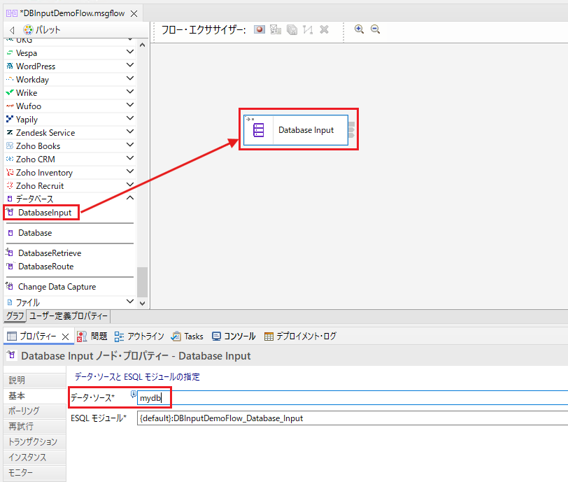

② パレットから「ツールボックス」セクションの「変換」→「Mapping」を選択し、ドラッグ＆ドロップでキャンバスへ配置します。さらにプロパティー・ビューでMappingノード・プロパティーに下表の値を設定します。

|  タブ |  項目   |         値          |
|------|---------|---------------------|
| 説明 | ノード名 | upsert_staff_target |

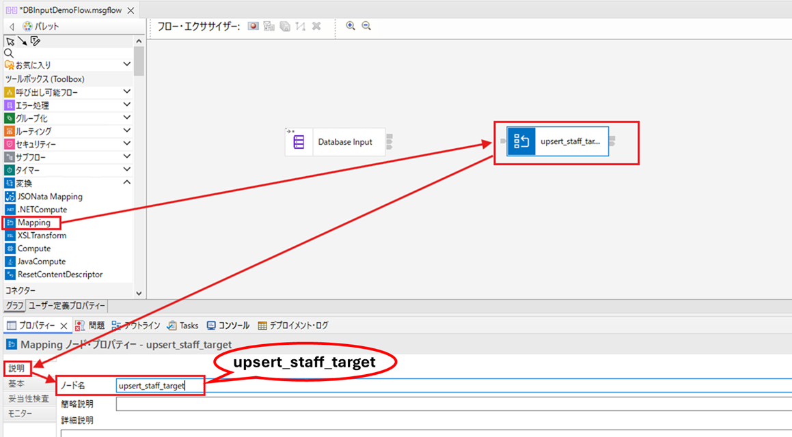

③ ノードのターミナルをドラッグすることで、ノード間を下記のように接続します。

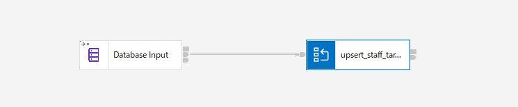

| 接続元ノード (Source Node) | 接続元端子 (Source Port) | → | 接続先ノード (Target Node) | 接続先端子 (Target Port) |
|---------------------------|---------------------------|---|-----------------------------|----------------------------|
| Database Input           | out                       | → | upsert_staff_target         | in                         |

### 6.7.4 DatabaseInputノードのESQLモジュールの構成

① Database Inputノードをダブルクリックして「データベース・イベント設計」エディターを開きます。

② 「データベース・イベント設計」タブより下記の項目を設定した後「クエリーを生成する」をクリックします。

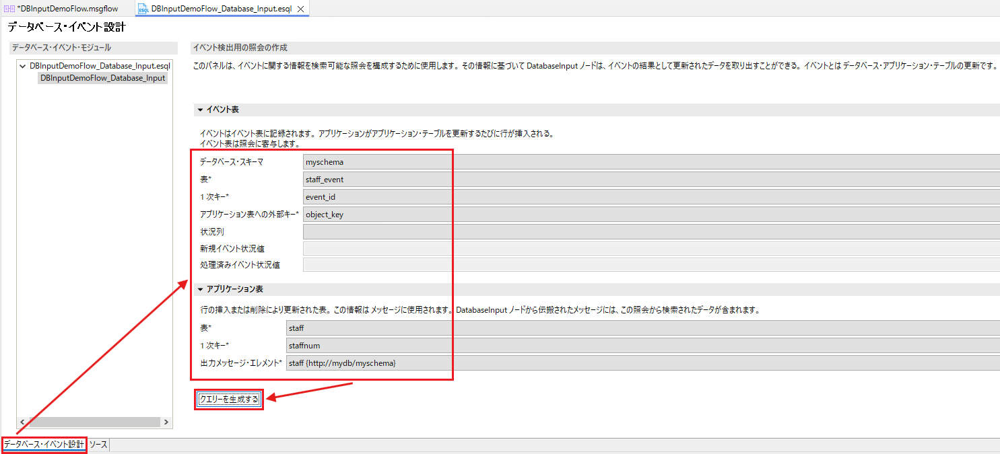

|         **分類**         |            **項目**           |           **値**            |
|:-------------------------|:-----------------------------|:----------------------------|
| **イベント表**            | データベース・スキーマ         | myschema                    |
|                          | 表                           | staff_event                 |
|                          | １次キー                     | event_id                     |
|                          | アプリケーション表への外部キー | object_key                   |
| **アプリケーション表**     | 表                          | staff                   　　　|
|                          | １次キー                     | staffnum                     |
|                          | 出力メッセージ・エレメント　   | staff {http://mydb/myschema} |

③ CTRL+S でファイルを保存します。

### 6.7.5 Mappingノードの実装

Mappingノード 「upsert_staff_target」 を、入力メッセージを元にmydbのstaff_targetテーブルを更新するように構成します。

① メッセージ・フロー・エディターで「upsert_staff_target」ノードをダブルクリックし、新規メッセージ・マップ・ウィザードを起動します。最初の画面ではそのまま「次へ」をクリックします。

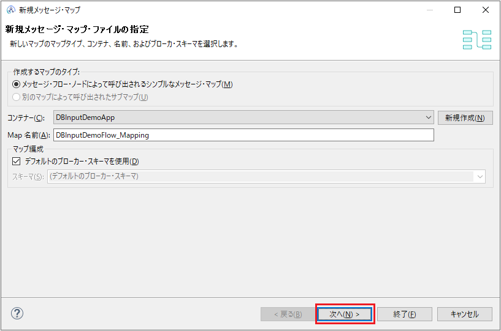

② マップ入出力の選択画面で「マップ入力を選択する」の「Lib_Staff」→「DFDL および XML スキーマ」→「staff」を選択し、「終了」をクリックします。今回は出力はデータベース・テーブルなので出力側のメッセージは選択する必要はありません。

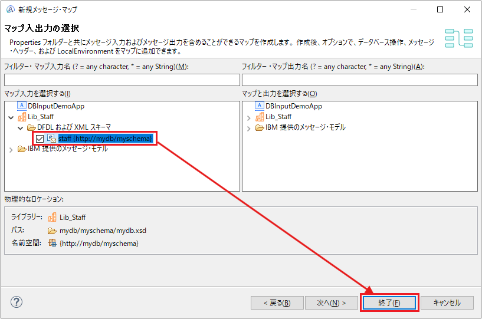

③ マップが新規に作成され、マッピング・エディターが起動します。上部のパレットから「データベース表で行を更新します」ボタンをクリックします。

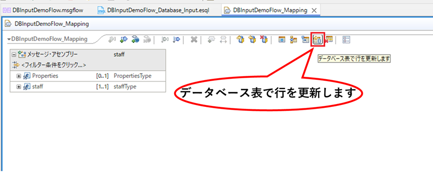

④ 新規のデータベース表更新画面で各項目を以下の通りに設定し、「OK」をクリックします。「where 節の定義」構成時には、「表の列」、「演算子」、「列の値に使用できる入力」の要素をそれぞれ順番にダブル・クリックすることでコンテンツ・アシストによってWhere句を構成できます。「OK」をクリックします。

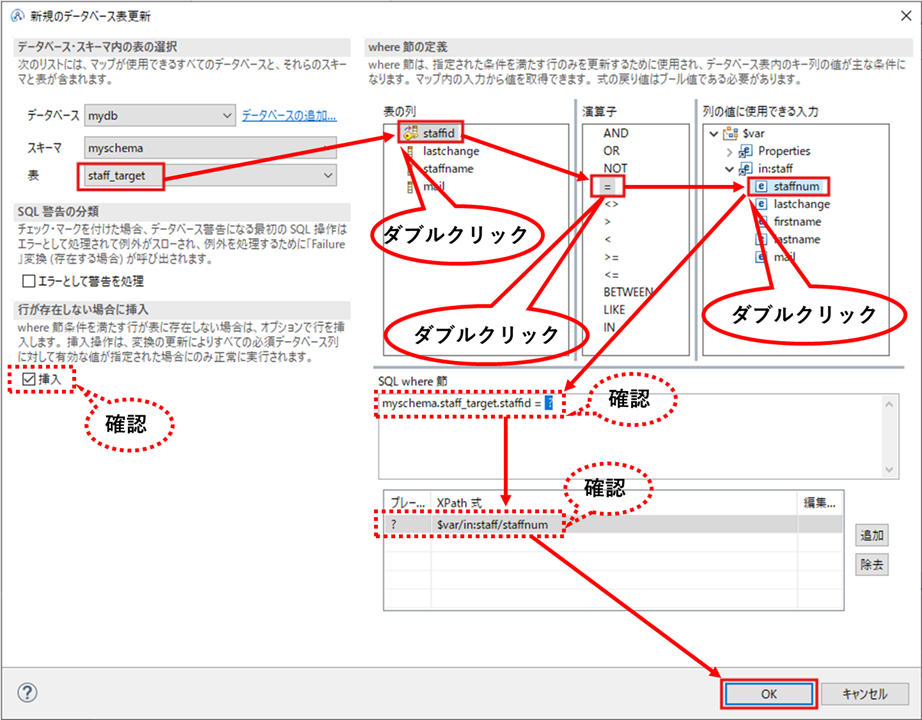

| カテゴリ                             | 項目             | 設定値                             |
|-------------------------------------|------------------|------------------------------------|
| **データベース・スキーマ内の表の選択** | データベース       | mydb                              |
|                                     | スキーマ          | myschema                          |
|                                     | 表                | staff_target                     |
| **行が存在しない場合に挿入**          | 挿入              | （チェックを入れる）                |
| **Where節の定義**                    | SQL where 節      | myschema.staff_target.staffid = ?|
|                                     | XPath式           | $var/in:staff/staffnum           |

⑤ Input側メッセージ・ツリーの「staff」にマウス・オーバーすると表示される接続の追加ハンドルを、作成された「Update」タスクにドラッグ＆ドロップし、「staff」と「Update」を接続します。

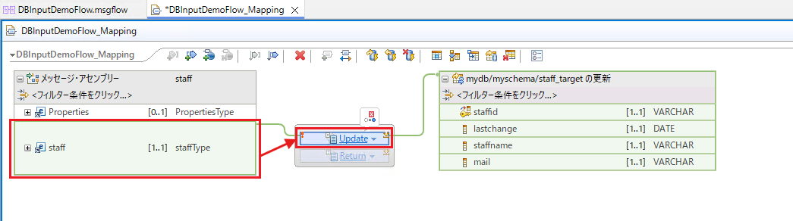

⑥ 「Update」をクリックし、「ここをクリック」をクリックしてドリルダウンします。

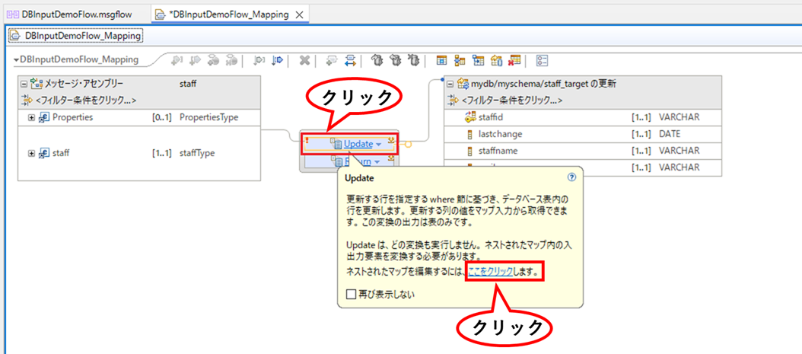

⑦ ドラッグ＆ドロップで以下のようにマップします。

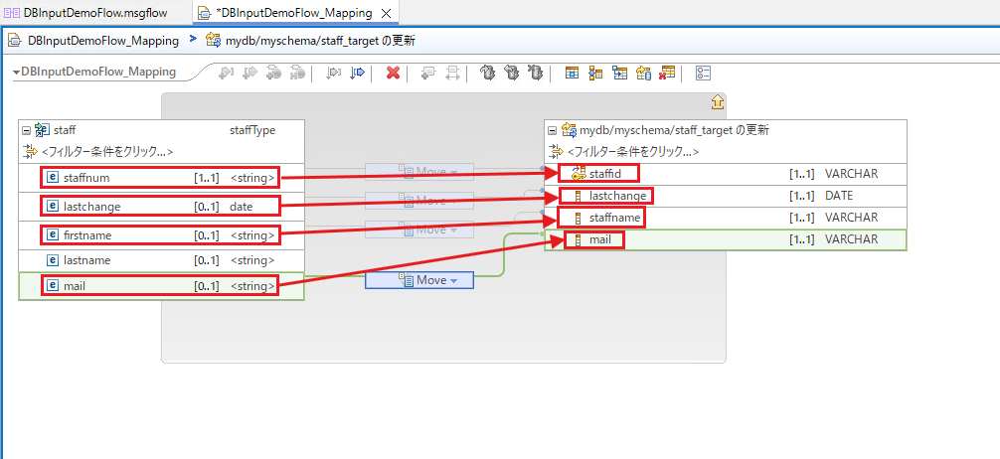

⑧ 「lastname」を以下のように「firstname」と「staffname」を繋ぐ「Move」タスクに接続し、接続選択ヘルパーから「１次接続」を選択します。

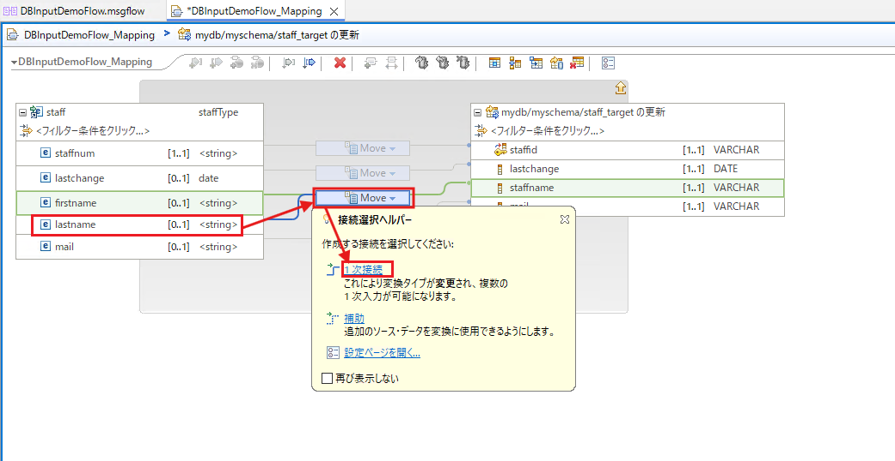

⑨ 自動的に「Move」が文字列結合タスク「Concat」に変換されるので、これをクリックして選択し、「プロパティー」ビューで以下のように設定します。

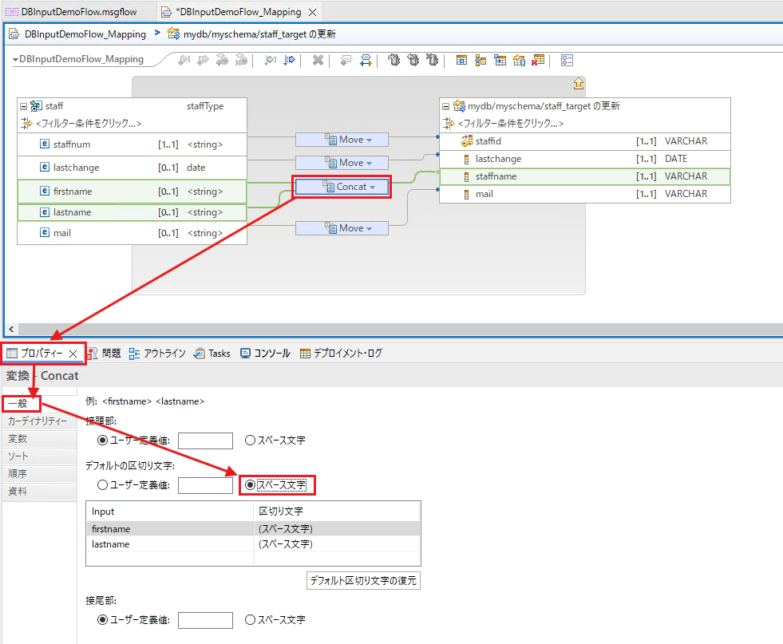

|  タブ |         項目        |      値     |
|------|---------------------|-------------|
| 一般 | デファルトの区切り文字 | スペース文字 |

⑩ 	CTRL+S で保存します。

以上でメッセージ・フローの作成は完了です。

[戻る](#ex6)

<a id="ex6.8"></a>

## 6.8 デプロイ・テスト

### 6.8.1 アプリケーションのデプロイ

ツールキットからACEランタイムへアプリケーションをデプロイします。
これまでの演習ではBARファイルを明示的に作成してデプロイを行ってきましたが、ここではBARファイルが暗黙的に生成される簡易的なデプロイの方法を利用します。

① 「アプリケーション開発」ビューと「Integration Explorer」ビューを最前面に表示します。

② アプリケーション「DBInputDemoApp」を、「Integration Explorer」ビューの「統合ノード」→「ACE13NODE」→「ACE13SERVER」へドラッグ＆ドロップし、アプリケーションをデプロイします。

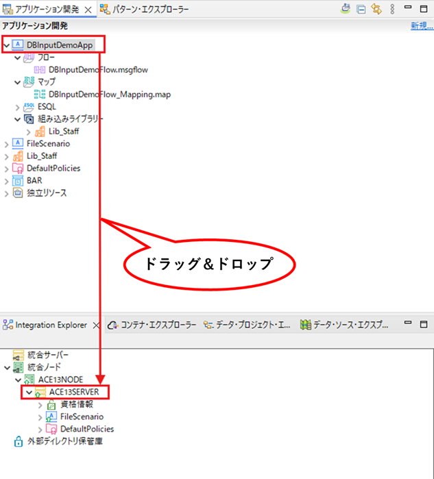

③ デプロイが成功したことを示すポップアップが表示されたら、ポップアップを閉じます。

### 6.8.2 アプリケーションのテスト

ツールキットからデータベースに接続し、staff表にデータを投入することでメッセージ・フローを起動します。

① 「データ・ソース・エクスプローラー」ビューで「データベース接続」フォルダーを開きます。

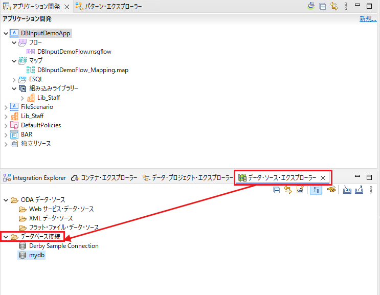

② 「mydb」を右クリックし、「接続」を選択します。もし既に接続済の場合には「更新」を選択します（追加で行ったデータベース定義を読み込ませるためです）。

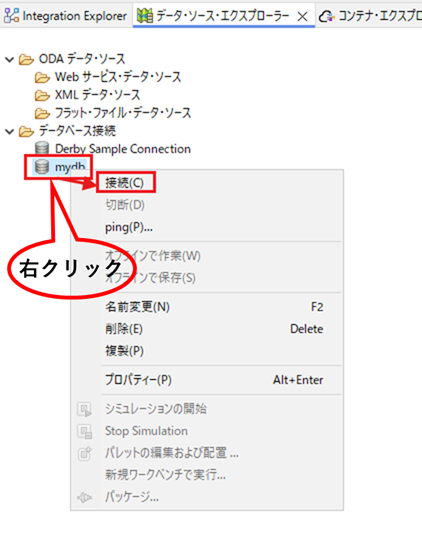
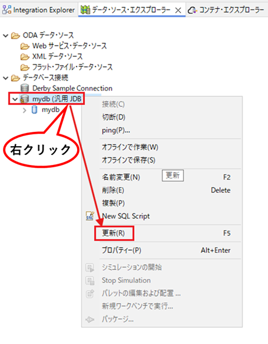

③ 「mydb」→「カタログ」→「mydb」→「スキーマ」→「myschema」→「表」と展開し、「staff」を右クリックし「データ」→「編集」を選択します。

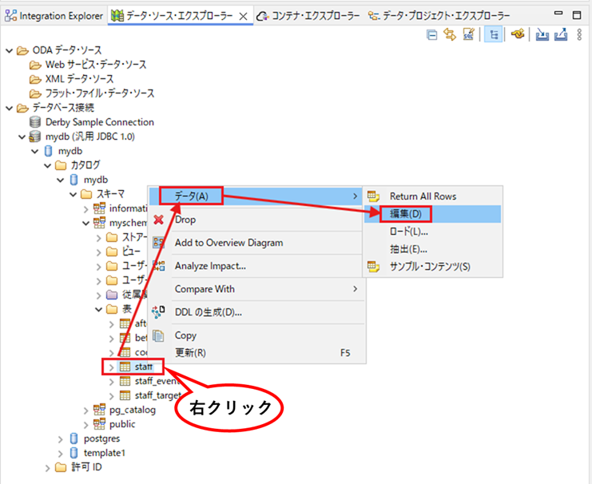

④ staff表のデータを確認できます。

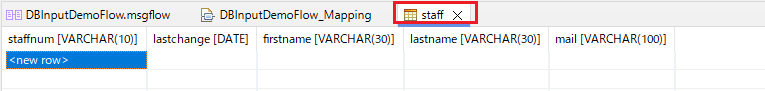

⑤ staff_target表についても、同様の手順で右クリック→「データ」→「編集」での内容を確認します。

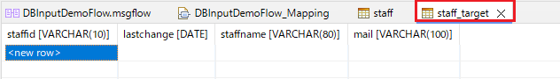

⑥ staff表にもどり、下記のようにテスト・データを入力し、CTRL+Sで保存するとデータベース上のstaff表に更新がコミットされます。

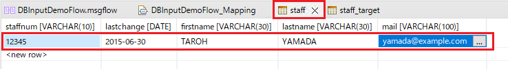

⑦ staff_target表を開き「F5」キーで表示をリフレッシュし、更新が伝搬していることを確認します。

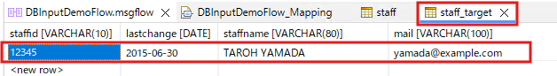


以上でアプリケーションの実行は完了です。


[戻る](#ex6)

---
